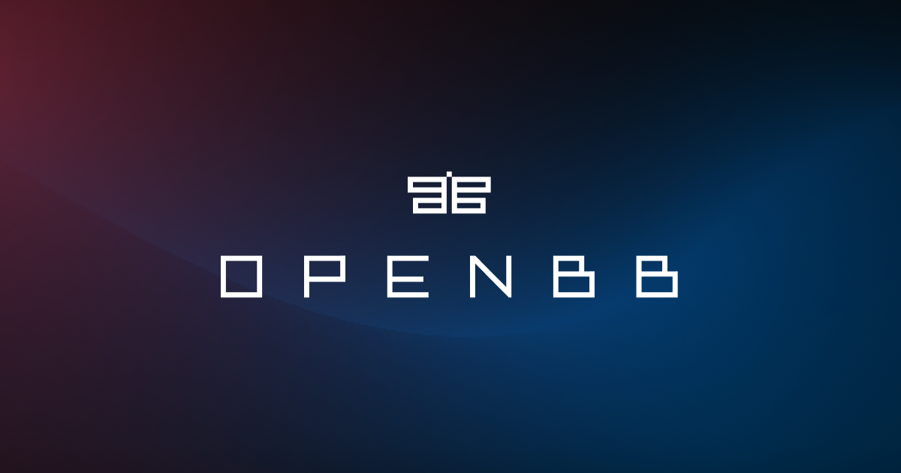

<!-- PROJECT SHIELDS -->
<!--
*** I'm using markdown "reference style" links for readability.
*** Reference links are enclosed in brackets [ ] instead of parentheses ( ).
*** See the bottom of this document for the declaration of the reference variables
*** for contributors-url, forks-url, etc. This is an optional, concise syntax you may use.
*** https://www.markdownguide.org/basic-syntax/#reference-style-links
-->

[![Stargazers][stars-shield]][stars-url]
[![Forks][forks-shield]][forks-url]
[![Contributors][contributors-shield]][contributors-url]
[![MIT License][license-shield]][license-url]

[![Issues][issues-shield]][issues-url]
[![Bugs Open][bugs-open-shield]][bugs-open-url]
[![Bugs Closed][bugs-closed-shield]][bugs-closed-url]

[](https://github.com/OpenBB-finance/OpenBBTerminal/actions)
[](https://gamestonk-terminal.readthedocs.io/?badge=latest)
[](https://github.com/OpenBB-finance/OpenBBTerminal/releases)
[](https://github.com/psf/black)
[](https://www.tickgit.com/browse?repo=github.com/OpenBB-finance/OpenBBTerminal&branch=main)


[](https://twitter.com/openbb_finance)

<!-- PROJECT LOGO -->
<br />
<p align="center">
  <a href="https://openbb.co/">
    
  </a>

  <h3 align="center">OpenBB Terminal 🚀</h3>
  <h4 align="center">Documentation can be found at: https://openbb.co/docs </h4>
  <p align="center">Click on the GIF below for a DEMO of the terminal.</p>

<p align="center">
   <a href="https://www.youtube.com/watch?v=fqGPK8OVHLk" rel="OpenBB Terminal Demo">
      
   </a>
</p>

  <p align="center">
    Investment research for everyone.
    <br />
    <a href="https://docs.openbb.co/terminal/quickstart/installation"><strong>≪  GETTING STARTED</strong></a>
    &nbsp · &nbsp <a href="https://github.com/OpenBB-finance/OpenBBTerminal/tree/master/CONTRIBUTING.md"><strong>CONTRIBUTING</strong></a> &nbsp · &nbsp
    <a href="https://docs.openbb.co/terminal">
    <strong>SEE FEATURES »</strong></a>
    <br />
    <br />
    <a href="https://github.com/OpenBB-finance/OpenBBTerminal/issues/new?assignees=&labels=bug&template=bug_report.md&title=%5BBug%5D">
    Report Bug</a>
    ·
    <a href="https://github.com/OpenBB-finance/OpenBBTerminal/issues/new?assignees=&labels=enhancement&template=enhancement.md&title=%5BIMPROVE%5D">
    Suggest Improvement</a>
    ·
    <a href="https://github.com/OpenBB-finance/OpenBBTerminal/issues/new?assignees=&labels=new+feature&template=feature_request.md&title=%5BFR%5D">
    Request a Feature</a>
  </p>
</p>

<!-- TABLE OF CONTENTS -->
<details open="open">
  <summary><h2 style="display: inline-block">Table of Contents</h2></summary>
  <ol>
    <li> <a href="#1-about-the-project">About The Project</a> </li>
    <li><a href="#2-installation">Installation</a></li>
    <li><a href="#3-contributing">Contributing</a></li>
    <li><a href="#4-license">License</a></li>
    <li><a href="#5-disclaimer">Disclaimer</a></li>
    <li><a href="#6-contacts">Contacts</a></li>
    <li><a href="#7-star-history">Star History</a></li>
    <li><a href="#8-contributors">Contributors</a></li>
  </ol>
</details>

## 1. About The Project

**How it started:**

OpenBBTerminal is an awesome stock and crypto market terminal that has been developed for fun, while I saw my GME shares tanking. But hey, I like the stock 💎🙌.

**How it's going:**

OpenBBTerminal provides a Python-based integrated environment for investment research, that allows
an average joe retail trader to leverage state-of-the-art Data Science and Machine Learning technologies.

As a Python-based environment, OpenBBTerminal opens access to numerous Python data libraries in Data Science
(Pandas, Numpy, Scipy, Jupyter), Machine Learning (Pytorch, Sklearn, Flair), and Data Acquisition
(Beautiful Soup, and numerous third-party APIs).

## 2. Installation

If you wish to install the OpenBB Terminal or the OpenBB SDK, please use one of the following options:

|**OpenBB Terminal**|**Usage**|
|:-|:-|
|[Windows Installer](https://docs.openbb.co/terminal/quickstart/installation?tab=windows)|Recommended way for Windows if you just want to use the OpenBB Terminal|
|[MacOS Installer](https://docs.openbb.co/terminal/quickstart/installation?tab=mac)|Recommended way for MacOS if you just want to use the OpenBB Terminal|
|[Docker](https://docs.openbb.co/terminal/quickstart/installation?tab=docker)|An alternative way if you just want to use the OpenBB Terminal|
|[Python](https://docs.openbb.co/terminal/quickstart/installation?tab=python)|If you wish to contribute to the development of the OpenBB Terminal|

|**OpenBB SDK** &nbsp; &nbsp; &nbsp; &nbsp; |**Usage**|
|:-|:-|
|[PyPi](https://docs.openbb.co/sdk/quickstart/installation)|Recommended way if you just want to use the OpenBB SDK|
|[Python](https://docs.openbb.co/terminal/quickstart/installation?tab=python)|If you wish to contribute to the development of the OpenBB SDK &nbsp; &nbsp; &nbsp; &nbsp;|

## 3. Contributing

There are three main ways of contributing to this project. (Hopefully you have starred the project by now ⭐️)

**BECOME A CONTRIBUTOR**

1. Fork the Project
2. Create your Feature Branch (`git checkout -b feature/AmazingFeature`)
3. Install the pre-commit hooks by running: `pre-commit install`
      Any time you commit a change, linters will be run automatically. On changes, you will have to re-commit
4. Commit your Changes (`git commit -m 'Add some AmazingFeature'`)
5. Push to your Branch (`git push origin feature/AmazingFeature`)
6. Open a Pull Request

You can read more details about adding a feature in our [CONTRIBUTING GUIDELINES](/CONTRIBUTING.md).

**RAISE AN ISSUE OR REQUEST A FEATURE**

- Raise an issue by opening a [bug ticket](https://github.com/OpenBB-finance/OpenBBTerminal/issues).
- Request a new  feature through a [feature request ticket](https://github.com/OpenBB-finance/OpenBBTerminal/issues).

**JOIN US**

Join [our Discord](https://openbb.co/discord) and provide us any feedback on The OpenBB Terminal.

## 4. License

Distributed under the MIT License. See
[LICENSE](https://github.com/OpenBB-finance/OpenBBTerminal/blob/main/LICENSE) for more information.

## 5. Disclaimer

*"A few things I am not. I am not a cat. I am not an institutional investor, nor am I a hedge fund. I do not have
clients and I do not provide personalized investment advice for fees or commissions."* DFV

```text
Trading in financial instruments involves high risks including the risk of losing some, or all, of your investment
amount, and may not be suitable for all investors.

Before deciding to trade in a financial instrument you should be fully informed of the risks and costs associated with trading the financial markets, carefully consider your investment objectives, level of experience, and risk appetite, and seek professional advice where needed.

The data contained in the OpenBBTerminal is not necessarily accurate.

OpenBB and any provider of the data contained in this website will not accept liability for any loss or damage as a result of your trading, or your reliance on the information displayed.
```

## 6. Contacts

If you have any questions about the terminal or anything OpenBB, feel free to email us at support@openbb.co

If you want to say hi, or are interested in partnering with us, feel free to reach us at hello@openbb.co

Feel free to share loss porn, memes or any questions at:

- Twitter: [@openbb_finance](https://twitter.com/openbb_finance)
- Discord: [openbb.co/discord](https://openbb.co/discord)
- Reddit: [openbb.co/reddit](https://openbb.co/reddit)

## 7. Star History

[](https://star-history.com/#openbb-finance/OpenBBTerminal&Date)

## 8. Contributors

<a href="https://github.com/OpenBB-finance/OpenBBTerminal/graphs/contributors">
   
</a>

<!-- MARKDOWN LINKS & IMAGES -->
<!-- https://www.markdownguide.org/basic-syntax/#reference-style-links -->

[contributors-shield]: https://img.shields.io/github/contributors/OpenBB-finance/OpenBBTerminal.svg?style=for-the-badge
[contributors-url]: https://github.com/OpenBB-finance/OpenBBTerminal/graphs/contributors
[forks-shield]: https://img.shields.io/github/forks/OpenBB-finance/OpenBBTerminal.svg?style=for-the-badge
[forks-url]: https://github.com/OpenBB-finance/OpenBBTerminal/network/members
[stars-shield]: https://img.shields.io/github/stars/OpenBB-finance/OpenBBTerminal.svg?style=for-the-badge
[stars-url]: https://github.com/OpenBB-finance/OpenBBTerminal/stargazers
[issues-shield]: https://img.shields.io/github/issues/OpenBB-finance/OpenBBTerminal.svg?style=for-the-badge&color=blue
[issues-url]: https://github.com/OpenBB-finance/OpenBBTerminal/issues
[bugs-open-shield]: https://img.shields.io/github/issues/OpenBB-finance/OpenBBTerminal/bug.svg?style=for-the-badge&color=yellow
[bugs-open-url]: https://github.com/OpenBB-finance/OpenBBTerminal/issues?q=is%3Aissue+label%3Abug+is%3Aopen
[bugs-closed-shield]: https://img.shields.io/github/issues-closed/OpenBB-finance/OpenBBTerminal/bug.svg?style=for-the-badge&color=success
[bugs-closed-url]: https://github.com/OpenBB-finance/OpenBBTerminal/issues?q=is%3Aissue+label%3Abug+is%3Aclosed
[license-shield]: https://img.shields.io/github/license/OpenBB-finance/OpenBBTerminal.svg?style=for-the-badge
[license-url]: https://github.com/OpenBB-finance/OpenBBTerminal/blob/main/LICENSE.txt
[linkedin-shield]: https://img.shields.io/badge/-LinkedIn-black.svg?style=for-the-badge&logo=linkedin&colorB=555
[linkedin-url]: https://linkedin.com/in/DidierRLopes
