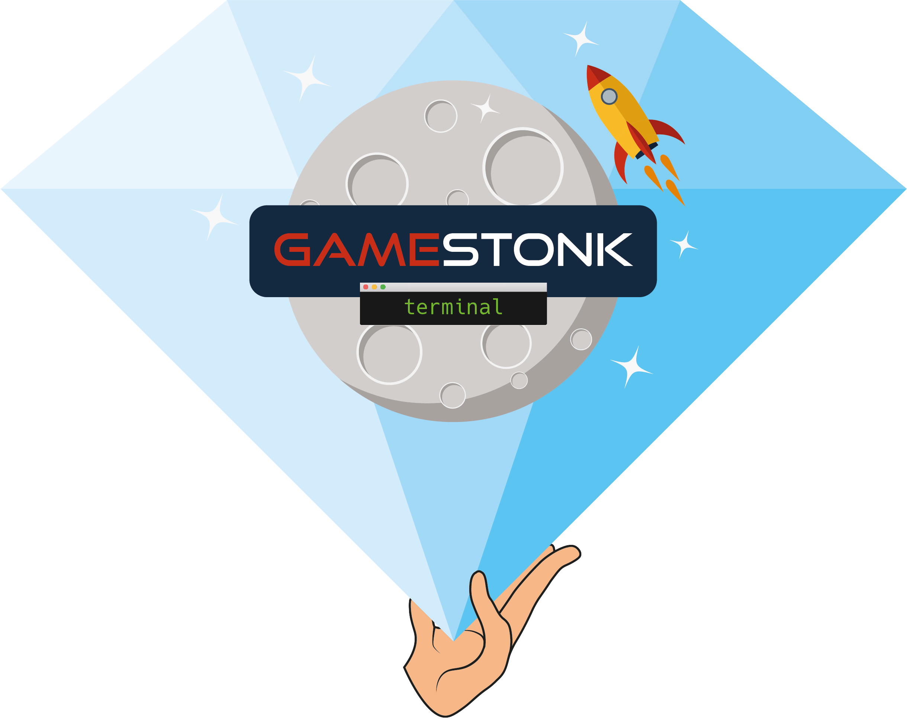

<!-- PROJECT SHIELDS -->
<!--
*** I'm using markdown "reference style" links for readability.
*** Reference links are enclosed in brackets [ ] instead of parentheses ( ).
*** See the bottom of this document for the declaration of the reference variables
*** for contributors-url, forks-url, etc. This is an optional, concise syntax you may use.
*** https://www.markdownguide.org/basic-syntax/#reference-style-links
-->
[![Stargazers][stars-shield]][stars-url]
[![Forks][forks-shield]][forks-url]
[![Contributors][contributors-shield]][contributors-url]
[![MIT License][license-shield]][license-url]

[![Issues][issues-shield]][issues-url]
[![Bugs Open][bugs-open-shield]][bugs-open-url]
[![Bugs Closed][bugs-closed-shield]][bugs-closed-url]

[](https://github.com/DidierRLopes/GamestonkTerminal/actions)
[](https://github.com/DidierRLopes/GamestonkTerminal/releases)
[](https://github.com/psf/black)


<!-- PROJECT LOGO -->
<br />
<p align="center">
  <a href="https://github.com/DidierRLopes/GamestonkTerminal">
    
  </a>

  <h3 align="center">Gamestonk Terminal 🚀</h3>

  <p align="center">
    The next best thing after Bloomberg Terminal. #weliketheterminal
    <br />
    <a href="https://github.com/DidierRLopes/GamestonkTerminal/blob/main/ROADMAP.md"><strong>≪  ROADMAP</strong></a>
    &nbsp · &nbsp
    <a href="https://github.com/DidierRLopes/GamestonkTerminal/tree/main/gamestonk_terminal/README.md"><strong>FEATURES »</strong></a>
    <br />
    <br />
    <a href="https://github.com/DidierRLopes/GamestonkTerminal/issues/new?assignees=&labels=bug&template=bug_report.md&title=%5BBug%5D">Report Bug</a>
    ·
    <a href="https://github.com/DidierRLopes/GamestonkTerminal/issues/new?assignees=&labels=enhancement&template=enhancement.md&title=%5BIMPROVE%5D">Suggest Improvement</a>
    ·
    <a href="https://github.com/DidierRLopes/GamestonkTerminal/issues/new?assignees=&labels=new+feature&template=feature_request.md&title=%5BFR%5D">Request Feature</a>
  </p>
</p>


<!-- TABLE OF CONTENTS -->
<details open="open">
  <summary><h2 style="display: inline-block">Table of Contents</h2></summary>
  <ol>
    <li> <a href="#about-the-project">About The Project</a> </li>
    <li>
      <a href="#getting-started">Getting Started</a>
      <ul>
        <li><a href="#install">Install</a></li>
        <li><a href="#advanced-user-install---machine-learning">Advanced User Install - Machine Learning</a></li>
        <li><a href="#other-issues">Other Issues</a></li>
        <li><a href="#modulenotfounderror">ModuleNotFoundError</a></li>
        <li><a href="#update-terminal">Update Terminal</a></li>
        <li><a href="#api-keys">API Keys</a></li>
        <li><a href="#usage">Usage</a></li>
      </ul>
    </li>
    <li><a href="#contributing">Contributing</a></li>
    <li><a href="#license">License</a></li>
    <li><a href="#disclaimer">Disclaimer</a></li>
    <li><a href="#contacts">Contacts</a></li>
    <li><a href="#acknowledgments">Acknowledgments</a></li>
  </ol>
</details>

## About The Project

**How it started:**

Gamestonk Terminal is an awesome stock and crypto market terminal that has been developed for fun, while I saw my GME shares tanking. But hey, I like the stock 💎🙌.

**How it's going:**

Gamestonk Terminal provides a modern Python-based integrated environment for investment research, that allows the average joe retail trader to leverage state-of-the-art Data Science and Machine Learning technologies.

As a modern Python-based environment, GamestonkTerminal opens access to numerous Python data libraries in Data Science (Pandas, Numpy, Scipy, Jupyter), Machine Learning (Pytorch, Tensorflow, Sklearn, Flair), and Data Acquisition (Beautiful Soup, and numerous third-party APIs). 


## Getting Started
### Install

This project was originally written and tested with Python 3.6.8. It should now support Python 3.6, 3.7, and 3.8.

Our current recommendation is to use this project with Anaconda's Python distribution - either full [__Anaconda3 Latest__](https://repo.anaconda.com/archive/) or [__Miniconda3 Latest__](https://repo.anaconda.com/archive/). Several features in this project utilize Machine Learning. Machine Learning Python dependencies are optional. If you decided to add Machine Learning features at a later point, you will likely have better user experience with Anaconda's Python distribution.

1. Install Anaconda

Confirm that you have it with: `conda -V`. The output should be something along the lines of: `conda 4.9.2`

2. Create Environment

You can name the environment whatever you want. Although you could use names such as: `welikethestock`, `thisistheway` or `diamondhands`, we recommend something simple and intuitive like `gst`. This is because this name will be used from now onwards.
```
conda create -n gst python=3.6.8
````

3. Activate the virtual environment

```
conda activate gst
```
Note: At the end, you can deactivate it with: `conda deactivate`

4. Fork the Project

- Via HTTPS: `git clone https://github.com/DidierRLopes/GamestonkTerminal.git`
- via SSH:  `git clone git@github.com:DidierRLopes/GamestonkTerminal.git`

Navigate into the folder with: `cd GamestonkTerminal/`

5. Install poetry
```
conda install poetry
```

5.5. If installing python 3.8
```
conda deactivate
conda activate gst
```
*The `conda deactivate` -> `conda activate` in the middle is on purpose, this is sometimes required to avoid issues with poetry*


6. Install poetry dependencies
```
poetry install
```
This is a library for package management, and ensures a smoother experience than: ``pip install -r requirements.txt``

7.  You're ready to Gamestonk it!

```
python terminal.py
```

### Advanced User Install - Machine Learning

If you are an advanced user and use other Python distributions, we have several requirements.txt documents that you can pick from to download project dependencies.

Note: The libraries specified in the [requirements.txt](/requirements.txt) file have been tested and work for the purpose of this project, however, these may be older versions. Hence, it is recommended for the user to set up a virtual python environment prior to installing these. This allows to keep dependencies required by different projects in separate places.

*If you would like to use optional Machine Learning features:*

* Update your [feature_flags.py](/gamestonk_terminal/feature_flags.py) with:
```
ENABLE_PREDICT = os.getenv("GTFF_ENABLE_PREDICT") or True
```

* Install optional ML features dependencies:
```
poetry install -E prediction
```
*If you run into issues installing or `Cannot convert a symbolic Tensor...` at runtime, try this:*

```
conda install -c conda-forge fbprophet numpy=1.19.5 hdf5=1.10.5
poetry install
poetry install -E prediction
```

*If you would like to set up a docker image:*

* Build the docker: `docker build .`
* Run it: `docker run -it gamestonkterminal:dev `

Note: The problem with docker is that it won't output matplotlib figures.

*Commands that may help you in case of an error:

* `python -m pip install --upgrade pip`
* `pip install pystan --upgrade`
* `poetry update --lock`

### Other Issues

If you run into trouble with poetry and the advice above did not help, your best bet is to try

1. `poetry update --lock`

2. `conda deactivate` -> `conda activate gst`, then try again

3. Delete the poetry cache, then try again

   | Platform | Location                        |
   | -------- | ------------------------------- |
   | Linux    | "~/.cache/pypoetry"             |
   | Mac      | "~/Library/Caches/pypoetry"     |
   | Windows  | "%localappdata%/pypoetry/cache" |

4. Track down the offensive package and purge it from your anaconda `<environment_name>` folder, then try again (removing through conda can sometimes leave locks behind)

   | Platform  | Location                                     |
   | --------- | -------------------------------------------- |
   | Linux/Mac | "~/anaconda3/envs" or "~/opt/anaconda3/envs" |
   | Windows   | "%userprofile%/anaconda3/envs"               |

5. Completely nuke your conda environment folder and make a new environment from scratch

6. Reboot your computer and try again

7. Submit a ticket on github

### ModuleNotFoundError

In the case when you run into an error of the form `ModuleNotFoundError: No module named '_______'`.  The solution is to
install the missing package via pip.  

If you get the error that `statsmodels` is not found, you would run
* `pip install statsmodels`

Then please submit an issue so that we can address why that was not imported.

Please note that the package `pmdarima` needs to installed through `pip install` and not through `conda install`.

### Update Terminal

The terminal is constantly being updated with new features and bug fixes, hence, for your terminal to be update, you can run:
```
git pull
```
to get the latest changes.

If this fails due to the fact that you had modified some python files, and there's a conflict with the updates, you can use:
```
git stash
```

Then, re-run `poetry install` or  `pip install -r requirements.txt` to get any new dependencies.

Once installation is finished, you're ready to gamestonk.

If you `stashed` your changes previously, you can un-stash them with:
```
git stash pop
```

### API Keys

The project is build around several different API calls, whether it is to access historical data or financials.

These are the ones where a key is necessary:
  * Alpha Vantage: https://www.alphavantage.co
  * Quandl: https://www.quandl.com/tools/api
  * Reddit: https://www.reddit.com/prefs/apps
  * Twitter: https://developer.twitter.com
  * Polygon: https://polygon.io
  * Financial Modeling Prep: https://financialmodelingprep.com/developer
  * FRED: https://fred.stlouisfed.org/docs/api/api_key.html
  * News API: https://newsapi.org
  * Tradier: https://developer.tradier.com/getting_started

When these are obtained, don't forget to update [config_terminal.py](/gamestonk_terminal/config_terminal.py).

Alternatively, you can also set them to the following environment variables: GT_API_KEY_ALPHAVANTAGE, 
GT_API_KEY_FINANCIALMODELINGPREP, GT_API_KEY_QUANDL, GT_API_REDDIT_CLIENT_ID, GT_API_REDDIT_CLIENT_SECRET, GT_API_REDDIT_USERNAME,
GT_API_REDDIT_USER_AGENT, GT_API_REDDIT_PASSWORD, GT_API_TWITTER_KEY, GT_API_TWITTER_SECRET_KEY,
GT_API_TWITTER_BEARER_TOKEN, GT_API_POLYGON_KEY, GT_FRED_API_KEY, GT_API_NEWS_TOKEN, GT_TRADIER_TOKEN .

Example:
```
export GT_API_REDDIT_USERNAME=SexyYear
```

Environment variables can also be set in a `.env` file at the top of the repo. This file is ignored by git so your API keys will stay secret. The above example stored in `.env` would be:
```
GT_API_REDDIT_USERNAME=SexyYear
```

Note that it is not necessary to have a valid Alpha Vantage key to get daily OHLC values.

### Usage

Start by loading a ticker of interest:
```
load -t GME
```
The menu will expand to all its menus since a ticker has been loaded.

View the historical data of this stock:
```
view
```
Slice the historical data by loading ticker and setting a starting point, e.g.
```
load -t GME -s 2020-06-04
```
Enter in technical analysis menu with
```
ta
```
and run a SMA with:
```
sma
```
However, imagine that you wanted to change the length of the window because you don't want to go long but do a swing, and therefore a smaller window is necessary. Check what settings are available on the SMA command:
```
sma -h
```
Once that has been seen, set the parameters that you want after flagging them. In this case, to change length window to 10, we would have to do:
```
sma -l 10
```

Example:


<!-- CONTRIBUTING -->
## Contributing

There are 3 main ways of contributing to this project.

**Become a Contributor 🦍**

Recommended if you bought the dip, and the share price keeps dipping. You may as well keep yourself busy while stonks go up.

1. Fork the Project
2. Create your Feature Branch (`git checkout -b feature/AmazingFeature`)
3. Commit your Changes (`git commit -m 'Add some AmazingFeature'`)
4. Appease the linters and commit again if needed
   1. Install and run `black` for every change you've made
   2. Install and run `flake8` for every change you've made. `flake8 . --count --ignore=E203,W503 --max-line-length=122 --show-source --statistics`
5. Push to your Branch (`git push origin feature/AmazingFeature`)
6. Open a Pull Request


**Become a Karen 🤷**

Recommended if you adopted a strategy of buying high and selling low.

We are interested in your view on what sort of [features](https://github.com/DidierRLopes/GamestonkTerminal/issues) would make you buy even higher and selling even lower.

Also, if somehow you're sitting in several mils due to this terminal, don't forget to report a [bug](https://github.com/DidierRLopes/GamestonkTerminal/issues) so that the team can fix, and keep the old ways.


**Join the 🙌 💎 Gang**

If red is your favourite color, and you never sell for a loss.

Welcome to the club, and feel free to support the developers behind this amazing open-source project.

<a href="https://www.buymeacoffee.com/didierlopes" target="_blank"></a>


## License

Distributed under the MIT License. See [LICENSE](https://github.com/DidierRLopes/GamestonkTerminal/blob/main/LICENSE) for more information.

## Disclaimer

"A few things I am not. I am not a cat. I am not an institutional investor, nor am I a hedge fund. I do not have clients and I do not provide personalized investment advice for fees or commissions." DFV

## Contacts

[Didier Rodrigues Lopes](https://www.linkedin.com/in/didier-lopes/) - dro.lopes@campus.fct.unl.pt

[Artem Veremy](https://www.linkedin.com/in/veremey/) - artem@veremey.net

[James Maslek](https://www.linkedin.com/in/james-maslek-b6810186/) - jmaslek11@gmail.com

Feel free to share loss porn, memes or any questions at https://discord.gg/BsfJk4MQ

## Acknowledgments

* [VICE article](https://www.vice.com/en/article/qjp9vp/gamestonk-terminal-is-a-diy-meme-stock-version-of-bloomberg-terminal)
* [Daily Fintech article](https://dailyfintech.com/2021/02/25/never-underestimate-bloomberg-but-here-are-5-reasons-why-the-gamestonk-terminal-is-a-contender/)
* [HackerNews](https://news.ycombinator.com/item?id=26258773)
* [Reddit r/algotrading](https://www.reddit.com/r/algotrading/comments/m4uvza/gamestonk_terminal_the_next_best_thing_after/)
* [Reddit r/Python](https://www.reddit.com/r/Python/comments/m515yk/gamestonk_terminal_the_equivalent_to_an/)


<!-- MARKDOWN LINKS & IMAGES -->
<!-- https://www.markdownguide.org/basic-syntax/#reference-style-links -->
[contributors-shield]: https://img.shields.io/github/contributors/DidierRLopes/GamestonkTerminal.svg?style=for-the-badge
[contributors-url]: https://github.com/DidierRLopes/GamestonkTerminal/graphs/contributors
[forks-shield]: https://img.shields.io/github/forks/DidierRLopes/GamestonkTerminal.svg?style=for-the-badge
[forks-url]: https://github.com/DidierRLopes/GamestonkTerminal/network/members
[stars-shield]: https://img.shields.io/github/stars/DidierRLopes/GamestonkTerminal.svg?style=for-the-badge
[stars-url]: https://github.com/DidierRLopes/GamestonkTerminal/stargazers
[issues-shield]: https://img.shields.io/github/issues/DidierRLopes/GamestonkTerminal.svg?style=for-the-badge&color=blue
[issues-url]: https://github.com/DidierRLopes/GamestonkTerminal/issues
[bugs-open-shield]: https://img.shields.io/github/issues/DidierRLopes/GamestonkTerminal/bug.svg?style=for-the-badge&color=yellow
[bugs-open-url]: https://github.com/DidierRLopes/GamestonkTerminal/issues?q=is%3Aissue+label%3Abug+is%3Aopen
[bugs-closed-shield]: https://img.shields.io/github/issues-closed/DidierRLopes/GamestonkTerminal/bug.svg?style=for-the-badge&color=success
[bugs-closed-url]: https://github.com/DidierRLopes/GamestonkTerminal/issues?q=is%3Aissue+label%3Abug+is%3Aclosed
[license-shield]: https://img.shields.io/github/license/DidierRLopes/GamestonkTerminal.svg?style=for-the-badge
[license-url]: https://github.com/DidierRLopes/GamestonkTerminal/blob/master/LICENSE.txt
[linkedin-shield]: https://img.shields.io/badge/-LinkedIn-black.svg?style=for-the-badge&logo=linkedin&colorB=555
[linkedin-url]: https://linkedin.com/in/DidierRLopes
