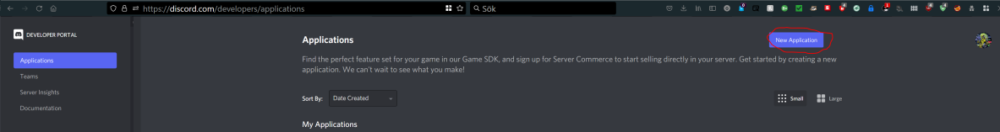
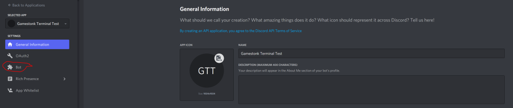
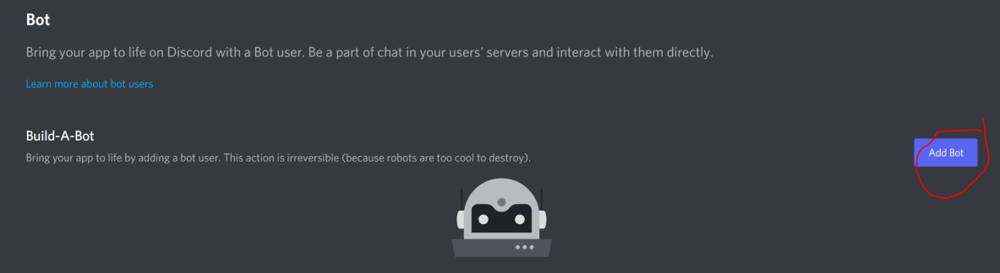
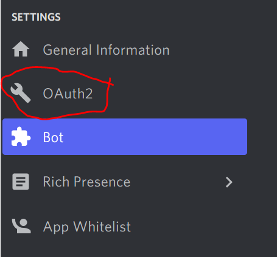
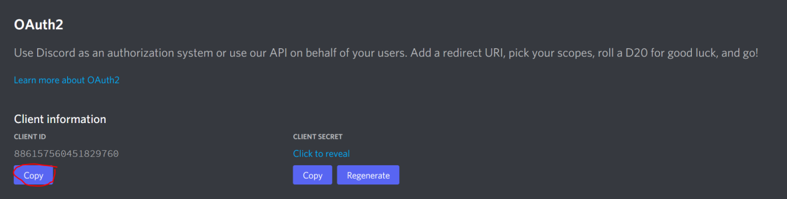
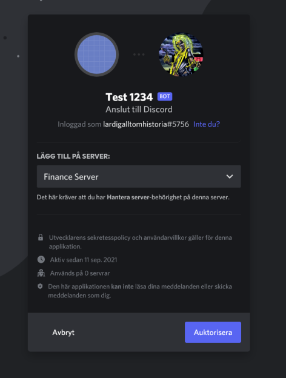
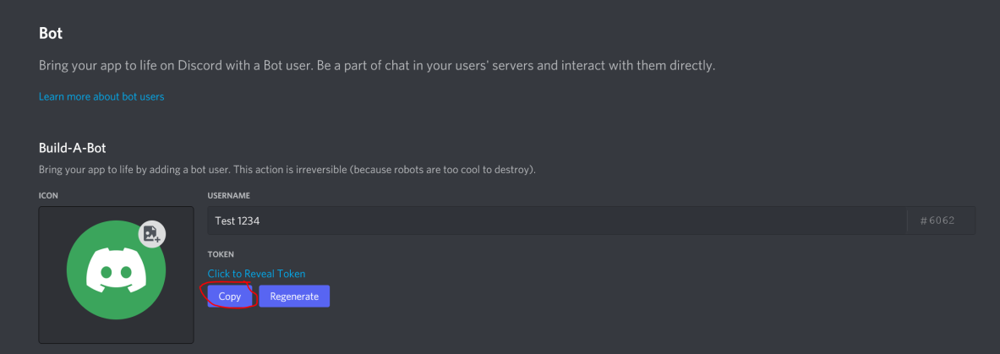
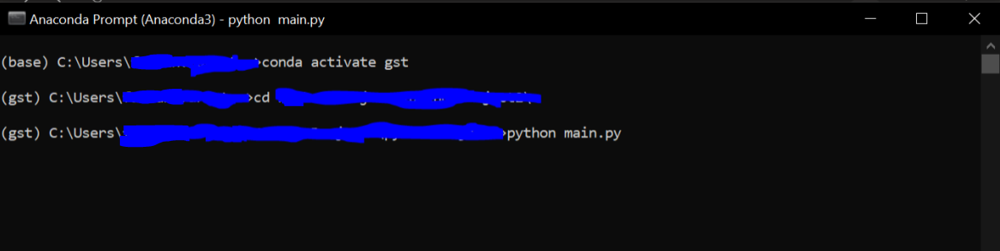

# DiscordBot
Implementation of a discord bot, which is WORK IN PROGRESS

<!-- PROJECT LOGO -->
<br />
<p align="center">
  <a href="https://github.com/GamestonkTerminal/DiscordBot">
    
  </a>

## Set Up

### Step 1: Getting a discord bot
Go to https://discord.com/developers/applications and click on "New Application" (See Picture 1)
Enter a name for example "Gamestonk Terminal Discord Bot"
Picture 1:

Then go to the bot page:

Then press "Add Bot":

Now go to your applications "OAuth2" Tab:


Then copy your Client ID:

Then invite your bot to your discord server by replacing the ENTERCLIENTID with your copied client ID in this url: https://discord.com/oauth2/authorize?client_id=ENTERCLIENTID&scope=bot (You can also do it on via this link generator https://discordapi.com/permissions.html where you can select the proper permissions)
After clicking the link you'll see something similar to this:

Register your app <a href="https://imgur.com/signin?redirect=http://api.imgur.com/oauth2/addclient" class="dy ie" rel="noopener ugc nofollow">here</a>. Choose “OAuth 2 authorization without a callback URL”. Registering is free for all open source projects and if your discord bot uses fewer than 1,250 uploads per day. You will receive an client ID and client secret once you submit the form.

### Step 2: Get the scripts to run the GST Discord Bot

(Note this assumes that you already have installed GST for more info about the installation: https://github.com/GamestonkTerminal/GamestonkTerminal#getting-started)

Download the code from this repository.

Then open the main.py file and go back to https://discord.com/developers/applications/ and go to your bot page. There you'll have to copy the token


Then change the settings in the beginning of main.py:
```
##############
## Settings ##
##############
DISCORD_BOT_TOKEN = 'string' # Insert your bots secrets token
IMGUR_CLIENT_ID = 'string' # Enter your imgur client id
COMMAND_PREFIX = '!' # Sets the prefix to the commands
activity = discord.Game(name='Gametonk Terminal: https://github.com/GamestonkTerminal/GamestonkTerminal')
gst_path = 'C:\\Users\\user\\GamestonkTerminal' # The path to Gamestonk Terminal
date_input_format = '%Y-%m-%d' # Enter your prefered date input format
```

### Step 3:
Activate your GST virtual enviroment and go to the place where your main.py file is located and run it.

Your finished! Go to your server and you should see the bot online!!!

## Code Structure and Contributing
The file system is built in the following way:
- Each context is one file unless it has categories and if it has it then it should have a file in the directory named context_main.py (example: Stocks has as a category Dark Pool Shorts -> stocks is a directory with a file stocks_main.py and dps is a file; economy has no categories -> economy is one file)
- The settings shall currently be in the main.py file (example: API keys)

A context/category file is built in the following way:
```
Imports

Functions
  Returns the embed or sends the response via pagination function from main

Class with the commands as cogs
  The Commands call the functions with given arguments
  Has one command with a list of the commands and can run them via emoji reactions from the user

Add the cogs class to the bot
```
If a funtion is often used by a context with categories or multiple files then add them to the context_main.py or the main.py file.

## Disclaimer
"A few things I am not. I am not a cat. I am not an institutional investor, nor am I a hedge fund. I do not have clients and I do not provide personalized investment advice for fees or commissions." DFV

Trading in financial instruments involves high risks including the risk of losing some, or all, of your investment amount, and may not be suitable for all investors. Before deciding to trade in financial instrument you should be fully informed of the risks and costs associated with trading the financial markets, carefully consider your investment objectives, level of experience, and risk appetite, and seek professional advice where needed. The data contained in GST is not necessarily accurate. GST Discord Bot/GST and any provider of the data contained in this website will not accept liability for any loss or damage as a result of your trading, or your reliance on the information displayed.
