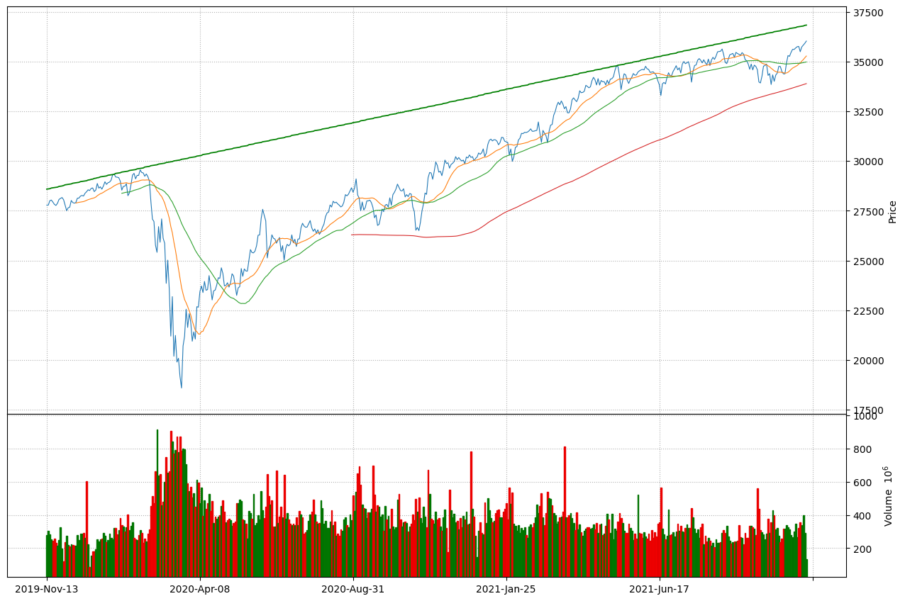
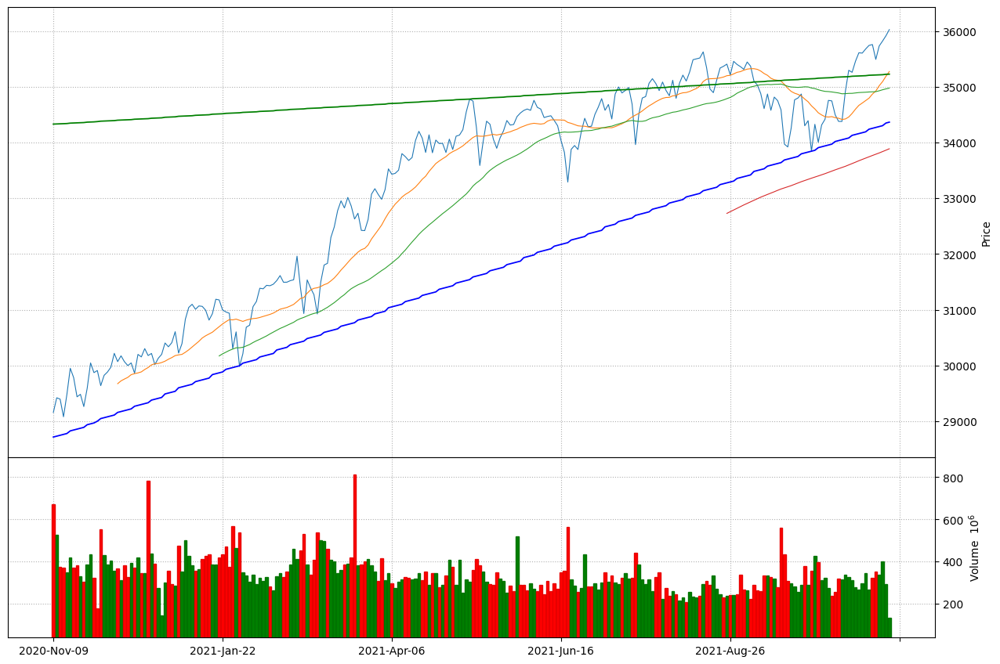
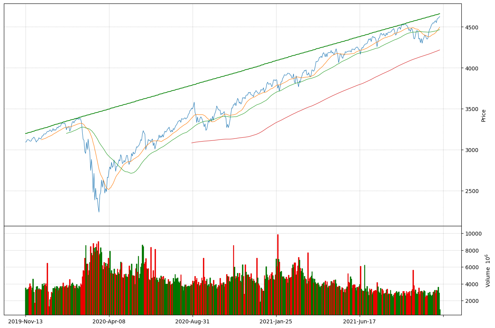
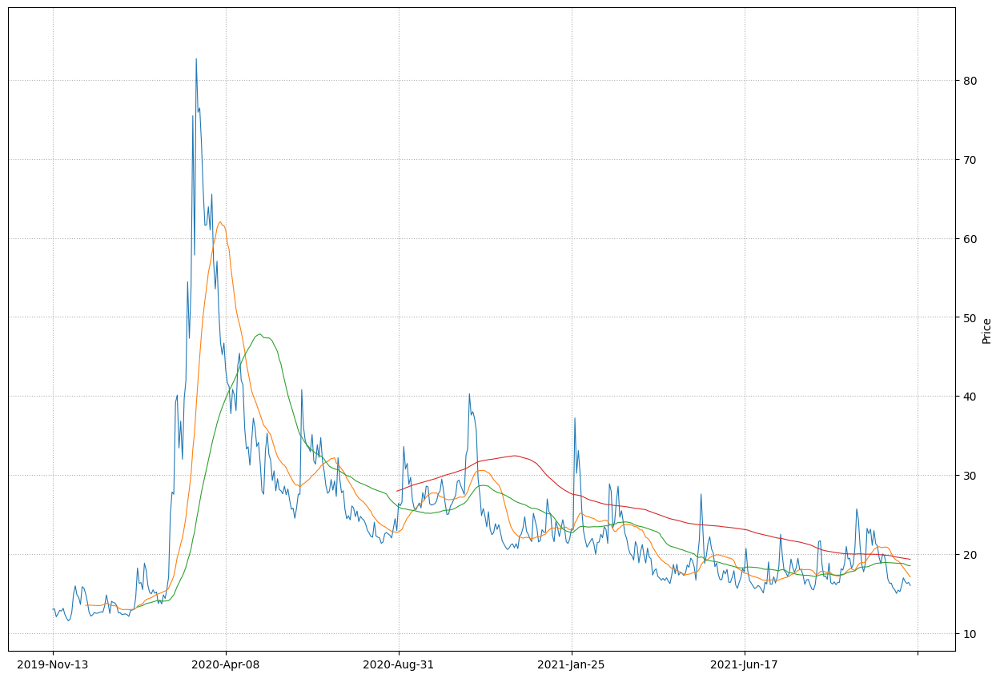
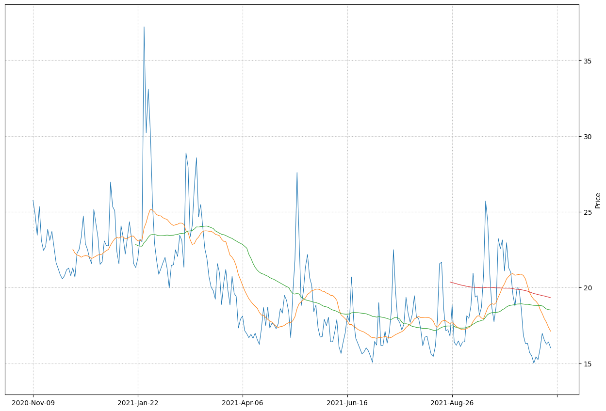
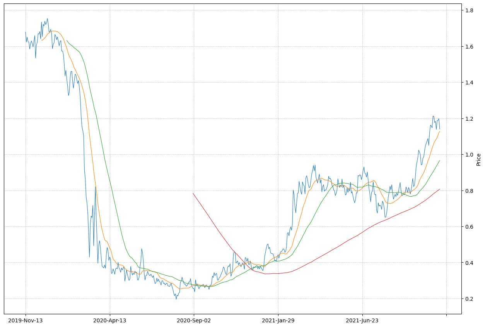
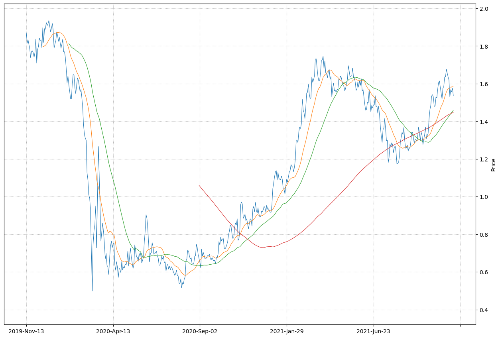

# Economy Data - 2021/11/02 16:16:06

## Dow Jones - 2 year trend with 20, 50 and 200 day SMA

    

    

## Dow Jones - 1 year trend with 20, 50 and 200 day SMA

    

    

## S&P 500 - 2 year trend with 20, 50 and 200 day SMA

    

    

## Market Volatility (VIX) - 2 year trend with  20, 50 and 200 day SMA

    

    

## Market Volatility (VIX) - 1 year trend with 20, 50 and 200 day SMA

    

    

## Yield on 5-Year US Treasury Notes - 2 year trend with 20, 50 and 200 day SMA

    

    

## Yield on 10-Year US Treasury Notes - 2 year trend with 20, 50 and 200 day SMA

    

    

## Yield on 30-Year US Treasury Notes - 2 year trend with 20, 50 and 200 day SMA

    

    

## Gold - 2 year trend with 20, 50 and 200 day SMA

## Silver - 2 year trend with 20, 50 and 200 day SMA

## Euro vs US Dollar - 2 year trend with 20, 50 and 200 day SMA

## Yen vs US Dollar - 2 year trend with 20, 50 and 200 day SMA

## Energy - 2 year trend with 20, 50 and 200 day SMA

## Crude Oil - 2 year trend with 20, 50 and 200 day SMA

## Real Estate - 2 year trend with 20, 50 and 200 day SMA

## Real Estate - 1 year trend with 20, 50 and 200 day SMA

## Financials - 2 year trend with 20, 50 and 200 day SMA

## Financials - 1 year trend with 20, 50 and 200 day SMA

## Materials - 2 year trend with 20, 50 and 200 day SMA

## Materials - 1 year trend with 20, 50 and 200 day SMA
