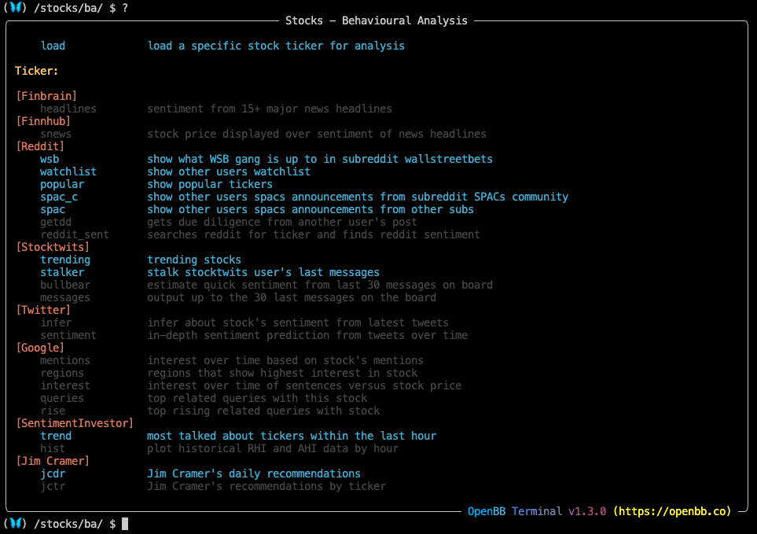
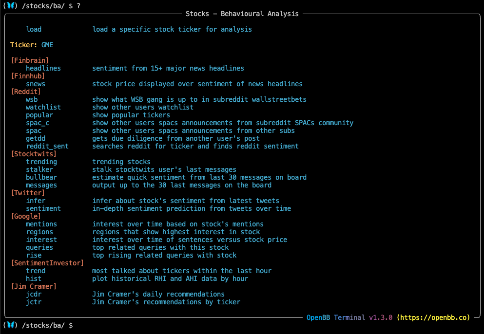
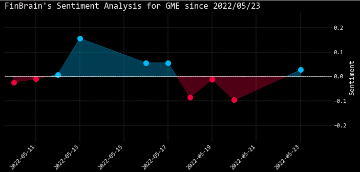
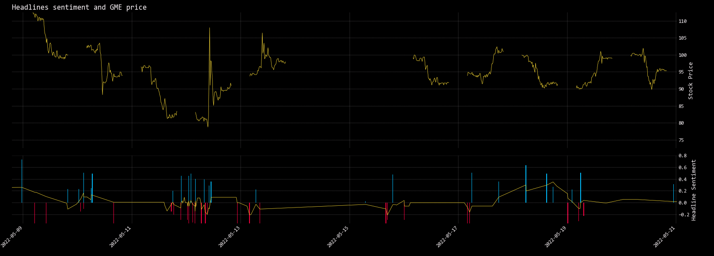
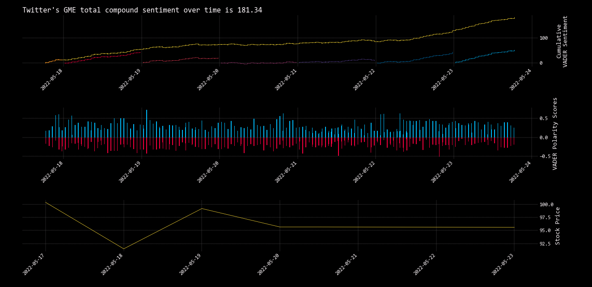
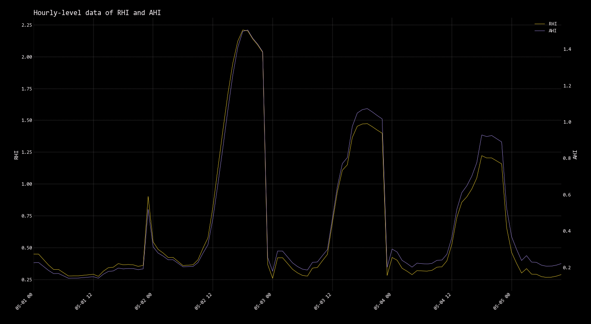
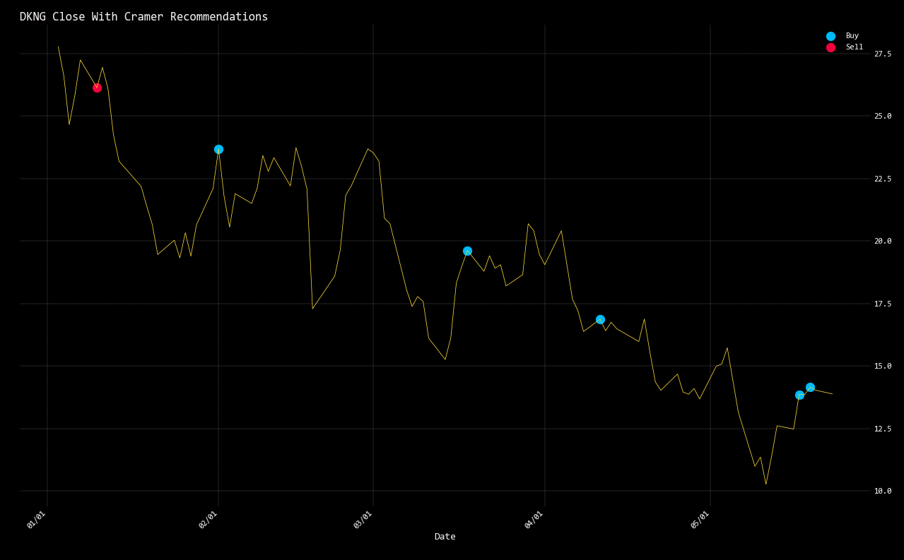

<h1>Introduction to the Behavioural Analysis Menu</h1>

The Behavioural Analysis submenu offers the user tools for guaging the overall public sentiment of a company online. The complexity of the tools range from message board scrapers to deep learning algorithms for financial analysis and prediction. Sentiment is particularly useful for momentum trading strategies, discovery, and general fundamental research. Navigate into the menu from the <a href="https://openbb-finance.github.io/OpenBBTerminal/terminal/introduction_to_stocks/" target="_blank">Stocks</a> menu by entering, `ba`; or, using absolute paths from anywhere in the Terminal: `/stocks/ba`

<br>

The commands with blue text here do not require a ticker, faded commands will turn blue when there is a ticker loaded.

````
(🦋) /stocks/ba/ $ load gme

Loading Daily GME stock with starting period 2019-05-20 for analysis.

Datetime: 2022 May 23 12:13
Timezone: America/New_York
Currency: USD
Market:   CLOSED
Company:  GameStop Corporation

(🦋) /stocks/ba/ $ ?
````
<br>

Some data sources will require a valid API key, which can be obtained for free and then set using the Keys menu. To use all of the features in this menu, obtain free API keys from these providers:

- <a href="https://finnhub.io/" target="_blank">Finnhub</a><br>
- <a href="https://developer.twitter.com/" target="_blank">Twitter</a><br>
- <a href="https://old.reddit.com/prefs/apps/" target="_blank">Reddit</a><br>
- <a href="https://sentimentinvestor.com/" target="_blank">Sentiment Investor</a><br>

See the <a href="https://openbb-finance.github.io/OpenBBTerminal/terminal/getting_started/#accessing-other-sources-of-data-via-api-keys" target="_blank">Getting Started Guide</a> for help setting API keys in the Terminal.

<h1></h1>
<h2>How to use the Behavioural Analysis Menu</h2><br>

As with every command, attaching `-h`, displays the help dialogue.

````
(🦋) /stocks/ba/ $ headlines -h
usage: headlines [-h] [--export EXPORT] [--raw]

FinBrain collects the news headlines from 15+ major financial news sources on a daily basis and analyzes them to generate sentiment scores for more than 4500 US stocks.FinBrain Technologies
develops deep learning algorithms for financial analysis and prediction, which currently serves traders from more than 150 countries all around the world. [Source: https://finbrain.tech]

optional arguments:
  -h, --help       show this help message (default: False)
  --export EXPORT  Export raw data into csv, json, xlsx and figure into png, jpg, pdf, svg (default: )
  --raw            Flag to display raw data (default: False)

(🦋) /stocks/ba/ $ headlines
````
<br>

````
(🦋) /stocks/ba/ $ snews -h
usage: snews [-h] [--export EXPORT]

Display stock price and headlines sentiment using VADER model over time. [Source: Finnhub]

optional arguments:
  -h, --help       show this help message (default: False)
  --export EXPORT  Export raw data into csv, json, xlsx and figure into png, jpg, pdf, svg (default: )

(🦋) /stocks/ba/ $ snews
````
<br>

The Reddit functions will return popular tickers and posts, or measure sentiment for a particular stock.

````
(🦋) /stocks/ba/ $ wsb

2022-05-23 10:00:12 - Daily Discussion Thread for May 23, 2022
https://old.reddit.com/r/wallstreetbets/comments/uvwq8z/daily_discussion_thread_for_may_23_2022/

                                 Reddit Submission                                 
┏━━━━━━━━━━━━━━━━┳━━━━━━━━━━━━━━━━━━┳━━━━━━━┳━━━━━━━━━━━━┳━━━━━━━━━━┳━━━━━━━━━━━━━┓
┃ Subreddit      ┃ Flair            ┃ Score ┃ # Comments ┃ Upvote % ┃ Awards      ┃
┡━━━━━━━━━━━━━━━━╇━━━━━━━━━━━━━━━━━━╇━━━━━━━╇━━━━━━━━━━━━╇━━━━━━━━━━╇━━━━━━━━━━━━━┩
│ wallstreetbets │ Daily Discussion │ 195   │ 9168       │ 88%      │ 3 Silver    │
│                │                  │       │            │          │ 2 Helpful   │
│                │                  │       │            │          │ 1 Wholesome │
│                │                  │       │            │          │ 1 Got the   │
└────────────────┴──────────────────┴───────┴────────────┴──────────┴─────────────┘

2022-05-21 11:34:21 - Most Anticipated Earnings Releases for the week beginning May 23rd, 2022
https://old.reddit.com/r/wallstreetbets/comments/uul9fs/most_anticipated_earnings_releases_for_the_week/

                                   Reddit Submission                                   
┏━━━━━━━━━━━━━━━━┳━━━━━━━━━━━━━━━━━┳━━━━━━━┳━━━━━━━━━━━━┳━━━━━━━━━━┳━━━━━━━━━━━━━━━━━━┓
┃ Subreddit      ┃ Flair           ┃ Score ┃ # Comments ┃ Upvote % ┃ Awards           ┃
┡━━━━━━━━━━━━━━━━╇━━━━━━━━━━━━━━━━━╇━━━━━━━╇━━━━━━━━━━━━╇━━━━━━━━━━╇━━━━━━━━━━━━━━━━━━┩
│ wallstreetbets │ Earnings Thread │ 960   │ 1325       │ 97%      │ 1 Silver         │
│                │                 │       │            │          │ 5 Helpful        │
│                │                 │       │            │          │ 3 Wholesome      │
│                │                 │       │            │          │ 1 Take My Energy │
│                │                 │       │            │          │ 1 Sne            │
└────────────────┴─────────────────┴───────┴────────────┴──────────┴──────────────────┘

2022-05-23 02:37:21 - 🔮WallStreetBets Predictions Tournament for May 2022🔮
https://old.reddit.com/r/wallstreetbets/comments/ug4ekc/wallstreetbets_predictions_tournament_for_may_2022/

                            Reddit Submission                            
┏━━━━━━━━━━━━━━━━┳━━━━━━━┳━━━━━━━━┳━━━━━━━━━━━━┳━━━━━━━━━━┳━━━━━━━━━━━━━┓
┃ Subreddit      ┃ Flair ┃ Score  ┃ # Comments ┃ Upvote % ┃ Awards      ┃
┡━━━━━━━━━━━━━━━━╇━━━━━━━╇━━━━━━━━╇━━━━━━━━━━━━╇━━━━━━━━━━╇━━━━━━━━━━━━━┩
│ wallstreetbets │ None  │ 113271 │ 468        │ 93%      │ 7 Silver    │
│                │       │        │            │          │ 14 Helpful  │
│                │       │        │            │          │ 14 Wholesom │
└────────────────┴───────┴────────┴────────────┴──────────┴─────────────┘

2022-05-23 04:20:33 - But now that 270k house is selling for 710k
https://old.reddit.com/r/wallstreetbets/comments/uvs1gf/but_now_that_270k_house_is_selling_for_710k/

                           Reddit Submission                            
┏━━━━━━━━━━━━━━━━┳━━━━━━━┳━━━━━━━┳━━━━━━━━━━━━┳━━━━━━━━━━┳━━━━━━━━━━━━━┓
┃ Subreddit      ┃ Flair ┃ Score ┃ # Comments ┃ Upvote % ┃ Awards      ┃
┡━━━━━━━━━━━━━━━━╇━━━━━━━╇━━━━━━━╇━━━━━━━━━━━━╇━━━━━━━━━━╇━━━━━━━━━━━━━┩
│ wallstreetbets │ Meme  │ 28402 │ 2237       │ 94%      │ 7 Wholesome │
│                │       │       │            │          │ 1 Gold      │
│                │       │       │            │          │ 3 Helpfu    │
└────────────────┴───────┴───────┴────────────┴──────────┴─────────────┘

2022-05-23 12:08:36 - The average post recently
https://old.reddit.com/r/wallstreetbets/comments/uvypvz/the_average_post_recently/

                           Reddit Submission                           
┏━━━━━━━━━━━━━━━━┳━━━━━━━┳━━━━━━━┳━━━━━━━━━━━━┳━━━━━━━━━━┳━━━━━━━━━━━━┓
┃ Subreddit      ┃ Flair ┃ Score ┃ # Comments ┃ Upvote % ┃ Awards     ┃
┡━━━━━━━━━━━━━━━━╇━━━━━━━╇━━━━━━━╇━━━━━━━━━━━━╇━━━━━━━━━━╇━━━━━━━━━━━━┩
│ wallstreetbets │ Meme  │ 2312  │ 55         │ 97%      │ 2 Wholesom │
└────────────────┴───────┴───────┴────────────┴──────────┴────────────┘

2022-05-23 13:49:25 - We're going to the moon. this useful chart proves it
https://old.reddit.com/r/wallstreetbets/comments/uw0n1w/were_going_to_the_moon_this_useful_chart_proves_it/

                          Reddit Submission                           
┏━━━━━━━━━━━━━━━━┳━━━━━━━┳━━━━━━━┳━━━━━━━━━━━━┳━━━━━━━━━━┳━━━━━━━━━━━┓
┃ Subreddit      ┃ Flair ┃ Score ┃ # Comments ┃ Upvote % ┃ Awards    ┃
┡━━━━━━━━━━━━━━━━╇━━━━━━━╇━━━━━━━╇━━━━━━━━━━━━╇━━━━━━━━━━╇━━━━━━━━━━━┩
│ wallstreetbets │ Chart │ 1004  │ 45         │ 95%      │ 1 Silver  │
│                │       │       │            │          │ 1 Helpful │
│                │       │       │            │          │ 1 Sne     │
└────────────────┴───────┴───────┴────────────┴──────────┴───────────┘

2022-05-23 15:42:14 - 💲 G M E 💵 The Data Reveals that a Historical Stock Phenomenon is Starting
https://old.reddit.com/r/wallstreetbets/comments/uw34pa/g_m_e_the_data_reveals_that_a_historical_stock/

                                Reddit Submission                                
┏━━━━━━━━━━━━━━━━┳━━━━━━━┳━━━━━━━┳━━━━━━━━━━━━┳━━━━━━━━━━┳━━━━━━━━━━━━━━━━━━━━━━┓
┃ Subreddit      ┃ Flair ┃ Score ┃ # Comments ┃ Upvote % ┃ Awards               ┃
┡━━━━━━━━━━━━━━━━╇━━━━━━━╇━━━━━━━╇━━━━━━━━━━━━╇━━━━━━━━━━╇━━━━━━━━━━━━━━━━━━━━━━┩
│ wallstreetbets │ Chart │ 670   │ 181        │ 87%      │ 1 LOVE!              │
│                │       │       │            │          │ 1 Moon               │
│                │       │       │            │          │ 1 Take My Power      │
│                │       │       │            │          │ 3 Wholesome          │
│                │       │       │            │          │ 10 All-Seeing Upvote │
│                │       │       │            │          │ 1 Take My Energy     │
│                │       │       │            │          │ 1 To The Stars       │
│                │       │       │            │          │ 1 Buy                │
│                │       │       │            │          │ 2 Silver             │
│                │       │       │            │          │ 3 Helpful            │
│                │       │       │            │          │ 1 Heartwarmin        │
└────────────────┴───────┴───────┴────────────┴──────────┴──────────────────────┘

2022-05-23 14:49:57 - Every single time
https://old.reddit.com/r/wallstreetbets/comments/uw1yco/every_single_time/

                         Reddit Submission                         
┏━━━━━━━━━━━━━━━━┳━━━━━━━┳━━━━━━━┳━━━━━━━━━━━━┳━━━━━━━━━━┳━━━━━━━━┓
┃ Subreddit      ┃ Flair ┃ Score ┃ # Comments ┃ Upvote % ┃ Awards ┃
┡━━━━━━━━━━━━━━━━╇━━━━━━━╇━━━━━━━╇━━━━━━━━━━━━╇━━━━━━━━━━╇━━━━━━━━┩
│ wallstreetbets │ Meme  │ 560   │ 65         │ 97%      │        │
└────────────────┴───────┴───────┴────────────┴──────────┴────────┘

2022-05-23 13:06:55 - Buy the rumor; the easiest play in town if you're patient enough to make it
https://old.reddit.com/r/wallstreetbets/comments/uvzsj5/buy_the_rumor_the_easiest_play_in_town_if_youre/

                                 Reddit Submission                                  
┏━━━━━━━━━━━━━━━━┳━━━━━━━━━━━━┳━━━━━━━┳━━━━━━━━━━━━┳━━━━━━━━━━┳━━━━━━━━━━━━━━━━━━━━┓
┃ Subreddit      ┃ Flair      ┃ Score ┃ # Comments ┃ Upvote % ┃ Awards             ┃
┡━━━━━━━━━━━━━━━━╇━━━━━━━━━━━━╇━━━━━━━╇━━━━━━━━━━━━╇━━━━━━━━━━╇━━━━━━━━━━━━━━━━━━━━┩
│ wallstreetbets │ Discussion │ 593   │ 288        │ 81%      │ 1 Silver           │
│                │            │       │            │          │ 1 Helpful          │
│                │            │       │            │          │ 2 Wholesome        │
│                │            │       │            │          │ 2 All-Seeing Upvot │
└────────────────┴────────────┴───────┴────────────┴──────────┴────────────────────┘

2022-05-23 11:30:46 - STOP POSTING USELESS CHART SCREENSHOTS ON WSB!!!
https://old.reddit.com/r/wallstreetbets/comments/uvy3b8/stop_posting_useless_chart_screenshots_on_wsb/

                                  Reddit Submission                                  
┏━━━━━━━━━━━━━━━━┳━━━━━━━━━━━━┳━━━━━━━┳━━━━━━━━━━━━┳━━━━━━━━━━┳━━━━━━━━━━━━━━━━━━━━━┓
┃ Subreddit      ┃ Flair      ┃ Score ┃ # Comments ┃ Upvote % ┃ Awards              ┃
┡━━━━━━━━━━━━━━━━╇━━━━━━━━━━━━╇━━━━━━━╇━━━━━━━━━━━━╇━━━━━━━━━━╇━━━━━━━━━━━━━━━━━━━━━┩
│ wallstreetbets │ Discussion │ 542   │ 125        │ 84%      │ 2 Silver            │
│                │            │       │            │          │ 1 Helpful           │
│                │            │       │            │          │ 1 Wholesome         │
│                │            │       │            │          │ 1 All-Seeing Upvote │
│                │            │       │            │          │ 1 Prid              │
└────────────────┴────────────┴───────┴────────────┴──────────┴─────────────────────┘
````
`trending` collects trending tickers from <a href="https://stocktwits.com" target="_blank">Stocktwits</a> and displays as a table.
````
                                        Trending Stocks                                        
┏━━━━━━━━┳━━━━━━━━━━━━━━━━━┳━━━━━━━━━━━━━━━━━━━━━━━━━━━━━━━━━━━━━━━━━━━━━━━━━━━━━━━━━━━━━━━━━━┓
┃ Ticker ┃ Watchlist Count ┃ Name                                                             ┃
┡━━━━━━━━╇━━━━━━━━━━━━━━━━━╇━━━━━━━━━━━━━━━━━━━━━━━━━━━━━━━━━━━━━━━━━━━━━━━━━━━━━━━━━━━━━━━━━━┩
│ LKNCY  │ 35314.00        │ Luckin Coffee Inc - ADR                                          │
├────────┼─────────────────┼──────────────────────────────────────────────────────────────────┤
│ ZM     │ 64127.00        │ Zoom Video Communications Inc - Ordinary Shares - Class A        │
├────────┼─────────────────┼──────────────────────────────────────────────────────────────────┤
│ BBY    │ 16630.00        │ Best Buy Co. Inc.                                                │
├────────┼─────────────────┼──────────────────────────────────────────────────────────────────┤
│ REQ.X  │ 9096.00         │ Request Network                                                  │
├────────┼─────────────────┼──────────────────────────────────────────────────────────────────┤
│ SIGA   │ 4390.00         │ SIGA Technologies Inc                                            │
├────────┼─────────────────┼──────────────────────────────────────────────────────────────────┤
│ RDBX   │ 13082.00        │ Redbox Entertainment Inc - Ordinary Shares - Class A             │
├────────┼─────────────────┼──────────────────────────────────────────────────────────────────┤
│ BGXX   │ 756.00          │ Bright Green Corp                                                │
├────────┼─────────────────┼──────────────────────────────────────────────────────────────────┤
│ JPM    │ 75144.00        │ JPMorgan Chase & Co.                                             │
├────────┼─────────────────┼──────────────────────────────────────────────────────────────────┤
│ PSTH   │ 24436.00        │ Pershing Square Tontine Holdings Ltd - Ordinary Shares - Class A │
├────────┼─────────────────┼──────────────────────────────────────────────────────────────────┤
│ ABNB   │ 45335.00        │ AIRBNB INC                                                       │
├────────┼─────────────────┼──────────────────────────────────────────────────────────────────┤
│ TRX.X  │ 35697.00        │ Tron                                                             │
├────────┼─────────────────┼──────────────────────────────────────────────────────────────────┤
│ ZIM    │ 7192.00         │ Zim Integrated Shipping Services Ltd                             │
├────────┼─────────────────┼──────────────────────────────────────────────────────────────────┤
│ KOLD   │ 4186.00         │ ProShares Trust - ProShares UltraShort Bloomberg Natural Gas     │
├────────┼─────────────────┼──────────────────────────────────────────────────────────────────┤
│ BBAI   │ 2473.00         │ BigBear.ai Holdings Inc                                          │
├────────┼─────────────────┼──────────────────────────────────────────────────────────────────┤
│ LRC.X  │ 20403.00        │ Loopring                                                         │
├────────┼─────────────────┼──────────────────────────────────────────────────────────────────┤
│ GNTX   │ 924.00          │ Gentex Corp.                                                     │
├────────┼─────────────────┼──────────────────────────────────────────────────────────────────┤
│ BAC    │ 125663.00       │ BANK OF AMERICA CORPORATION                                      │
├────────┼─────────────────┼──────────────────────────────────────────────────────────────────┤
│ UTHR   │ 1810.00         │ United Therapeutics Corp                                         │
├────────┼─────────────────┼──────────────────────────────────────────────────────────────────┤
│ NOC    │ 7220.00         │ Northrop Grumman Corp.                                           │
├────────┼─────────────────┼──────────────────────────────────────────────────────────────────┤
│ LQDA   │ 3075.00         │ Liquidia Corp                                                    │
├────────┼─────────────────┼──────────────────────────────────────────────────────────────────┤
│ ENV    │ 346.00          │ Envestnet Inc.                                                   │
├────────┼─────────────────┼──────────────────────────────────────────────────────────────────┤
│ NGVC   │ 770.00          │ Natural Grocers by Vitamin Cottage Inc                           │
├────────┼─────────────────┼──────────────────────────────────────────────────────────────────┤
│ VMW    │ 9263.00         │ Vmware Inc. - Ordinary Shares - Class A                          │
├────────┼─────────────────┼──────────────────────────────────────────────────────────────────┤
│ EXPO   │ 226.00          │ Exponent Inc.                                                    │
├────────┼─────────────────┼──────────────────────────────────────────────────────────────────┤
│ CVGI   │ 979.00          │ Commercial Vehicle Group Inc                                     │
├────────┼─────────────────┼──────────────────────────────────────────────────────────────────┤
│ FSBC   │ nan             │ Five Star Bancorp                                                │
├────────┼─────────────────┼──────────────────────────────────────────────────────────────────┤
│ DKS    │ 6185.00         │ Dicks Sporting Goods, Inc.                                       │
├────────┼─────────────────┼──────────────────────────────────────────────────────────────────┤
│ BKNG   │ 15912.00        │ Booking Holdings Inc                                             │
├────────┼─────────────────┼──────────────────────────────────────────────────────────────────┤
│ SNPO   │ 132.00          │ Snap One Holdings Corp                                           │
├────────┼─────────────────┼──────────────────────────────────────────────────────────────────┤
│ VXX    │ 30217.00        │ iPath S&P 500 VIX Short-Term Futures ETN                         │
└────────┴─────────────────┴──────────────────────────────────────────────────────────────────┘
````
Scan Twitter for company sentiment.
````
(🦋) /stocks/ba/ $ sentiment -h
usage: sentiment [-l LIMIT] [-d N_DAYS_PAST] [-c] [-h] [--export EXPORT]

Plot in-depth sentiment predicted from tweets from last days that contain pre-defined ticker. [Source: Twitter]

optional arguments:
  -l LIMIT, --limit LIMIT
                        limit of tweets to extract per hour. (default: 15)
  -d N_DAYS_PAST, --days N_DAYS_PAST
                        number of days in the past to extract tweets. (default: 6)
  -c, --compare         show corresponding change in stock price (default: False)
  -h, --help            show this help message (default: False)
  --export EXPORT       Export raw data into csv, json, xlsx and figure into png, jpg, pdf, svg (default: )

(🦋) /stocks/ba/ $ sentiment -c
From 2022-05-23 retrieving 360 tweets (15 tweets/hour)
From 2022-05-22 retrieving 360 tweets (15 tweets/hour)
From 2022-05-21 retrieving 360 tweets (15 tweets/hour)
From 2022-05-20 retrieving 360 tweets (15 tweets/hour)
From 2022-05-19 retrieving 360 tweets (15 tweets/hour)
From 2022-05-18 retrieving 360 tweets (15 tweets/hour)
From 2022-05-17 retrieving 360 tweets (15 tweets/hour)
````


````
(🦋) /stocks/ba/ $ infer -h
usage: infer [-l LIMIT] [-h] [--export EXPORT]

Print quick sentiment inference from last tweets that contain the ticker. This model splits the text into character-level tokens and uses vader sentiment analysis. [Source: Twitter]

optional arguments:
  -l LIMIT, --limit LIMIT
                        limit of latest tweets to infer from. (default: 100)
  -h, --help            show this help message (default: False)
  --export EXPORT       Export raw data into csv, json, xlsx (default: )

(🦋) /stocks/ba/ $ infer
From: 2022-05-23 18:21:12
To:   2022-05-23 18:30:36
100 tweets were analyzed.
Frequency of approx 1 tweet every 6 seconds.
The summed compound sentiment of GME is: 18.42
The average compound sentiment of GME is: 0.18
Of the last 100 tweets, 41.00 % had a higher positive sentiment
Of the last 100 tweets, 19.00 % had a higher negative sentiment
````
`queries` returns a list of the top related Google searches for the loaded ticker.

````
(🦋) /stocks/ba/ $ queries

 Top GME's related queries 
┏━━━━━━━━━━━━━━━━━┳━━━━━━━┓
┃ query           ┃ value ┃
┡━━━━━━━━━━━━━━━━━╇━━━━━━━┩
│ stock gme       │ 100%  │
├─────────────────┼───────┤
│ amc             │ 29%   │
├─────────────────┼───────┤
│ amc stock       │ 24%   │
├─────────────────┼───────┤
│ gme price       │ 23%   │
├─────────────────┼───────┤
│ gme stock price │ 14%   │
├─────────────────┼───────┤
│ gme share       │ 7%    │
├─────────────────┼───────┤
│ gme share price │ 6%    │
├─────────────────┼───────┤
│ reddit          │ 6%    │
├─────────────────┼───────┤
│ gme reddit      │ 6%    │
├─────────────────┼───────┤
│ bb              │ 5%    │
└─────────────────┴───────┘
````
<a href="https://sentimentinvestor.com" target="_blank">Sentiment Investor</a> analyzes millions of messages to show the most talked about stocks by hour.

````
(🦋) /stocks/ba/ $ trend -h
usage: trend [-s START] [-hr HOUR] [-n NUMBER] [-h] [--export EXPORT] [-l LIMIT]

Show most talked about tickers within the last one hour

optional arguments:
  -s START, --start START
                        The starting date (format YYYY-MM-DD). Default: Today (default: 2022-05-23)
  -hr HOUR, --hour HOUR
                        Hour of the day in the 24-hour notation. Example: 14 (default: 0)
  -n NUMBER, --number NUMBER
                        Number of results returned from Sentiment Investor. Default: 10 (default: 10)
  -h, --help            show this help message (default: False)
  --export EXPORT       Export raw data into csv, json, xlsx (default: )
  -l LIMIT, --limit LIMIT
                        Number of entries to show in data. (default: 10)

(🦋) /stocks/ba/ $ trend

Most trending stocks at 2022-05-23 00:00 
┏━━━━━━━━┳━━━━━━━┳━━━━━━━━┳━━━━━━┳━━━━━━┓
┃ TICKER ┃ TOTAL ┃ LIKES  ┃ RHI  ┃ AHI  ┃
┡━━━━━━━━╇━━━━━━━╇━━━━━━━━╇━━━━━━╇━━━━━━┩
│ SPY    │ 89.00 │ 43.00  │ 1.22 │ 1.26 │
├────────┼───────┼────────┼──────┼──────┤
│ AMC    │ 80.00 │ 155.00 │ 1.07 │ 1.18 │
├────────┼───────┼────────┼──────┼──────┤
│ TSLA   │ 80.00 │ 78.00  │ 1.07 │ 1.34 │
├────────┼───────┼────────┼──────┼──────┤
│ BTC    │ 62.00 │ 74.00  │ 1.14 │ 1.09 │
├────────┼───────┼────────┼──────┼──────┤
│ NIO    │ 50.00 │ 14.00  │ 1.17 │ 1.15 │
├────────┼───────┼────────┼──────┼──────┤
│ AAPL   │ 28.00 │ 4.00   │ 0.66 │ 0.75 │
├────────┼───────┼────────┼──────┼──────┤
│ AMD    │ 26.00 │ 59.00  │ 0.57 │ 0.61 │
├────────┼───────┼────────┼──────┼──────┤
│ NVAX   │ 13.00 │ 4.00   │ 0.47 │ 0.40 │
├────────┼───────┼────────┼──────┼──────┤
│ NVDA   │ 12.00 │ 11.00  │ 0.45 │ 0.47 │
├────────┼───────┼────────┼──────┼──────┤
│ DIS    │ 12.00 │ 1.00   │ 0.69 │ 0.44 │
└────────┴───────┴────────┴──────┴──────┘
````
`hist` Plots historical sentiment data as indexes.

````
(🦋) /stocks/ba/ $ hist -h
usage: hist [-s START] [-e END] [-n NUMBER] [-h] [--export EXPORT] [--raw] [-l LIMIT]

Plot historical sentiment data of RHI and AHI by hour

optional arguments:
  -s START, --start START
                        The starting date (format YYYY-MM-DD) of the stock. Default: 7 days ago (default: 2022-05-16)
  -e END, --end END     The ending date (format YYYY-MM-DD) of the stock. Default: today (default: 2022-05-23)
  -n NUMBER, --number NUMBER
                        Number of results returned from Sentiment Investor. Default: 100 (default: 100)
  -h, --help            show this help message (default: False)
  --export EXPORT       Export raw data into csv, json, xlsx and figure into png, jpg, pdf, svg (default: )
  --raw                 Flag to display raw data (default: False)
  -l LIMIT, --limit LIMIT
                        Number of entries to show in data. (default: 10)

(🦋) /stocks/ba/ $ hist -s 2022-05-01
````
<br>

Inspired by the Twitter user, <a href="https://twitter.com/CramerTracker" source="_blank">@cramertracker</a>, the final two features follow (CNBC Talking Head) Jim Cramer stock recommendations as satire that rings true.

````
(🦋) /stocks/ba/ $ jcdr

                         Jim Cramer Recommendations for 05/19                         
┏━━━━━━━━━━━━━━━━━━━━━━━━┳━━━━━━━━┳━━━━━━━━┳━━━━━━━━━━━┳━━━━━━━━━━━━┳━━━━━━━━━━━━━━━━┓
┃ Company                ┃ Symbol ┃ Price  ┃ LastPrice ┃ Change (%) ┃ Recommendation ┃
┡━━━━━━━━━━━━━━━━━━━━━━━━╇━━━━━━━━╇━━━━━━━━╇━━━━━━━━━━━╇━━━━━━━━━━━━╇━━━━━━━━━━━━━━━━┩
│ Apple                  │ AAPL   │ 137.35 │ 142.38    │ 3.53       │ Buy            │
├────────────────────────┼────────┼────────┼───────────┼────────────┼────────────────┤
│ AeroVironment          │ AVAV   │ 85.35  │ 85.49     │ 0.16       │ Buy            │
├────────────────────────┼────────┼────────┼───────────┼────────────┼────────────────┤
│ Alibaba                │ BABA   │ 87.69  │ 87.04     │ -0.75      │ Sell           │
├────────────────────────┼────────┼────────┼───────────┼────────────┼────────────────┤
│ Constellation Energy   │ CEG    │ 57.23  │ 56.92     │ -0.54      │ Buy            │
├────────────────────────┼────────┼────────┼───────────┼────────────┼────────────────┤
│ Costco                 │ COST   │ 422.93 │ 427.93    │ 1.17       │ Buy            │
├────────────────────────┼────────┼────────┼───────────┼────────────┼────────────────┤
│ DraftKings             │ DKNG   │ 14.15  │ 13.89     │ -1.87      │ Buy            │
├────────────────────────┼────────┼────────┼───────────┼────────────┼────────────────┤
│ Lockheed Martin        │ LMT    │ 425.62 │ 433.71    │ 1.87       │ Buy            │
├────────────────────────┼────────┼────────┼───────────┼────────────┼────────────────┤
│ Cloudflare             │ NET    │ 58.00  │ 56.92     │ -1.90      │ Buy            │
├────────────────────────┼────────┼────────┼───────────┼────────────┼────────────────┤
│ Northrop Grumman       │ NOC    │ 448.50 │ 456.57    │ 1.77       │ Buy            │
├────────────────────────┼────────┼────────┼───────────┼────────────┼────────────────┤
│ NVIDIA                 │ NVDA   │ 171.24 │ 168.29    │ -1.75      │ Buy            │
├────────────────────────┼────────┼────────┼───────────┼────────────┼────────────────┤
│ Palo Alto Networks     │ PANW   │ 436.37 │ 502.69    │ 13.19      │ Buy            │
├────────────────────────┼────────┼────────┼───────────┼────────────┼────────────────┤
│ PLBY Group             │ PLBY   │ 9.06   │ 9.26      │ 2.16       │ Sell           │
├────────────────────────┼────────┼────────┼───────────┼────────────┼────────────────┤
│ Raytheon Technologies  │ RTX    │ 90.25  │ 91.87     │ 1.76       │ Buy            │
├────────────────────────┼────────┼────────┼───────────┼────────────┼────────────────┤
│ SoFi Technologies      │ SOFI   │ 7.75   │ 7.30      │ -6.16      │ Buy            │
└────────────────────────┴────────┴────────┴───────────┴────────────┴────────────────┘
````

<br>

Back to <a href="https://openbb-finance.github.io/OpenBBTerminal/terminal/introduction_to_stocks/" target="_blank">Stocks</a>