<h1>Introduction to the Comparison Analysis Menu</h1>

The Comparison Analysis menu provides the user with tools for:
  - searching and populating a list of companies that are similar to the loaded ticker.
  - building a correlation matrix.
  - comparing the price and volume history of multiple companies.
  - comparing financial statements, technical performance, and ownership statistics of otherwise similar companies.
  - comparing sentiment of similar companies.
  - building a list of companies to use features from the <a href="https://openbb-finance.github.io/OpenBBTerminal/terminal/portfolio/po/" target="_blank"> Portfolio Optimization menu</a>.

To use all features in this menu, the following <a href="https://openbb-finance.github.io/OpenBBTerminal/terminal/#accessing-other-sources-of-data-via-api-keys" target="_blank">API keys (free) </a> must be obtained by the user:

  - <a href="https://finnhub.io/" target="_blank">Finnhub</a> `getfinnhub`
  - <a href="https://polygon.io/" target="_blank">Polygon</a> `getpoly`

It is not necessary to load a ticker from the <a href="https://openbb-finance.github.io/OpenBBTerminal/terminal/stocks/" target="_blank">`stocks`</a> menu to use these features. Enter Comparison Analysis submenu by tpying `ca` and pressing `enter`.

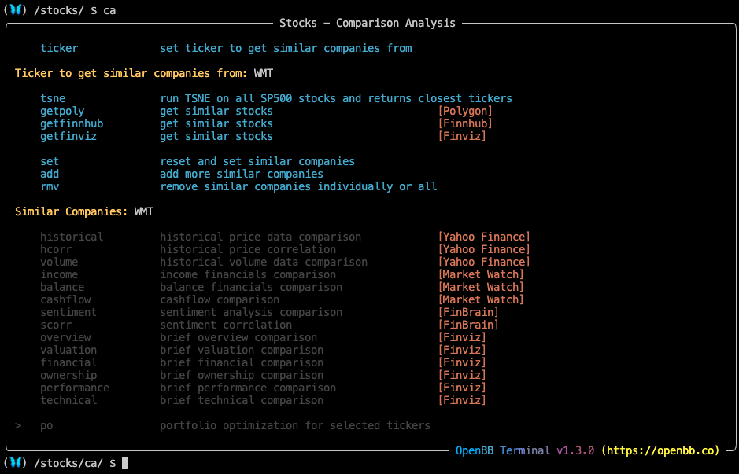

<h2>How to use the Comparison Analysis Menu</h2>

To add a primary ticker, or to swap it for another, enter `ticker AMZN`. The three commands: `getfinnhub`, `getpoly`, & `getfinviz` all provide a similar function. Sources may return different results, try all three and pick the best.

````
(🦋) /stocks/ca/ $ getfinviz
[Finviz] Similar Companies: WMT, BIG, BJ, COST, DG, DLTR, OLLI, PSMT, TGT, TUEM 

(🦋) /stocks/ca/ $ getpoly
[Polygon] Similar Companies: WMT, AMZN, COST, EBAY, DLTR, KSS, JCP, TGT, M, DG

(🦋) /stocks/ca/ $ getfinnhub
[Finnhub] Similar Companies: WMT, COST, BJ, PSMT
````
Using any of these commands will automatically populate the list of similar companies for analysis. `add` & `rmv` allows the user to make modifications, or create a list from scratch.

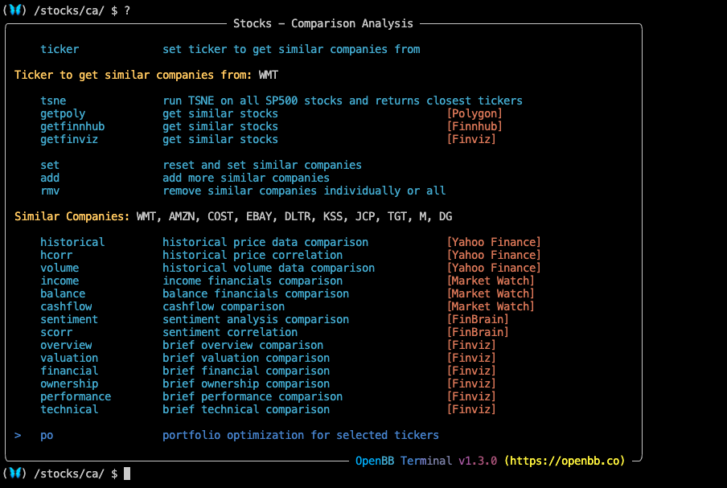

To show a correlation matrix, use the `hcorr` command. The start dates can be modified, which changes the results, to show correlation over different periods.

One year correlation matrix:
`hcorr`

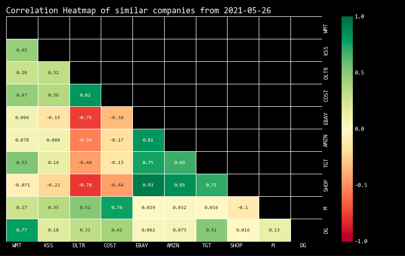<br>

YTD correlation matrix:
`hcorr -s 2022-01-01`

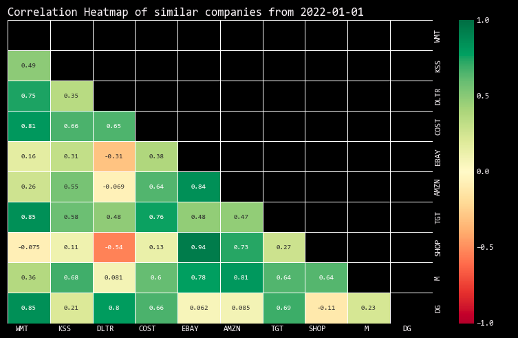<br>

The list of similar companies can be compared by a number of fundamental metrics. `valuation` displays earnings and valuation multiples.

`(🦋) /stocks/ca/ $ valuation`

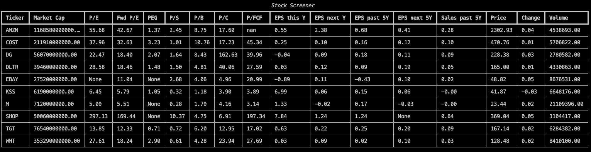<br>

`(🦋) /stocks/ca/ $ performance` compares technical performance of similar companies:

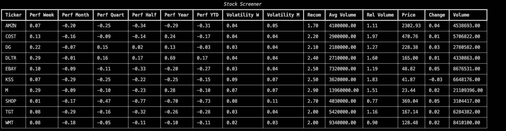<br>

`sentiment` is a chart from  <a href="https://finbrain.tech" target="_blank">Finbrain</a> that shows sentiment over the last ten days.

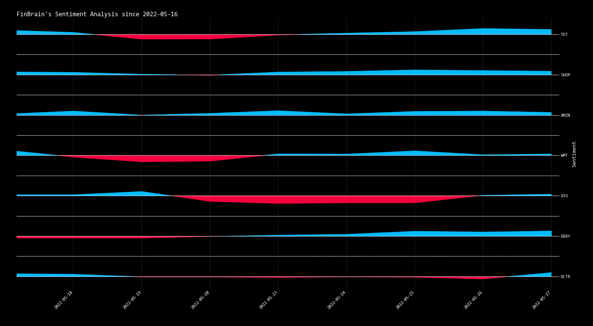<br>

This list of similar companies can be imported directly to the <a href="https://openbb-finance.github.io/OpenBBTerminal/terminal/portfolio/po/" target="_blank">Portfolio Optimization</a> menu by using the command, `po`.

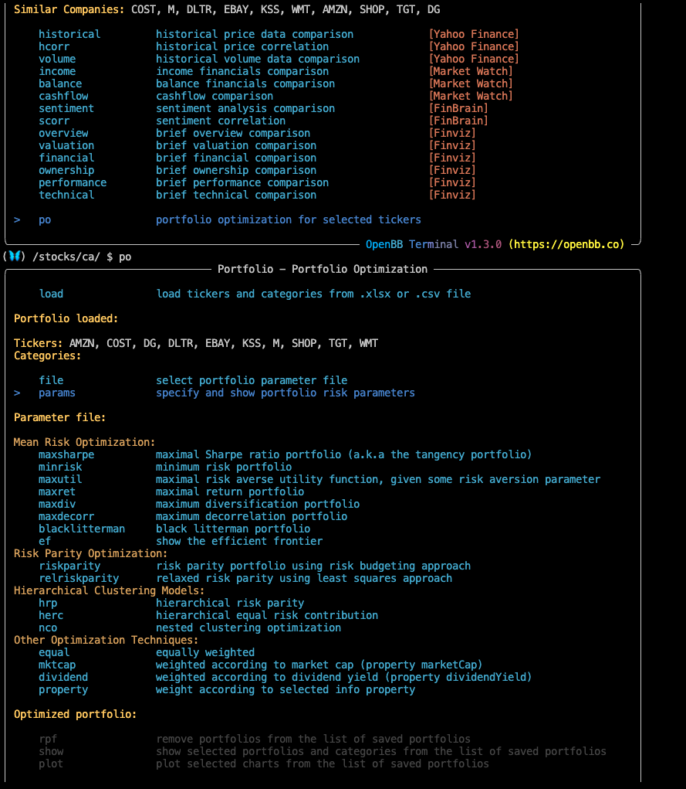<br>

<h2>Examples</h2>

The correlation matrix can also be used in other ways, like measuring sectors or asset classes. The chart below is a daily, price-normalized, comparison of S&P, NASDAQ, and BTC futures.

````
(🦋) /stocks/ca/ $ add es=f
[Custom] Similar Companies: ES=F, NQ=F, BTC=F 

(🦋) /stocks/ca/ $ historical -n
````
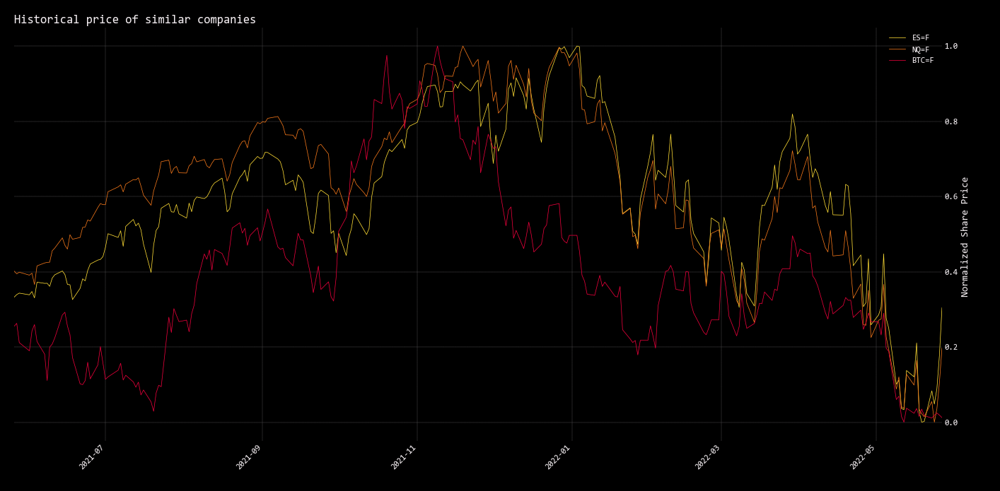<br>

This is a chart of the NASDAQ 100 Index, and three different futures contracts that are trading against it.

````
(🦋) /stocks/ca/ $ set ^NDX,NQH23.CME,NQZ22.CME,NQ=F
[Custom] Similar Companies: ^NDX, NQH23.CME, NQZ22.CME, NQ=F 

(🦋) /stocks/ca/ $ historical
````
<br>

Compare financial statements of the ten largest US banks.

````
(🦋) /stocks/ca/ $ set C,USB,WFC,JPM,TD,GS,PNC,TFC,BAC,COF
[Custom] Similar Companies: C, USB, WFC, JPM, TD, COF, PNC, TFC, BAC, GS 
(🦋) /stocks/ca/ $ cashflow
````
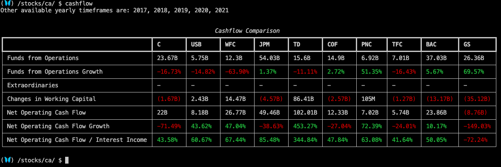<br>

Compare the income statements.

````
(🦋) /stocks/ca/ $ income
````
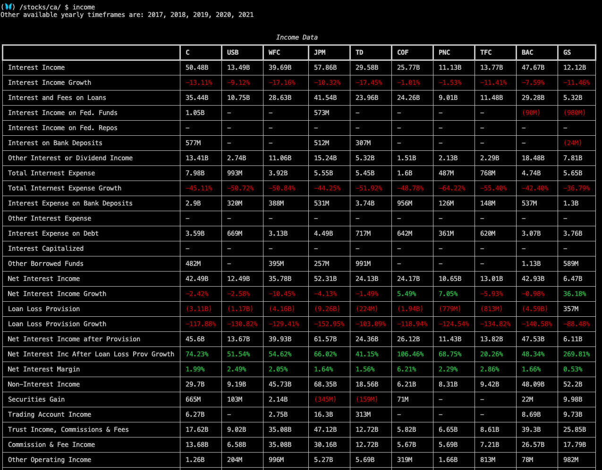<br>

Back to <a href="https://openbb-finance.github.io/OpenBBTerminal/terminal/stocks/" target="_blank"> `stocks`</a>. To run a demonstration of the commands presented here, in the OpenBB Terminal, run this command from the home menu: `exe routines/comparison_demo.openbb`
