<h1>An Introduction to the Dark Pools & Short Data Menu</h1>

Dark Pools and short selling are both, controversial and mysterious, subjects. The lack of disclosure for short sales and dark pool trades makes a lot of guess-work. It is a good idea to read through some research on the topic available from the SEC:
  - <a href="https://www.sec.gov/marketstructure/research/ats_data_paper_october_2013.pdf" target="_blank">Alternative Trading Systems: Description of ATS Trading in National Market System Stocks</a>
  - <a href="https://www.sec.gov/news/statement/shedding-light-on-dark-pools.html" target="_blank">Shedding Light on Dark Pools</a>
  - <a href="https://www.sec.gov/dera/staff-papers" target="_blank">Staff Papers and Analyses</a>

The purpose of this menu is to provide the user with tools for guaging the level of short interest, FTD rate, and off-exchange volume in a <a href="https://www.law.cornell.edu/cfr/text/17/242.600" target="_blank">NMS security</a>. There are also commands for looking at market as a whole. Enter the submenu from the <a href="https://openbb-finance.github.io/OpenBBTerminal/terminal/stocks/" target="_blank">Stocks menu</a> by typing, `dps`, and hitting `enter`.

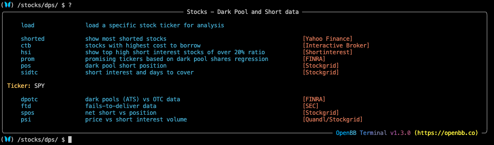<br>

To use every feature in the Dark Pools menu, an API key for <a href="https://www.quandl.com/" target="_blank">Quandl</a> must be obtained (for free) and authorized on the local installation. See the <a href="https://openbb-finance.github.io/OpenBBTerminal/terminal/#accessing-other-sources-of-data-via-api-keys" target="_blank">Getting Started Guide</a> for help setting up the API keys in the OpenBB Terminal. The four commands at the bottom of the menu rely on a loaded ticker while the six above do not.

<h2>How to use the Dark Pools Menu</h2><br>

The commands which are not ticker-specific provide screener-like utility. A list of the most-shorted stocks, according to Yahoo Finance, is displayed with the `shorted` command. It should be noted that this menu is only able to provide data for SEC-regulated equities.

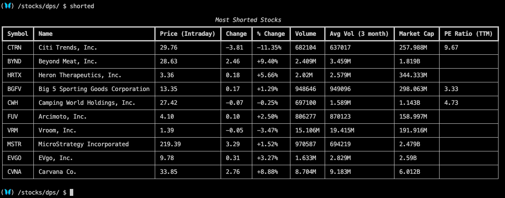<br>

`hsi` is another <a href="https://highshortinterest.com" target="_blank">source</a> for the same list. There will be slight variations between the two.

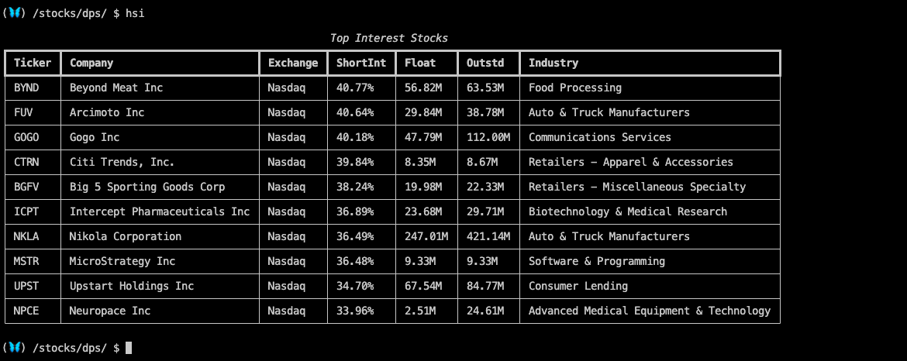<br>

`prom` performs a linear regression to scan for tickers with growing trade activity on ATS tapes, reported to <a href="https://otctransparency.finra.org/otctransparency/AtsIssueData" target="_blank">FINRA</a>.<br>
````
(🦋) /stocks/dps/ $ prom -n 50 -l 5 -t T1
Processing Tier T1 ...
Processing regression on 50 promising tickers ...
````
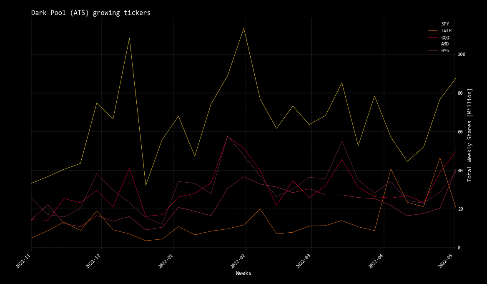<br>

Tier 2 NMS Tickers:
````
(🦋) /stocks/dps/ $ prom -n 50 -l 5 -t T2
Processing Tier T2 ...
Processing regression on 50 promising tickers ...
````

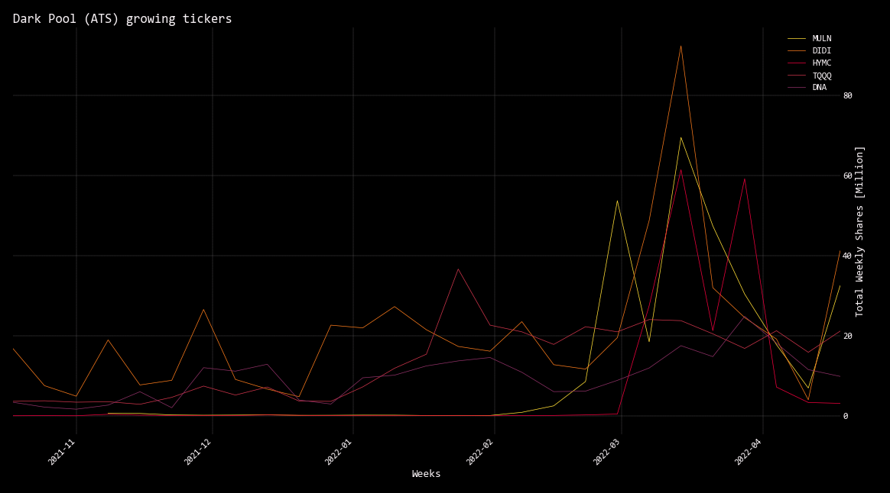<br>

Tier 3 OTCE Tickers:
````
(🦋) /stocks/dps/ $ prom -n 50 -l 5 -t OTCE
Processing Tier OTCE ...
Processing regression on 50 promising tickers ...
````
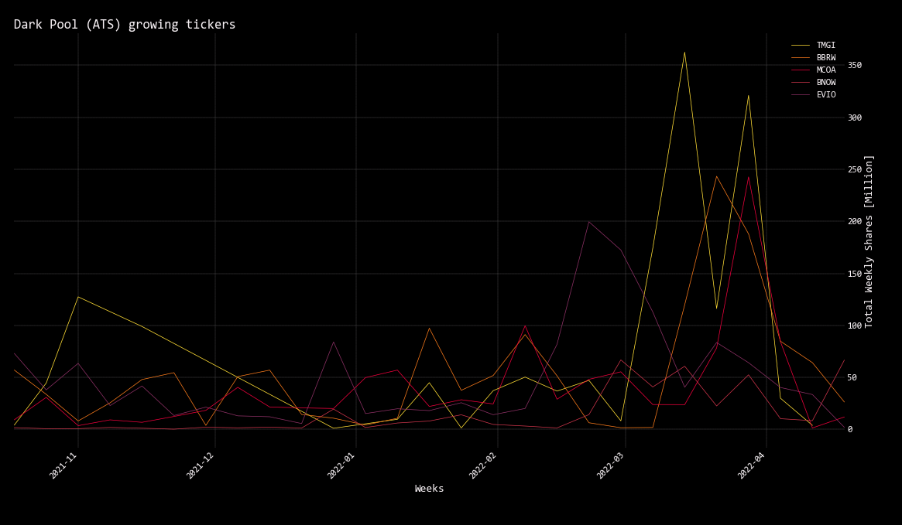<br>

`pos` provides a summary for the last reported trading day (information is updated in the early evening). Position represents a rolling twenty-day total and directional trends can be identified by watching the changes over time. Adding the `-a` flag will sort the list from the bottom up - the most negative - and creates a fuller picture when watching in tandom with the positive side of the ledger. Monitor the rate of change in position sizes, or a reversal in directional flow. This <a href="https://squeezemetrics.com/monitor/download/pdf/short_is_long.pdf?" target="_blank">white paper</a>, written by SqueezeMetrics, sheds some light on the trading activity reported here.
````
(🦋) /stocks/dps/ $ pos -l 25
````
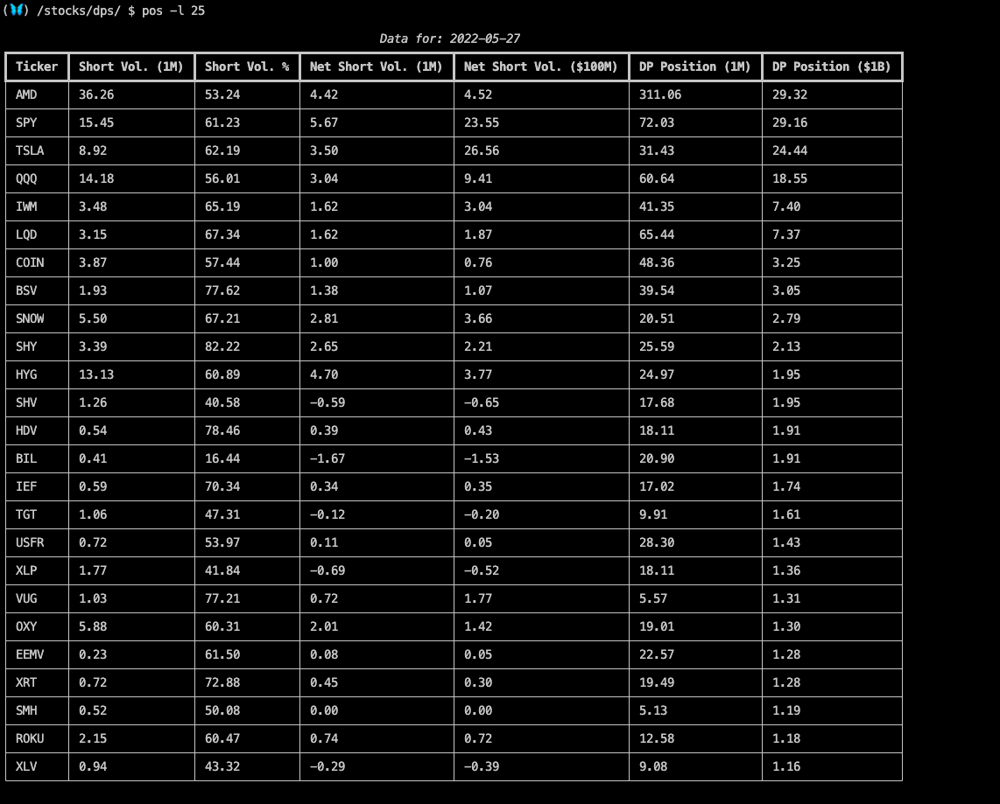<br>

The other end of the spectrum:
````
(🦋) /stocks/dps/ $ pos -l 25 -a
````
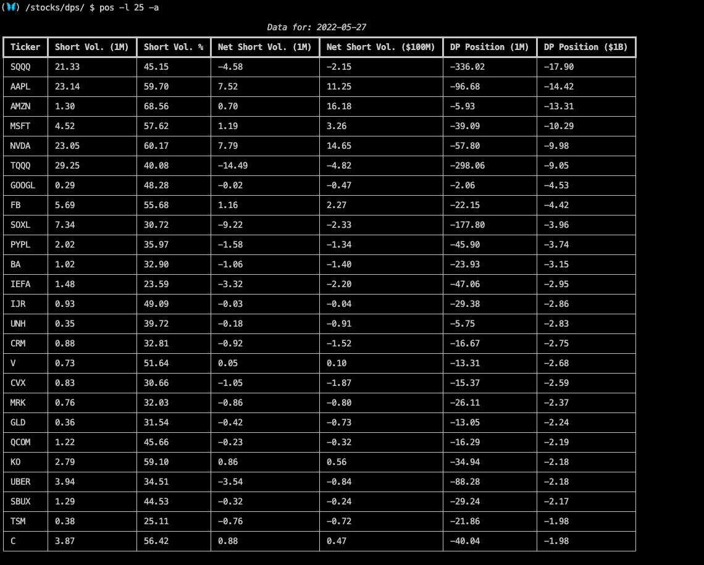<br>

Call on the help dialogue for every command by attaching, `-h` to the command. The optional arguments give the user flexibility to sort the columns, print the raw data, or export to a file.

<h2>Examples</h2><br>

The cost-to-borrow is used as a proxy-measurement for an equity's specialness. `ctb` shows the  most expensive equities to short, and the number shares available to short, on Interactive Brokers.
````
(🦋) /stocks/dps/ $ ctb
````
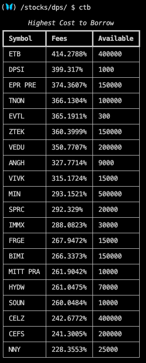<br>

How many tickers have a borrow rate above 100%? Set the limit to a high number and export the data to a spreadsheet.
````
(🦋) /stocks/dps/ $ ctb -n 5000 --export xlsx

Saved file: /exports/20220530_130058_stocks_dark_pool_shorts_cost_to_borrow.xlsx
````
As of writing, there are 158 securities with a cost-to-borrow rate above 100%.<br>
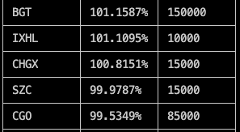<br>

Cross reference that list with the `sidtc` command. Days-to-cover is the approximate number of days it would take to cover those shorts if the amount and proportion of volume were to remain constant. Use the optional arguments to sort the columns.<br>
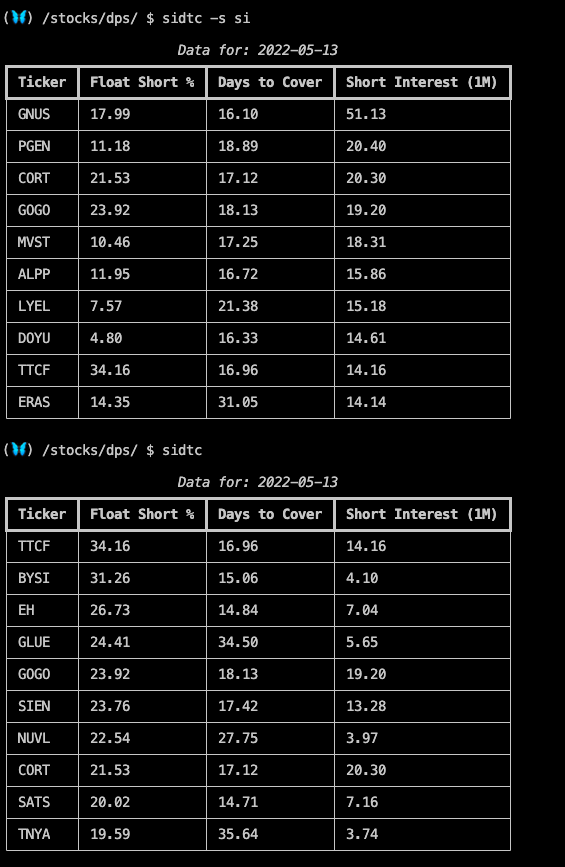<br>

Load AAPL and request a 1-year chart of the net short volume and position. This provides the individual ticker data corresponding with the `pos` command.

````
(🦋) /stocks/dps/ $ load AAPL

Loading Daily AAPL stock with starting period 2019-05-28 for analysis.

Datetime: 2022 May 30 14:59
Timezone: America/New_York
Currency: USD
Market:   CLOSED
Company:  Apple Inc.

(🦋) /stocks/dps/ $ spos

````
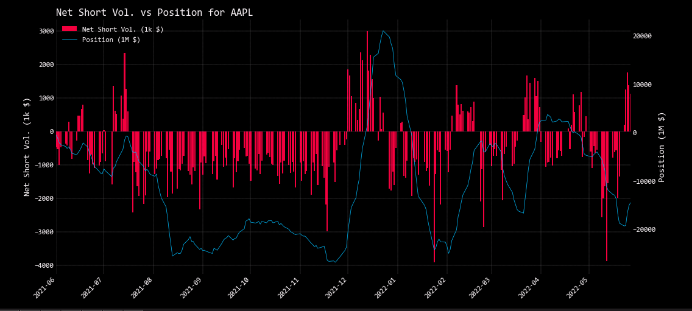<br>

Prolonged periods where the net short volume is above 50% are notable.

````
(🦋) /stocks/dps/ $ psi
````

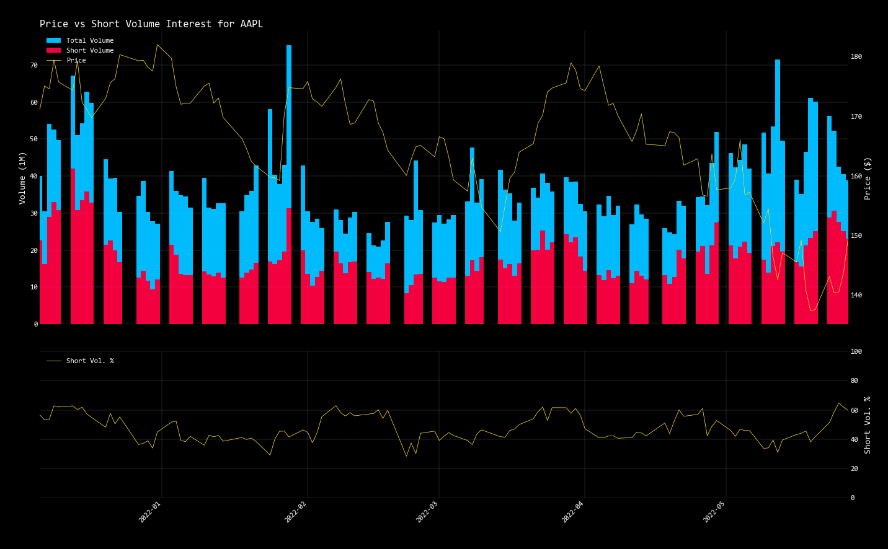<br>

See the aggregate sum total of fail-to-delivers, with the historical price, with the `ftd` command.

````
(🦋) /stocks/dps/ $ ftd -s 2020-05-30
````
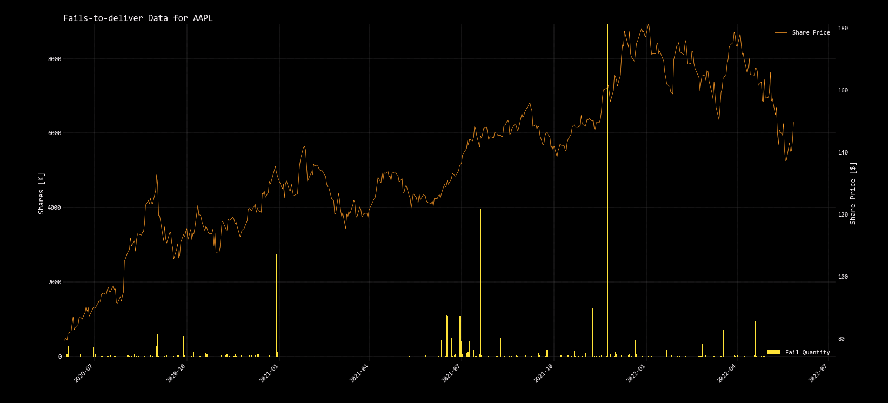<br>

The data from `dpotc`, statistics for individual NMS tickers, shows weekly OTC and ATS trade volume with the average lot size, which is reported on a lagging schedule.

````
(🦋) /stocks/dps/ $ dpotc
````
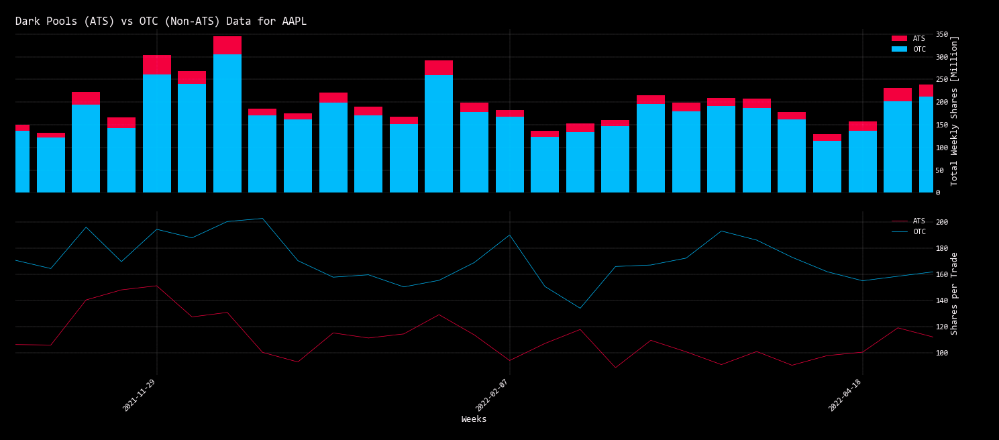<br>

Back to <a href="https://openbb-finance.github.io/OpenBBTerminal/terminal/stocks/" target="_blank">Stocks</a>.