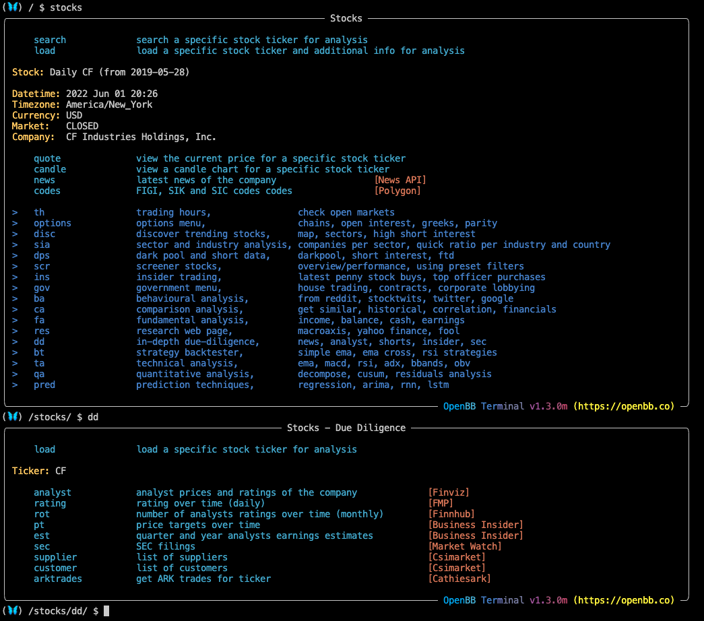
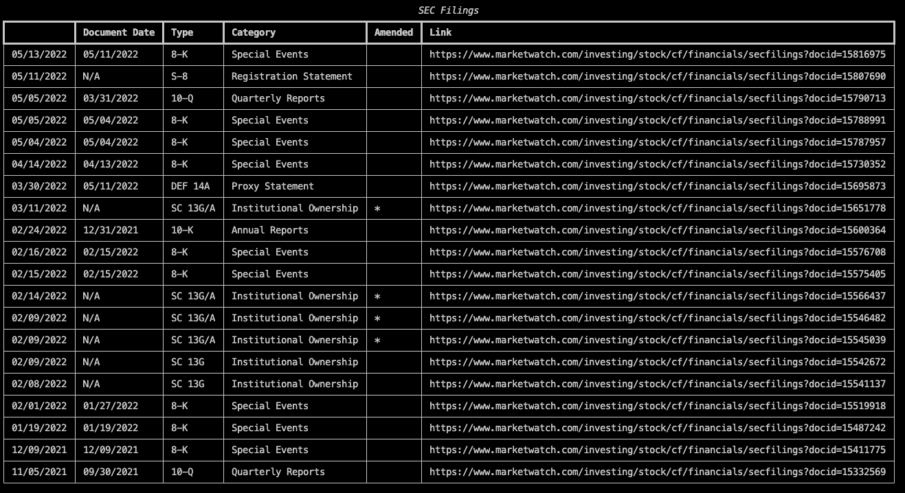
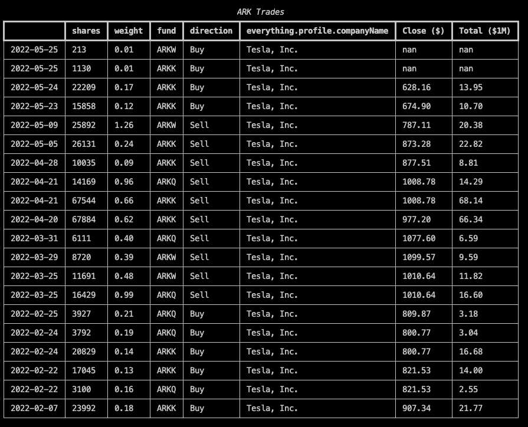
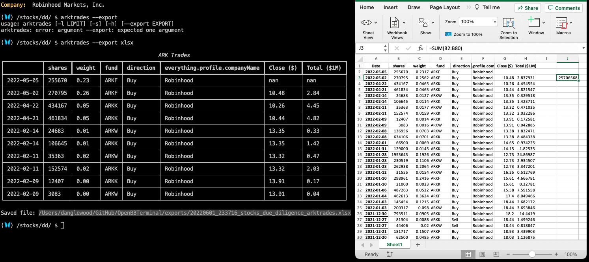
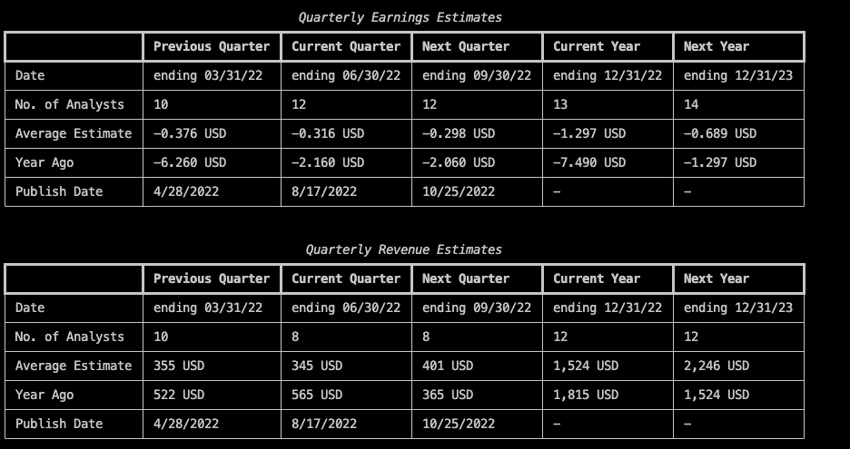
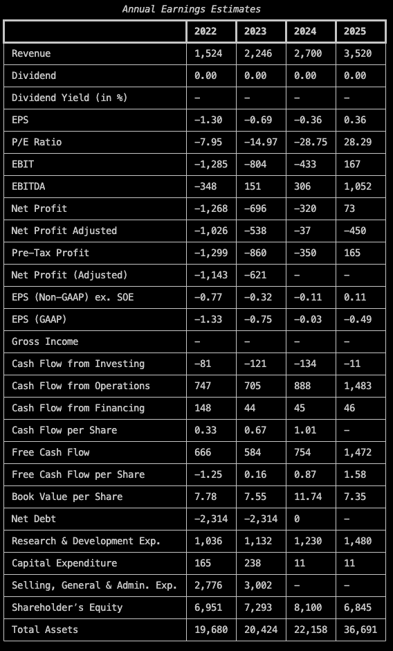
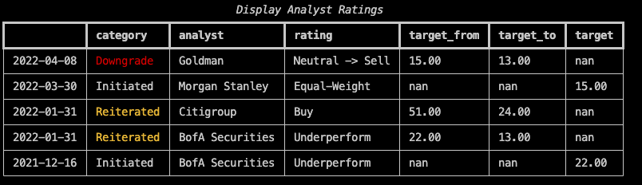

<h1>Introduction to the Due Dilligence Menu</h1>

The Due Diligence submenu, located within the <a href="https://openbb-finance.github.io/OpenBBTerminal/terminal/stocks/" target="_blank">`Stocks`</a> menu, is primarily for supplementing fundamental analysis with information such as:

  - Analyst ratings and price targets over time
  - Earnings estimates
  - SEC filings
  - Business-to-business customers and suppliers
  - What kind of trades, if any, ARK is involved in with the loaded ticker.

To use all features in this menu, two (free) API keys must be obtained. Refer to the <a href="https://openbb-finance.github.io/OpenBBTerminal/terminal/#accessing-other-sources-of-data-via-api-keys" target="_blank">Getting Started Guide</a> for instructions on storing API keys in the Terminal.

  - rating: FMP - <a href="https://site.financialmodelingprep.com/developer/docs/" target="_blank">Financial Modeling Prep</a>
  - rot: <a href="https://finnhub.io/" target="_blank">Finnhub</a>

Entering the submenu requires having a ticker <a href="https://openbb-finance.github.io/OpenBBTerminal/terminal/#explanation-of-commands" target="_blank">loaded</a> from the `Stocks` menu. With a stock selected, type `dd` into the command line and press `enter`.

 

<h2>How to use the Due Diligence Menu</h2>

With the same company, as loaded above, `sec -l 20` prints a table of the last twenty SEC filings from the company, and provides a link to a hosted document on <a href="https://marketwatch.com" target="_blank">MarketWatch</a>.

 

`pt` displays a chart of historical adjusted closing prices and price targets. `pt --raw` prints a table, `pt --export xlsx` exports a spreadsheet, while `pt -l [n]` limits the number of price targets to return to `n`.

 

A new ticker can be loaded directly from the Due Diligence submenu; for example, `load tsla`

<h2>Examples</h2>

With $TSLA loaded, `arktrades -l 20`, shows the last twenty trades across all ARK funds.

 

Export the history of $HOOD trades for further analysis. `arktrades --export xlsx`

 

`est` displays futures earnings estimates.

 

`analyst`

 

Always do your own Due Diligence! To run a demo in the OpenBB Terminal of the features discussed here, launch the routine from the Main Menu by entering: `exe routines/dd_demo.openbb` in the command line and hitting `enter`. Click <a href="https://openbb-finance.github.io/OpenBBTerminal/terminal/stocks/" target="_blank">here</a> to go back to `Stocks`.
