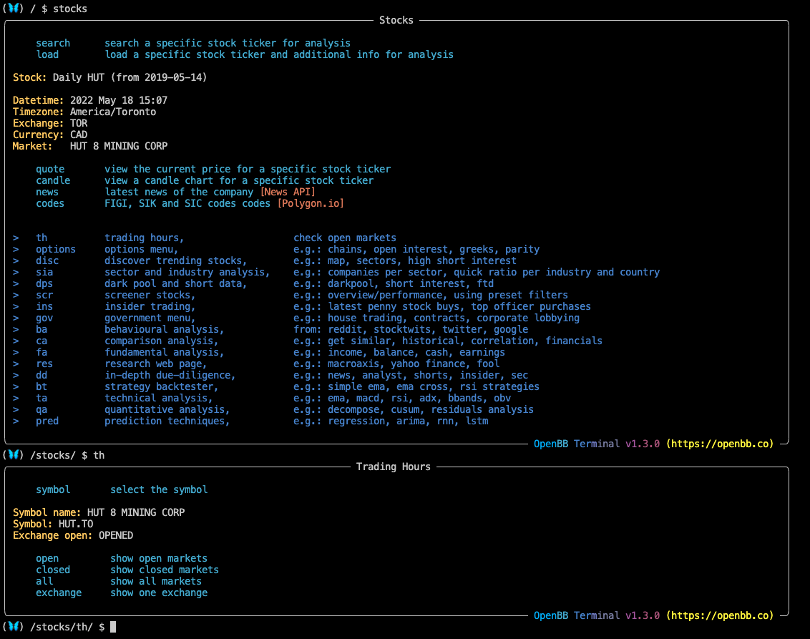
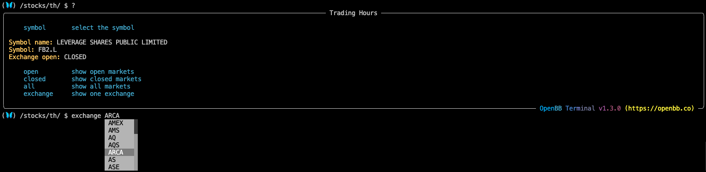

<h1>An Introduction to the Trading Hours Menu</h1>

This set of features is for checking the operating status of markets globally. To access the Trading Hours features, enter `th` from the <a href="https://openbb-finance.github.io/OpenBBTerminal/terminal/introduction_to_stocks/" target="_blank">Stocks</a> menu. Alternatively, a user can access the submenu with absolute path navigation from anywhere in the Terminal: `/stocks/th`<br>



<h1></h1>
<h2>How to use the Trading Hours Menu</h2><br>

A symbol is not required to be loaded. Once in the Trading Hours submenu, the operation is simple. Chose from:` open`, `closed`, `all`, or, `exchange`.

`open`: show open markets

````
(🦋) /stocks/th/ $ open
                      Open markets                      
┏━━━━━┳━━━━━━━━━━━━━━━━━━━━━━━━━━━━━━━━━━━┳━━━━━━━━━━━━┓
┃     ┃ name                              ┃ short_name ┃
┡━━━━━╇━━━━━━━━━━━━━━━━━━━━━━━━━━━━━━━━━━━╇━━━━━━━━━━━━┩
│ FRA │ Frankfurt Stock Exchange          │ F          │
├─────┼───────────────────────────────────┼────────────┤
│ STU │ Börse Stuttgart                   │ SG         │
├─────┼───────────────────────────────────┼────────────┤
│ MUN │ Börse München                     │ MU         │
├─────┼───────────────────────────────────┼────────────┤
│ DUS │ Börse Düsseldorf                  │ DU         │
├─────┼───────────────────────────────────┼────────────┤
│ MEX │ Bolsa Mexicana de Valores         │ MX         │
├─────┼───────────────────────────────────┼────────────┤
│ FKA │ Frankfurt Stock Exchange          │ F          │
├─────┼───────────────────────────────────┼────────────┤
│ NYQ │ New York Stock Exchange           │ NYSE       │
├─────┼───────────────────────────────────┼────────────┤
│ VAN │ TSX Venture Exchange              │ V          │
├─────┼───────────────────────────────────┼────────────┤
│ SAO │ A Bolsa do Brasil                 │ SA         │
├─────┼───────────────────────────────────┼────────────┤
│ PNK │ OTC Markets Group                 │ OTC        │
├─────┼───────────────────────────────────┼────────────┤
│ TOR │ Toronto Stock Exchange            │ TO         │
├─────┼───────────────────────────────────┼────────────┤
│ NGM │ NasdaqGM                          │ NASGM      │
├─────┼───────────────────────────────────┼────────────┤
│ NCM │ Nasdaq                            │ NASDQ      │
├─────┼───────────────────────────────────┼────────────┤
│ NMS │ NasdaqGS                          │ NASGS      │
├─────┼───────────────────────────────────┼────────────┤
│ ASE │ NYSE American                     │ AMEX       │
├─────┼───────────────────────────────────┼────────────┤
│ BUE │ Bolsas y Mercados Argentinos      │ BA         │
├─────┼───────────────────────────────────┼────────────┤
│ SGO │ Bolsa de Santiago                 │ SN         │
├─────┼───────────────────────────────────┼────────────┤
│ CNQ │ Canadian Securities Exchange: CSE │ CN         │
├─────┼───────────────────────────────────┼────────────┤
│ NEO │ NEO Exchange                      │ NE         │
├─────┼───────────────────────────────────┼────────────┤
│ NYS │ NYS                               │ NYS        │
├─────┼───────────────────────────────────┼────────────┤
│ NAS │ NASDAQ                            │ NAS        │
├─────┼───────────────────────────────────┼────────────┤
│ PCX │ NYSE Arca                         │ ARCA       │
└─────┴───────────────────────────────────┴────────────┘
````
`closed`: show markets that are closed
````
(🦋) /stocks/th/ $ closed
                    Closed markets                     
┏━━━━━┳━━━━━━━━━━━━━━━━━━━━━━━━━━━━━━━━━━┳━━━━━━━━━━━━┓
┃     ┃ name                             ┃ short_name ┃
┡━━━━━╇━━━━━━━━━━━━━━━━━━━━━━━━━━━━━━━━━━╇━━━━━━━━━━━━┩
│ SHZ │ Shenzen Stock Exchange           │ SHZE       │
├─────┼──────────────────────────────────┼────────────┤
│ KSC │ Korea Exchange                   │ KRX        │
├─────┼──────────────────────────────────┼────────────┤
│ KOE │ Korea Exchange                   │ KRX        │
├─────┼──────────────────────────────────┼────────────┤
│ HKG │ Hong Kong Stock Exchange         │ HKEX       │
├─────┼──────────────────────────────────┼────────────┤
│ KLS │ Bursa Malaysia                   │ KLSE       │
├─────┼──────────────────────────────────┼────────────┤
│ ENX │ Euronext                         │ NX         │
├─────┼──────────────────────────────────┼────────────┤
│ TWO │ Taipei Exchange                  │ TWO        │
├─────┼──────────────────────────────────┼────────────┤
│ HAM │ Hamburger Börse                  │ HM         │
├─────┼──────────────────────────────────┼────────────┤
│ TW  │ Taiwan Stock Exchange            │ TWSE       │
├─────┼──────────────────────────────────┼────────────┤
│ PAR │ Euronext Paris                   │ PA         │
├─────┼──────────────────────────────────┼────────────┤
│ GER │ Deutsche Börse Xetra             │ DE         │
├─────┼──────────────────────────────────┼────────────┤
│ IOB │ London Stock Exchange            │ IL         │
├─────┼──────────────────────────────────┼────────────┤
│ LSE │ London Stock Exchange            │ L          │
├─────┼──────────────────────────────────┼────────────┤
│ HAN │ Börsen Hamburg-Hannover          │ HA         │
├─────┼──────────────────────────────────┼────────────┤
│ SAU │ Tadwul                           │ SR         │
├─────┼──────────────────────────────────┼────────────┤
│ JPX │ Japan Exchange Group             │ T          │
├─────┼──────────────────────────────────┼────────────┤
│ ASX │ Australian Securities Exchange   │ AX         │
├─────┼──────────────────────────────────┼────────────┤
│ SAP │ Sapporo Securities Exchange      │ S          │
├─────┼──────────────────────────────────┼────────────┤
│ SES │ Singapore Exchange               │ SI         │
├─────┼──────────────────────────────────┼────────────┤
│ TLO │ Borsa Italiana                   │ TI         │
├─────┼──────────────────────────────────┼────────────┤
│ VIE │ Wiener Börse                     │ VI         │
├─────┼──────────────────────────────────┼────────────┤
│ BSE │ BSE                              │ BO         │
├─────┼──────────────────────────────────┼────────────┤
│ OSL │ Oslo Børs                        │ OL         │
├─────┼──────────────────────────────────┼────────────┤
│ NSI │ National Stock Exchange of India │ NS         │
├─────┼──────────────────────────────────┼────────────┤
│ STO │ Nasdaq Nordic Stockholm          │ ST         │
├─────┼──────────────────────────────────┼────────────┤
│ MCE │ Bolsa de Madrid                  │ MC         │
├─────┼──────────────────────────────────┼────────────┤
│ MIL │ Borsa Italiana                   │ MI         │
├─────┼──────────────────────────────────┼────────────┤
│ BUD │ Budapest Stock Exchange          │ BD         │
├─────┼──────────────────────────────────┼────────────┤
│ SHH │ Shanghai Stock Exchange          │ SS         │
├─────┼──────────────────────────────────┼────────────┤
│ SET │ Stock Exchange of Thailand       │ BK         │
├─────┼──────────────────────────────────┼────────────┤
│ ISE │ Euronext Dublin                  │ IR         │
├─────┼──────────────────────────────────┼────────────┤
│ AMS │ Euronext Amsterdam               │ AS         │
├─────┼──────────────────────────────────┼────────────┤
│ ATH │ Athens Stock Exchange            │ AT         │
├─────┼──────────────────────────────────┼────────────┤
│ AQS │ Aquis Exchange                   │ AQ         │
├─────┼──────────────────────────────────┼────────────┤
│ CPH │ Nasdaq Nordic Copenhagen         │ CO         │
├─────┼──────────────────────────────────┼────────────┤
│ CSE │ Colombo Stock Exchange           │ CM         │
├─────┼──────────────────────────────────┼────────────┤
│ JKT │ Indonesia Stock Exchange         │ JK         │
├─────┼──────────────────────────────────┼────────────┤
│ HEL │ Nasdaq Nordic Helsinki           │ HE         │
├─────┼──────────────────────────────────┼────────────┤
│ EBS │ SIX Swiss Exchange               │ SW         │
├─────┼──────────────────────────────────┼────────────┤
│ NZE │ NZX                              │ NZ         │
├─────┼──────────────────────────────────┼────────────┤
│ CCS │ Bolsa de Valores de Caracas      │ CR         │
├─────┼──────────────────────────────────┼────────────┤
│ JNB │ JSE                              │ JO         │
├─────┼──────────────────────────────────┼────────────┤
│ BRU │ Euronext Brussels                │ BR         │
├─────┼──────────────────────────────────┼────────────┤
│ TLV │ Tel Aviv Stock Exchange          │ TA         │
├─────┼──────────────────────────────────┼────────────┤
│ DOH │ Qatar Stock Exchange             │ QA         │
├─────┼──────────────────────────────────┼────────────┤
│ MCX │ MOEX                             │ ME         │
├─────┼──────────────────────────────────┼────────────┤
│ IST │ Borsa Istanbul                   │ IS         │
├─────┼──────────────────────────────────┼────────────┤
│ LIS │ Euronext Lisbon                  │ LS         │
├─────┼──────────────────────────────────┼────────────┤
│ LIT │ Nasdaq OMX Vilnius               │ VS         │
├─────┼──────────────────────────────────┼────────────┤
│ PRA │ Prague Stock Exchange            │ PR         │
├─────┼──────────────────────────────────┼────────────┤
│ TAL │ Nasdaq OMX Tallinn               │ TL         │
├─────┼──────────────────────────────────┼────────────┤
│ ICE │ Nasdaq Nordic Iceland            │ IC         │
├─────┼──────────────────────────────────┼────────────┤
│ RIS │ Nasdaq OMX Riga                  │ RG         │
├─────┼──────────────────────────────────┼────────────┤
│ CAI │ The Egyptian Exchange            │ CA         │
├─────┼──────────────────────────────────┼────────────┤
│ SAT │ Nasdaq OMX Stockholm             │ ST         │
└─────┴──────────────────────────────────┴────────────┘
````
`all`: show all markets and their status
````
(🦋) /stocks/th/ $ all
                         World markets                          
┏━━━━━┳━━━━━━━━━━━━━━━━━━━━━━━━━━━━━━━━━━━┳━━━━━━━━━━━━┳━━━━━━━┓
┃     ┃ name                              ┃ short_name ┃ open  ┃
┡━━━━━╇━━━━━━━━━━━━━━━━━━━━━━━━━━━━━━━━━━━╇━━━━━━━━━━━━╇━━━━━━━┩
│ SHZ │ Shenzen Stock Exchange            │ SHZE       │ False │
├─────┼───────────────────────────────────┼────────────┼───────┤
│ KSC │ Korea Exchange                    │ KRX        │ False │
├─────┼───────────────────────────────────┼────────────┼───────┤
│ KOE │ Korea Exchange                    │ KRX        │ False │
├─────┼───────────────────────────────────┼────────────┼───────┤
│ HKG │ Hong Kong Stock Exchange          │ HKEX       │ False │
├─────┼───────────────────────────────────┼────────────┼───────┤
│ KLS │ Bursa Malaysia                    │ KLSE       │ False │
├─────┼───────────────────────────────────┼────────────┼───────┤
│ FRA │ Frankfurt Stock Exchange          │ F          │ True  │
├─────┼───────────────────────────────────┼────────────┼───────┤
│ STU │ Börse Stuttgart                   │ SG         │ True  │
├─────┼───────────────────────────────────┼────────────┼───────┤
│ ENX │ Euronext                          │ NX         │ False │
├─────┼───────────────────────────────────┼────────────┼───────┤
│ TWO │ Taipei Exchange                   │ TWO        │ False │
├─────┼───────────────────────────────────┼────────────┼───────┤
│ HAM │ Hamburger Börse                   │ HM         │ False │
├─────┼───────────────────────────────────┼────────────┼───────┤
│ MUN │ Börse München                     │ MU         │ True  │
├─────┼───────────────────────────────────┼────────────┼───────┤
│ DUS │ Börse Düsseldorf                  │ DU         │ True  │
├─────┼───────────────────────────────────┼────────────┼───────┤
│ TW  │ Taiwan Stock Exchange             │ TWSE       │ False │
├─────┼───────────────────────────────────┼────────────┼───────┤
│ PAR │ Euronext Paris                    │ PA         │ False │
├─────┼───────────────────────────────────┼────────────┼───────┤
│ GER │ Deutsche Börse Xetra              │ DE         │ False │
├─────┼───────────────────────────────────┼────────────┼───────┤
│ IOB │ London Stock Exchange             │ IL         │ False │
├─────┼───────────────────────────────────┼────────────┼───────┤
│ LSE │ London Stock Exchange             │ L          │ False │
├─────┼───────────────────────────────────┼────────────┼───────┤
│ MEX │ Bolsa Mexicana de Valores         │ MX         │ True  │
├─────┼───────────────────────────────────┼────────────┼───────┤
│ HAN │ Börsen Hamburg-Hannover           │ HA         │ False │
├─────┼───────────────────────────────────┼────────────┼───────┤
│ SAU │ Tadwul                            │ SR         │ False │
├─────┼───────────────────────────────────┼────────────┼───────┤
│ JPX │ Japan Exchange Group              │ T          │ False │
├─────┼───────────────────────────────────┼────────────┼───────┤
│ ASX │ Australian Securities Exchange    │ AX         │ False │
├─────┼───────────────────────────────────┼────────────┼───────┤
│ SAP │ Sapporo Securities Exchange       │ S          │ False │
├─────┼───────────────────────────────────┼────────────┼───────┤
│ FKA │ Frankfurt Stock Exchange          │ F          │ True  │
├─────┼───────────────────────────────────┼────────────┼───────┤
│ SES │ Singapore Exchange                │ SI         │ False │
├─────┼───────────────────────────────────┼────────────┼───────┤
│ TLO │ Borsa Italiana                    │ TI         │ False │
├─────┼───────────────────────────────────┼────────────┼───────┤
│ VIE │ Wiener Börse                      │ VI         │ False │
├─────┼───────────────────────────────────┼────────────┼───────┤
│ BSE │ BSE                               │ BO         │ False │
├─────┼───────────────────────────────────┼────────────┼───────┤
│ OSL │ Oslo Børs                         │ OL         │ False │
├─────┼───────────────────────────────────┼────────────┼───────┤
│ NSI │ National Stock Exchange of India  │ NS         │ False │
├─────┼───────────────────────────────────┼────────────┼───────┤
│ STO │ Nasdaq Nordic Stockholm           │ ST         │ False │
├─────┼───────────────────────────────────┼────────────┼───────┤
│ MCE │ Bolsa de Madrid                   │ MC         │ False │
├─────┼───────────────────────────────────┼────────────┼───────┤
│ MIL │ Borsa Italiana                    │ MI         │ False │
├─────┼───────────────────────────────────┼────────────┼───────┤
│ BUD │ Budapest Stock Exchange           │ BD         │ False │
├─────┼───────────────────────────────────┼────────────┼───────┤
│ SHH │ Shanghai Stock Exchange           │ SS         │ False │
├─────┼───────────────────────────────────┼────────────┼───────┤
│ SET │ Stock Exchange of Thailand        │ BK         │ False │
├─────┼───────────────────────────────────┼────────────┼───────┤
│ NYQ │ New York Stock Exchange           │ NYSE       │ True  │
├─────┼───────────────────────────────────┼────────────┼───────┤
│ VAN │ TSX Venture Exchange              │ V          │ True  │
├─────┼───────────────────────────────────┼────────────┼───────┤
│ SAO │ A Bolsa do Brasil                 │ SA         │ True  │
├─────┼───────────────────────────────────┼────────────┼───────┤
│ ISE │ Euronext Dublin                   │ IR         │ False │
├─────┼───────────────────────────────────┼────────────┼───────┤
│ AMS │ Euronext Amsterdam                │ AS         │ False │
├─────┼───────────────────────────────────┼────────────┼───────┤
│ ATH │ Athens Stock Exchange             │ AT         │ False │
├─────┼───────────────────────────────────┼────────────┼───────┤
│ PNK │ OTC Markets Group                 │ OTC        │ True  │
├─────┼───────────────────────────────────┼────────────┼───────┤
│ AQS │ Aquis Exchange                    │ AQ         │ False │
├─────┼───────────────────────────────────┼────────────┼───────┤
│ CPH │ Nasdaq Nordic Copenhagen          │ CO         │ False │
├─────┼───────────────────────────────────┼────────────┼───────┤
│ TOR │ Toronto Stock Exchange            │ TO         │ True  │
├─────┼───────────────────────────────────┼────────────┼───────┤
│ NGM │ NasdaqGM                          │ NASGM      │ True  │
├─────┼───────────────────────────────────┼────────────┼───────┤
│ NCM │ Nasdaq                            │ NASDQ      │ True  │
├─────┼───────────────────────────────────┼────────────┼───────┤
│ NMS │ NasdaqGS                          │ NASGS      │ True  │
├─────┼───────────────────────────────────┼────────────┼───────┤
│ CSE │ Colombo Stock Exchange            │ CM         │ False │
├─────┼───────────────────────────────────┼────────────┼───────┤
│ JKT │ Indonesia Stock Exchange          │ JK         │ False │
├─────┼───────────────────────────────────┼────────────┼───────┤
│ HEL │ Nasdaq Nordic Helsinki            │ HE         │ False │
├─────┼───────────────────────────────────┼────────────┼───────┤
│ EBS │ SIX Swiss Exchange                │ SW         │ False │
├─────┼───────────────────────────────────┼────────────┼───────┤
│ ASE │ NYSE American                     │ AMEX       │ True  │
├─────┼───────────────────────────────────┼────────────┼───────┤
│ BUE │ Bolsas y Mercados Argentinos      │ BA         │ True  │
├─────┼───────────────────────────────────┼────────────┼───────┤
│ SGO │ Bolsa de Santiago                 │ SN         │ True  │
├─────┼───────────────────────────────────┼────────────┼───────┤
│ CNQ │ Canadian Securities Exchange: CSE │ CN         │ True  │
├─────┼───────────────────────────────────┼────────────┼───────┤
│ NZE │ NZX                               │ NZ         │ False │
├─────┼───────────────────────────────────┼────────────┼───────┤
│ CCS │ Bolsa de Valores de Caracas       │ CR         │ False │
├─────┼───────────────────────────────────┼────────────┼───────┤
│ JNB │ JSE                               │ JO         │ False │
├─────┼───────────────────────────────────┼────────────┼───────┤
│ BRU │ Euronext Brussels                 │ BR         │ False │
├─────┼───────────────────────────────────┼────────────┼───────┤
│ TLV │ Tel Aviv Stock Exchange           │ TA         │ False │
├─────┼───────────────────────────────────┼────────────┼───────┤
│ DOH │ Qatar Stock Exchange              │ QA         │ False │
├─────┼───────────────────────────────────┼────────────┼───────┤
│ MCX │ MOEX                              │ ME         │ False │
├─────┼───────────────────────────────────┼────────────┼───────┤
│ NEO │ NEO Exchange                      │ NE         │ True  │
├─────┼───────────────────────────────────┼────────────┼───────┤
│ NYS │ NYS                               │ NYS        │ True  │
├─────┼───────────────────────────────────┼────────────┼───────┤
│ IST │ Borsa Istanbul                    │ IS         │ False │
├─────┼───────────────────────────────────┼────────────┼───────┤
│ NAS │ NASDAQ                            │ NAS        │ True  │
├─────┼───────────────────────────────────┼────────────┼───────┤
│ LIS │ Euronext Lisbon                   │ LS         │ False │
├─────┼───────────────────────────────────┼────────────┼───────┤
│ LIT │ Nasdaq OMX Vilnius                │ VS         │ False │
├─────┼───────────────────────────────────┼────────────┼───────┤
│ PRA │ Prague Stock Exchange             │ PR         │ False │
├─────┼───────────────────────────────────┼────────────┼───────┤
│ TAL │ Nasdaq OMX Tallinn                │ TL         │ False │
├─────┼───────────────────────────────────┼────────────┼───────┤
│ ICE │ Nasdaq Nordic Iceland             │ IC         │ False │
├─────┼───────────────────────────────────┼────────────┼───────┤
│ RIS │ Nasdaq OMX Riga                   │ RG         │ False │
├─────┼───────────────────────────────────┼────────────┼───────┤
│ CAI │ The Egyptian Exchange             │ CA         │ False │
├─────┼───────────────────────────────────┼────────────┼───────┤
│ PCX │ NYSE Arca                         │ ARCA       │ True  │
├─────┼───────────────────────────────────┼────────────┼───────┤
│ SAT │ Nasdaq OMX Stockholm              │ ST         │ False │
└─────┴───────────────────────────────────┴────────────┴───────┘
````
`exchange`: shows the status of a single venue <br></br> 


<h1></h1>
<h2>Example Uses</h2>

````
(🦋) /stocks/th/ $ symbol RY.TO

Selected symbol
Symbol:        RY.TO
Name:          ROYAL BANK OF CANADA
Market open:   False
````
````
(🦋) /stocks/th/ $ symbol FB2.L

Selected symbol
Symbol:        FB2.L
Name:          LEVERAGE SHARES PUBLIC LIMITED 
Market open:   False
````
````
(🦋) /stocks/th/ $ exchange BO
                                             BSE    BSE                                              
                                      Name: name, dtype: object                                      
┏━━━━━━━━━━━━━━━━━━━━━━━┳━━━━━━━━━━━━━━━━━━━━━━━━━━━━━━━━━━━━━━━━━━━━━━━━━━━━━━━━━━━━━━━━━━━━━━━━━━━┓
┃                       ┃ BSE                                                                       ┃
┡━━━━━━━━━━━━━━━━━━━━━━━╇━━━━━━━━━━━━━━━━━━━━━━━━━━━━━━━━━━━━━━━━━━━━━━━━━━━━━━━━━━━━━━━━━━━━━━━━━━━┩
│ name                  │ BSE                                                                       │
├───────────────────────┼───────────────────────────────────────────────────────────────────────────┤
│ short_name            │ BO                                                                        │
├───────────────────────┼───────────────────────────────────────────────────────────────────────────┤
│ website               │ https://www.bseindia.com/static/markets/equity/EQReports/tra_trading.aspx │
├───────────────────────┼───────────────────────────────────────────────────────────────────────────┤
│ market_open           │ 09:15:00                                                                  │
├───────────────────────┼───────────────────────────────────────────────────────────────────────────┤
│ market_close          │ 15:30:00                                                                  │
├───────────────────────┼───────────────────────────────────────────────────────────────────────────┤
│ lunchbreak_start      │ None                                                                      │
├───────────────────────┼───────────────────────────────────────────────────────────────────────────┤
│ lunchbreak_end        │ None                                                                      │
├───────────────────────┼───────────────────────────────────────────────────────────────────────────┤
│ opening_auction_start │ None                                                                      │
├───────────────────────┼───────────────────────────────────────────────────────────────────────────┤
│ opening_auction_end   │ None                                                                      │
├───────────────────────┼───────────────────────────────────────────────────────────────────────────┤
│ closing_auction_start │ None                                                                      │
├───────────────────────┼───────────────────────────────────────────────────────────────────────────┤
│ closing_auction_end   │ None                                                                      │
├───────────────────────┼───────────────────────────────────────────────────────────────────────────┤
│ timezone              │ Asia/Kolkata                                                              │
├───────────────────────┼───────────────────────────────────────────────────────────────────────────┤
│ flag                  │ 🇮🇳                                                                        
├───────────────────────┼───────────────────────────────────────────────────────────────────────────┤
│ open                  │ False                                                                     │
└───────────────────────┴───────────────────────────────────────────────────────────────────────────┘
````

Back to <a href="https://openbb-finance.github.io/OpenBBTerminal/terminal/introduction_to_stocks/" target="_blank">Stocks</a>
