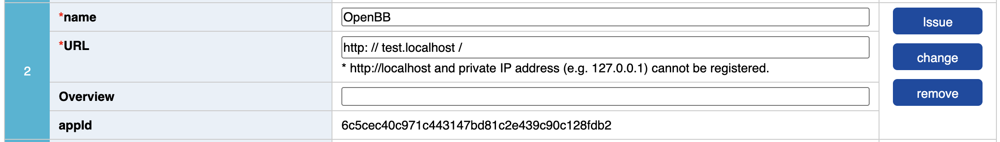

# OpenBB e-Stat Provider

## Overview

The e-Stat provider integrates Japan's official government statistical portal API into OpenBB. [e-Stat](https://www.e-stat.go.jp/en) is operated by the Ministry of Internal Affairs and Communications and provides access to 28+ statistical databases including population census, labor surveys, economic indicators, trade statistics, and regional data.

**Attribution Notice**: This service uses API functions from e-Stat, however its contents are not guaranteed by government.

## Setup Instructions

### Step 1: Register for e-Stat Account

1. Visit: https://www.e-stat.go.jp/en/mypage/user/preregister
2. Complete registration with your email
3. Confirm your email and log in

### Step 2: Get Your Application ID (API Key)

1. After logging in, go to "My Page" (top right corner)
2. Click on "API functions" section
3. Fill in the simple form:
   - **Name**: Your app name
   - **URL**: Your URL (use `http://test.localhost/` if not public)
   - **Overview**: Brief description (optional)
4. Click "Issue" button
5. Your Application ID will be displayed immediately


*Example of the API functions dashboard showing Application IDs*

### Step 3: Configure Your API Key

```python
from openbb import obb

# Set your API key (required)
obb.account.credentials.estat_api_key = "your_application_id_here"
```

## Quick Start

```python
# Get Japanese population census data
data = obb.economy.statistical_data(
    provider="estat",
    symbol="0003433219",  # Population Census dataset ID
)

# Get data with filters
data = obb.economy.statistical_data(
    provider="estat",
    symbol="0003433219",
    area_code="13000",    # Tokyo Prefecture
    start_date="2020-01",
    end_date="2020-12"
)
```

## Finding Your Data

### Understanding the Data Structure

Think of e-Stat as Japan's official government data library. To use it effectively, understand these key concepts:

**Dataset IDs** (like `0003433219`): Unique identifiers for each data collection. You'll find these on the e-Stat website when browsing datasets.

**Area Codes**: Geographic filters
- `00000` = All of Japan (national data)
- `13000` = Tokyo Prefecture  
- `27000` = Osaka Prefecture
- City codes are longer (e.g., `13101` for Chiyoda-ku, Tokyo)

**Stats Codes**: Survey identifiers (e.g., `00200521` for Population Census)

**Category Codes**: Vary by dataset - check the specific dataset documentation for valid values

### Three Ways to Find Dataset IDs

#### Method 1: Browse the Website (Easiest)

1. Go to: https://www.e-stat.go.jp/en/stat-search/database
2. Use categories like "Population and Households", "Labor and Wages", "Prices"
3. Click on a dataset to view details
4. The dataset ID appears in the URL and dataset information

#### Method 2: Search by Keywords

Use the search box on the e-Stat website with English terms like "population", "unemployment", "consumer price"

#### Method 3: API Discovery

```python
import requests

# Search for datasets programmatically
url = "https://api.e-stat.go.jp/rest/3.0/app/json/getStatsList"
params = {
    "appId": "your_api_key_here",
    "lang": "E",
    "searchWord": "population census",
    "limit": 20
}

response = requests.get(url, params=params)
data = response.json()
# Dataset IDs will be in the response
```

### Common Datasets

**Population Census**: `0003433219` and similar IDs
- Complete population count every 5 years
- Includes demographics by prefecture/city

**Consumer Price Index**: Various IDs in the `0003` series
- Monthly inflation data
- Price changes by category

**Labor Force Survey**: Multiple IDs in the `0003` series
- Monthly employment statistics
- Unemployment rates

Note: Dataset IDs can change when surveys are updated. Always verify current IDs on the e-Stat website.

## Parameters

- `symbol`: Statistical dataset ID (required) - the unique identifier from e-Stat
- `stats_code`: Survey code like `00200521` for specific surveys
- `area_code`: Geographic filter (see area codes above)
- `category_code`: Dataset-specific category filters
- `search_kind`: "1" for standard statistics, "2" for regional mesh statistics
- `collect_area`: Collection area for aggregated data
- `start_date` / `end_date`: Date range in YYYY-MM format

**Note**: This provider currently only supports JSON format responses.

## Troubleshooting

**"Invalid Application ID" Error**
- Verify your API key from the e-Stat API functions page
- Ensure you've set `obb.account.credentials.estat_api_key`

**"Statistical data not found" Error**
- Check the dataset ID is current (IDs can change)
- Not all parameters work with all datasets
- Try removing optional parameters

**Japanese Text in Responses**
- Normal for some metadata despite `lang=E` parameter
- Numerical data is universal

**Empty Data**
- Some datasets update infrequently (annually or every 5 years)
- Check the e-Stat website for update schedules

## API Reference

- **API Guide**: https://www.e-stat.go.jp/api/api/index.php/en/api-info/api-guide
- **API Specification**: https://www.e-stat.go.jp/api/api/index.php/en/api-info/api-spec
- **Database Search**: https://www.e-stat.go.jp/en/stat-search/database

## Development

### Running Tests

```bash
cd openbb_platform/providers/estat
poetry install
poetry run pytest tests/
```

### Contributing

Contributions are welcome! Areas for improvement:
- Additional data fetchers for specific statistical categories
- Enhanced date parsing for Japanese fiscal periods
- Caching for frequently accessed metadata

Please ensure all contributions maintain the attribution notice and comply with e-Stat's terms of use.

## License & Attribution

When using this provider, you must acknowledge:

> This service uses API functions from e-Stat, however its contents are not guaranteed by government.

This attribution is required by e-Stat's terms of use: https://www.e-stat.go.jp/api/api/index.php/en/api-info/credit