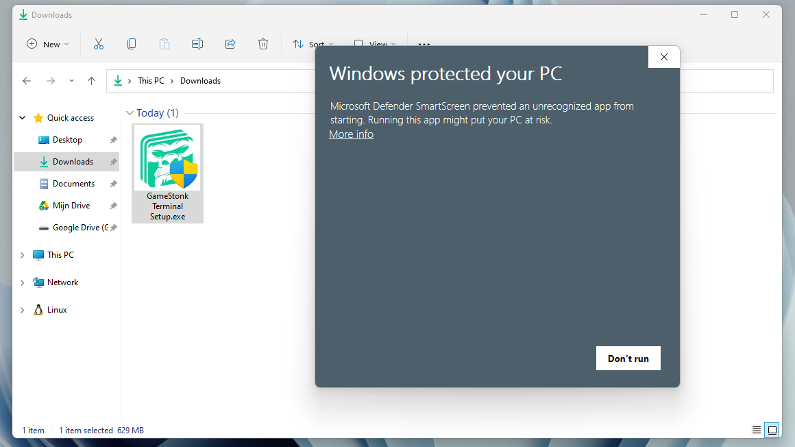
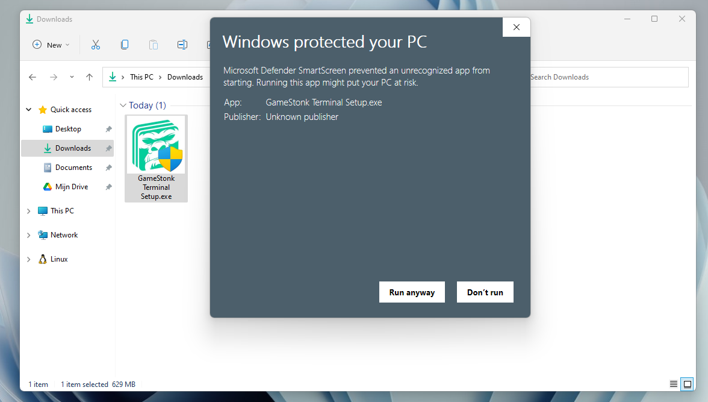
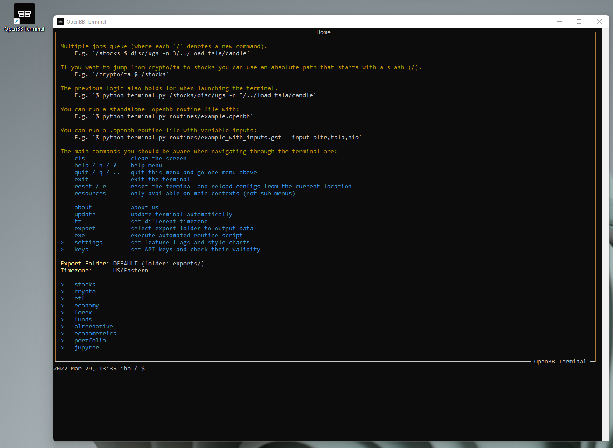
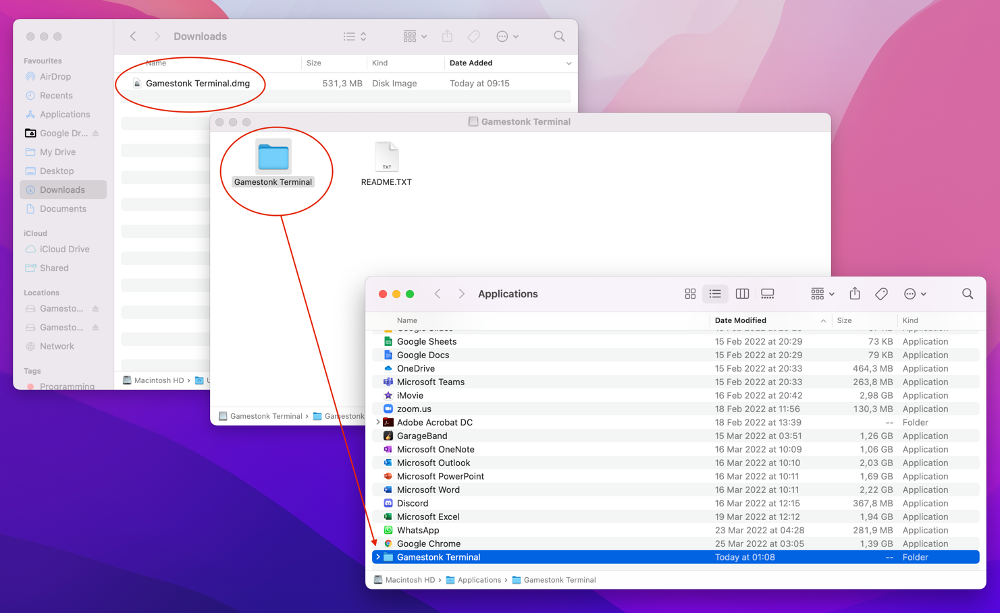
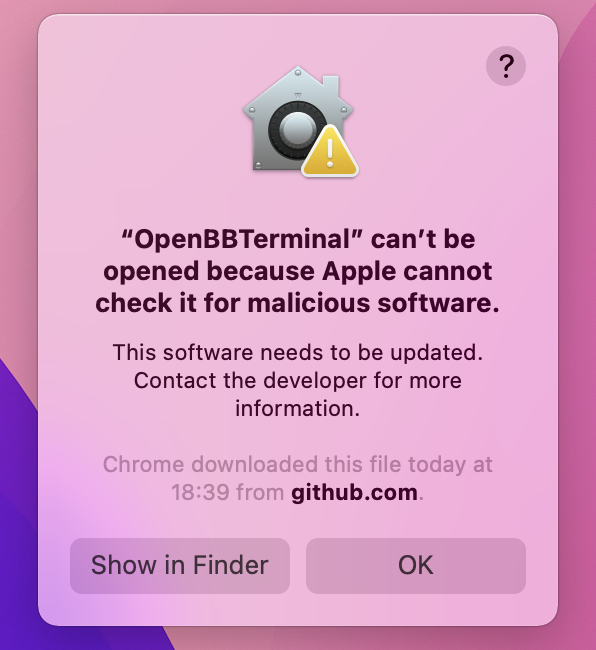
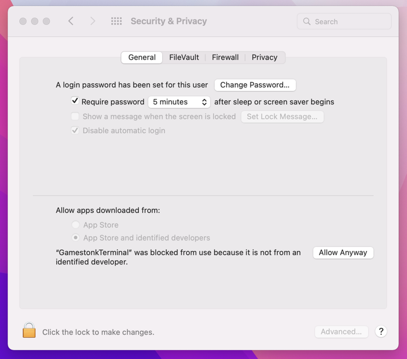
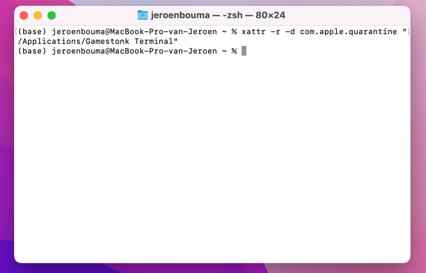

# OpenBB Terminal

<!-- TABLE OF CONTENTS -->
<details open="open">
  <summary><h2 style="display: inline-block">Table of Contents</h2></summary>
    <ol>
      <li><a href="#user">General Installation Process</a></li>
      <li><a href="#Anaconda---Python">Anaconda & Python Installation</a></li>
      <li><a href="#Docker-Installation">Docker Installation</a></li>
      <li><a href="#web-ui---docker">Docker Web UI Installation</a></li>
      <li><a href="#local-installation-of-gst-on-raspberry-pi">Raspberry-Pi-Installation - Portable GST</a></li>
      <li><a href="#api-keys">API Keys</a></li>
    </ol>
</details>

---

There are currently four options to install the terminal:

- using Installer: recommended if you just want to use the terminal
- using Python: recommended if you want to develop new features
- using Docker: alternative option to the installer if preferred
- using Docker Web UI: if you want to deploy the web UI for users to access over your LAN

First step in all options is to star the project


If you want to install the terminal using Python ignore the User section and jump to <a href="#Anaconda & Python">
Anaconda & Python</a> section.

## User

If you are interested in running the terminal via the installer, these steps will guide you through the installation
process and explain to you what each message means.

### Windows

The process starts off by downloading the installer, see below for how to download the most recent release:

- Go to [the following link](https://github.com/OpenBB-finance/OpenBBTerminal/releases)
- Click on the most recent release
- Click on the ".exe" file:

Then follow these steps:

| Installation instructions                                                                                                                                                                                                                                                                                               | Illustration                                                                                                                                |
|:------------------------------------------------------------------------------------------------------------------------------------------------------------------------------------------------------------------------------------------------------------------------------------------------------------------------|:--------------------------------------------------------------------------------------------------------------------------------------------|
| <div style="width:300px">Double click the .exe file that got downloaded to your "Downloads" folder. You will most likely receive the error on the right stating "Windows protected your PC". This is because the installer is still in beta phase, and the team has not yet requested verification from Windows. </div> | <p align="center"></p> |
| <div style="width:300px">Click on "More info" and select "Run anyway" to start the installation process. Proceed by following the steps. Do note that if you wish to install the application to 'Program Files' that you will have to run the resulting application as Administrator.                                   | <p align="center"></p>                               |
 | <div style="width:300px">By clicking on the application that appeared on your Desktop, you are able to run the Terminal. The first time this takes a bit longer to load.                                                                                                                                                | <p align="center"></p>                   |

### macOS

The process starts off by downloading the installer, see below for how to download the most recent release:

- Go to [the following link](https://github.com/OpenBB-finance/OpenBBTerminal/releases)
- Click on the most recent release
- Click on the ".dmg" file:

Installation instructions:

1. Open the .dmg file that got downloaded to your "Downloads" folder.
2. Drag the folder into your "Applications" folder. This should take some time as it is extracting the
files from the .dmg file.
3. Open the folder and click on the "OpenBB Terminal" file, this should run the application.



| Note about "Cannot check it for malicious software" warning                                                                                                                                                                                                                                                                                                                                                                                                                                                                                                                                                                                                                                            | Illustration                                                                                                                      |
|:-------------------------------------------------------------------------------------------------------------------------------------------------------------------------------------------------------------------------------------------------------------------------------------------------------------------------------------------------------------------------------------------------------------------------------------------------------------------------------------------------------------------------------------------------------------------------------------------------------------------------------------------------------------------------------------------------------|:----------------------------------------------------------------------------------------------------------------------------------|
| <div style="width:300px">It is possible you will see the image displayed on the right. This is because the installer is still in beta phase, and the team has not yet requested verification from Apple. Please see below how to correct for this.</div>                                                                                                                                                                                                                                                                                                                                                                                                                                               | <p align="center"></p> |
| <div style="width:300px">**Option 1 (via MacOS settings):** <br><br> 1) Run the file. You will most likely receive a message that macOS was not able to check whether the application contains malicious software. The reasoning for this is described above. <br> 2) Go to System Preferences > Security & Privacy > General. You should see a message at the bottom that says that the file "was blocked from use because it is not from an identified developer". Click on “Allow anyway” or "Open anyway".<br> 3) If you receive the above message multiple times on different files, keep allowing the files via Step 2 or use Option 2.<br> 4) You should now be able to launch the application. | <p align="center"></p> |
 | <div style="width:300px">**Option 2 (via Terminal):** <br><br> 1) Run the file. You will most likely receive a message that macOS was not able to check whether the application contains malicious software. The reasoning for this is described in the note above. <br> 2) Open the "Terminal" application. This can be done by using Command (⌘) + Space and typing "terminal". <br> 3) Within this "Terminal" application, assuming you moved the file to the Applications folder, enter the following command: `xattr -r -d com.apple.quarantine "/Applications/OpenBB Terminal"`<br> 4) You should now be able to launch the application.                                                         | <p align="center"></p> |

## Developer

### Anaconda & Python

This installation type supports both Windows and Unix systems (Linux + MacOS). However, on Windows it can become messy
so it is easier to use Windows Subsystem Linux (WSL) on this operating system. WSL emulates a Linux machine inside your
Windows system.

If you are using macOS or other Linux operating systems you can jump the next section
<a href="#installing-the-terminal">Installing the terminal</a>.

#### Installing WSL (Only for Windows users)

If you are using Windows you first you need to install WSL. The process is simple and a tutorial can be found [here](https://www.sitepoint.com/wsl2/).
Once you reach the section **Update Linux** on that tutorial, you should have a linux machine installed and can proceed
to the next steps.

Since WSL installation is headless by default (i.e., you have only access to a terminal running a linux distribution)
you need some extra steps to be able to visualize the charts produced by the terminal (more detailed tutorial [here](https://medium.com/@shaoyenyu/make-matplotlib-works-correctly-with-x-server-in-wsl2-9d9928b4e36a)):

1. Dynamically export the DISPLAY environment variable in WSL2:

   ```bash
   # add to the end of ~/.bashrc file
   export DISPLAY=$(cat /etc/resolv.conf | grep nameserver | awk '{print $2}'):0
   # source the file
   source ~/.bashrc
   ```

2. Download and install [VcXsrv](https://sourceforge.net/projects/vcxsrv/)
3. When running the program is important to check "Disable access control"

After this, `VcXsrv` should be running successfully and we can proceed to terminal installation.

Although we **extremely** recommend using WSL to run the terminal on windows, if you don't want or can't for some reason,
you can try install the terminal directly on Windows without WSL. If you'd like to see a video recording of the
installation on Windows without WSL, @JohnnyDankseed has made one available [here](https://www.youtube.com/watch?v=-DJJ-cfquDA).

#### Installing the terminal

These steps are common in all operating systems (Windows with or without WSL, MacOS or Linux).

This project supports Python 3.8 and 3.9. By default, the newly created virtual environment will use Python 3.8.13

Our current recommendation is to use this project with Anaconda's Python distribution - either full
[**Anaconda3 Latest**](https://www.anaconda.com/products/distribution) or [**Miniconda3 Latest**](https://docs.conda.io/en/latest/miniconda.html).
Several features in this project utilize Machine Learning. Machine Learning Python dependencies are optional. For MacOS systems, Miniconda3 is recommended.

1. [Install Anaconda](https://docs.anaconda.com/anaconda/install/index.html) (It's on the AUR as anaconda or miniconda3!)

   - Follow the instructions specified on the website above:

     - If you are using macOS click [Installing on MacOS](https://docs.anaconda.com/anaconda/install/mac-os/)
     - If you are using WSL or Linux click [Installing on Linux](https://docs.anaconda.com/anaconda/install/linux/)
     - If you are using Windows click [Installing on Windows](https://docs.anaconda.com/anaconda/install/windows/).
     **ONLY REQUIRED IF NOT USING WSL**, you also need to install/update Microsoft C++ Build Tools from here: <https://visualstudio.microsoft.com/visual-cpp-build-tools/>

   - After following the steps, confirm that you have it by opening a terminal and running: `conda -V`. The output
   should be something along the lines of: `conda 4.11.0`

2. Install git

   ```bash
   conda install -c anaconda git
   ```

    **For Linux users only, run these additional commands:**

    ```bash
    sudo apt update
    sudo apt install -y cmake gcc
    pip install cmake
    ```

3. Clone the Project

   - Via HTTPS: `git clone https://github.com/OpenBB-finance/OpenBBTerminal.git`
   - via SSH: `git clone git@github.com:OpenBB-finance/OpenBBTerminal.git`

4. Navigate into the project's folder

   ```bash
   cd OpenBBTerminal/
   ```

5. Create Environment

   You can name the environment whatever you want. Although you could use names such as: `welikethestock`, `thisistheway`
   or `diamondhands`, we recommend something simple and intuitive like `gst`. This is because this name will be used
   from now onwards.

   ```bash
   conda env create -n gst --file build/conda/conda-3-8-env.yaml
   ```

6. Activate the virtual environment

   ```bash
   conda activate gst
   ```

   Note: At the end, you can deactivate it with: `conda deactivate`.

7. Install dependencies with poetry

   Install the main dependencies with

   ```bash
   poetry install
   ```

   To enable the `prediction` menu install additional dependencies after installing main dependencies:

   - On M1 mac

      ```bash
      conda install -c conda-forge tensorflow==2.7.0
      poetry install -E prediction
      ```

   - On all other systems

      ```bash
      poetry install -E prediction
      ```

   If you are having trouble with Poetry (e.g. on a Windows system), simply install requirements.txt with pip

   ```bash
   pip install -r requirements.txt
   ```

8. You're ready to use the terminal!

   ```bash
   python terminal.py
   ```

9. (Windows - Optional and **only if you are not using WSL**) Speeding up opening process in the future

   After you've installed OpenBB Terminal, you'll find a file named "OpenBB Terminal.bat". You can use this file
   to open OpenBB Terminal quicker. This file can be moved to your desktop if you'd like. If you run into issues
   while trying to run the batch file. If you run into issues with the batch files, edit the file and check to see if
   the directories match up. This file assumes you used the default directories when installing.

10. Jupyter Lab (Optional. Early alpha). User the Terminal from Jupyter Lab

    You can install Jupyter Lab extensions that help you manage settings and launch the terminal in a JL bash console
    using the commands in the [jupyterlab/README.md](jupyterlab/README.md)

**NOTE:** When you close the terminal and re-open it, the only command you need to re-call is `conda activate gst`
before you call `python terminal.py` again.

**TROUBLESHOOT:** If you are having troubles to install, check our _newest_
<a href="https://github.com/OpenBB-finance/OpenBBTerminal/blob/master/TROUBLESHOOT.md">
<strong>troubleshoot page</strong></a>. You can also reach for help on our [discord](https://discord.gg/Up2QGbMKHY).

### Advanced User Install - Machine Learning

If you are an advanced user and use other Python distributions, we have several requirements.txt documents that you can
pick from to download project dependencies.

If you are using conda instead of build/conda/conda-3-8-env.yaml configuration file in Step 5, use build/conda/conda-3-8-env-full.

Note: The libraries specified in the [requirements.txt](/requirements.txt) file have been tested and work for
the purpose of this project, however, these may be older versions. Hence, it is recommended for the user to set up
a virtual python environment prior to installing these. This allows to keep dependencies required by different projects
in separate places.

_If you would like to use optional Machine Learning features:_

- Update your [feature_flags.py](/openbb_terminal/feature_flags.py) with:

```bash
ENABLE_PREDICT = os.getenv("OPENBB_ENABLE_PREDICT") or True
```

- Install optional ML features dependencies:

```bash
poetry install -E prediction
```

  **NOTE: For MacOS users should use this method instead of the poetry command

  ```bash
  conda install -c conda-forge tensorflow==2.7.0
  ```

- Ready to launch:

  ```python
  python terminal.py
  ```

### Update Terminal

The terminal is constantly being updated with new features and bug fixes, hence, for your terminal to be update,
you can run:

```bash
git pull
```

to get the latest changes.

If this fails due to the fact that you had modified some python files, and there's a conflict with the updates, you can use:

```bash
git stash
```

Then, re-run `poetry install` or `pip install -r requirements.txt` to get any new dependencies.

Once installation is finished, you're ready to openbb.

If you `stashed` your changes previously, you can un-stash them with:

```bash
git stash pop
```

### Docker Installation

1. Make sure docker desktop is installed. Install links can be found [here](https://www.docker.com/products/docker-desktop).
   To confirm that your docker desktop is downloaded and running, open a command prompt or terminal and enter
   `docker info`. If you get the following you are not running the docker desktop:

   ```text
   Server:
   ERROR: Cannot connect to the Docker daemon at unix:///var/run/docker.sock.
   Is the docker daemon running?
   ```

   Open the docker desktop app in this case.

2. Download the latest docker image.

   ```bash
   docker pull ghcr.io/openbb-finance/openbbterminal-poetry:latest
   ```

   Upon running this the first time, you should see the various layers downloading (note the random series of letters
   numbers will vary). The first time this is run, it will take a few minutes. Subsequent updates will be much faster,
   as the changes will be in the MB instead of GB.

   

   Once the download is complete, confirm that the image has been created by doing `docker images`. You should see
   something similar to

   ```text
   REPOSITORY                             TAG       IMAGE ID       CREATED        SIZE
   ghcr.io/openbb-finance/openbbterminal-poetry   latest    b1409a304750   42 hours ago   2.29GB
   ```

3. Run a container

   You are now ready to run the terminal (every time you want to use the terminal you need to run this command):

   `docker run -it --rm ghcr.io/openbb-finance/openbbterminal-poetry:latest`

   This will open up the terminal in your command prompt or terminal. Note that this has provided now environment file,
   so you will not be able to view plots or use keys at this stage.

   At this point, you should be able to use the majority of the features using Docker. To read more on adding the
   environment keys and how to configure your X-server to show plots, hop over to the
   [Advanced Docker Setup](/DOCKER_ADVANCED.md).

### Web UI - Docker

1. Ensure Docker is installed.
2. Navigate to the location of the Dockerfile in the repo (`cd openbb_terminal_web`)
3. Ensure the launcher is executable with `chmod +x ./launch`
4. Launch it with `./launch`. If you get a permission denied error, do `sudo ./launch` instead
5. Once it's launched, you will be able to access it by going to `http://host-ip:8080` in a browser, or
   `http://localhost:8080` if you are running it on your local machine.

For API keys, create the `setenv` file if it doesn't already exist.
It will automatically get created on the first launch, and won't get committed to Git because it is on the `.gitignore`.
Set the API keys [as explained here](https://github.com/OpenBB-finance/OpenBBTerminal/blob/main/DOCKER_ADVANCED.md#environment-variables).
Once you've put the API keys in that file, re-run the launch script, and it will use your API keys.
There are a few things that still don't work, and you can see what works and what doesn't [here](https://github.com/CoconutMacaroon/OpenBBTerminal/blob/main/openbb_terminal_web/README.md#todo).

### Local Installation of GST on Raspberry Pi

1. Running raspbian lite(headless) or desktop (both 64bit) we should first start off with an update/upgrade.

   ```bash
   sudo apt update && sydo apt upgrade
   ```

   Once completed reboot and lets reopen.

2. [Install Miniforge](https://github.com/conda-forge/miniforge) The community version of anaconda/miniconda that has
   Arm support.

   - Follow the on screen prompts to install miniforge(conda).

   ```bash
   wget https://github.com/conda-forge/miniforge/releases/latest/download/Miniforge3-Linux-aarch64.sh
   ```

   - After following the steps, confirm that you have it by opening a terminal and running: `conda -V`. The output
   should be something along the lines of: `conda 4.9.2`

3. Install git

   ```bash
   conda install -c anaconda git
   ```

4. Install Cmake

   ```bash
   sudo apt update
   sudo apt install -y cmake
   pip install cmake
   ```

5. Clone the Project

   - Via HTTPS: `git clone https://github.com/OpenBB-finance/OpenBBTerminal.git`
   - via SSH: `git clone git@github.com:OpenBB-finance/OpenBBTerminal.git`

6. Navigate into the project's folder

   ```bash
   cd OpenBB/
   ```

7. Create Environment

   You can name the environment whatever you want. Although you could use names such as: `welikethestock`, `thisistheway`
   or `diamondhands`, we recommend something simple and intuitive like `gst`. This is because this name will be used
   from now onwards.

   ```bash
   conda env create -n openbb python=3.8.13
   ```

8. Activate the virtual environment

   ```bash
   conda activate openbb
   ```

   Note: At the end, you can deactivate it with: `conda deactivate`.

9. Update all poetry dependencies

   ```bash
   poetry update --lock
   ```

   Note: This is done to solve any issues with poetry dependencies for the arm architecture of the rpi

10. Install using our updated poetry installation

    ```bash
    poetry install
    ```

11. Ready to rock on a Raspbery Pi!

    ```bash
    python terminal.py
    ```

    Note: For a headless installation using raspbian lite also follow the Jupyter Lab installation

12. Jupyter Lab (Optional. Early alpha). User the Terminal from Jupyter Lab

   You can install Jupyter Lab extensions that help you manage settings and launch the terminal in a JL bash console
   using the commands in the [jupyterlab/README.md](jupyterlab/README.md)

**NOTE:** When you close the terminal and re-open it, the only command you need to re-call is `conda activate gst`
before you call `python terminal.py` again.

### API Keys

The project is build around several different API calls, whether it is to access historical data or financials.
The table below shows the ones where a key is necessary.

The easiest way is of updating the keys is by using the terminal. You are able to directly set these variables from
within the "keys" menu. This menu can be found on the first menu you see when opening the terminal.


Then, by typing the command on the left-hand side, followed by your API Key, you can set the key and use the commands
attached to it.


When you have installed the terminal through Anaconda & Python, you can use the environment variable to set your
API Keys directly instead of using the Terminal, for the variable name in the code one just needs to
remove the "GT\_", this can be found in [config_terminal.py](/openbb_terminal/config_terminal.py).

| Website                                                                         | Environment Variables                                                                                                                                                 |
| :------------------------------------------------------------------------------ | :-------------------------------------------------------------------------------------------------------------------------------------------------------------------- |
| [Alpha Vantage](https://www.alphavantage.co)                                    | OPENBB_API_KEY_ALPHAVANTAGE                                                                                                                                           |
| [Binance](https://binance.com)                                                  | OPENBB_API_BINANCE_KEY <br/> OPENBB_API_BINANCE_SECRET                                                                                                                |
| [CoinMarketCap](https://coinmarketcap.com)                                      | OPENBB_API_CMC_KEY <br/>                                                                                                                                              |
| [DEGIRO](https://www.degiro.fr)                                                 | OPENBB_DG_USERNAME <br/> OPENBB_DG_PASSWORD <br/> OPENBB_DG_TOTP_SECRET                                                                                               |
| [FRED](https://fred.stlouisfed.org)                                             | OPENBB_API_FRED_KEY                                                                                                                                                   |
| [Financial Modeling Prep](https://financialmodelingprep.com)                    | OPENBB_API_KEY_FINANCIALMODELINGPREP                                                                                                                                  |
| [Finnhub](https://finnhub.io)                                                   | OPENBB_API_FINNHUB_KEY                                                                                                                                                |
| [News](https://newsapi.org)                                                     | OPENBB_API_NEWS_TOKEN                                                                                                                                                 |
| [Oanda](https://developer.oanda.com)                                            | OPENBB_OANDA_TOKEN <br/> OPENBB_OANDA_ACCOUNT                                                                                                                         |
| [Polygon](https://polygon.io)                                                   | OPENBB_API_POLYGON_KEY                                                                                                                                                |
| [Quandl](https://www.quandl.com)                                                | OPENBB_API_KEY_QUANDL                                                                                                                                                 |
| [Reddit](https://www.reddit.com)                                                | OPENBB_API_REDDIT_CLIENT_ID <br> OPENBB_API_REDDIT_CLIENT_SECRET <br/> OPENBB_API_REDDIT_USERNAME <br/> OPENBB_API_REDDIT_USER_AGENT <br/> OPENBB_API_REDDIT_PASSWORD |
| [SentimentInvestor](https://sentimentinvestor.com)                              | OPENBB_API_SENTIMENTINVESTOR_TOKEN <br> OPENBB_API_SENTIMENTINVESTOR_KEY                                                                                              |
| [Tradier](https://developer.tradier.com)                                        | OPENBB_TRADIER_TOKEN                                                                                                                                                  |
| [Twitter](https://developer.twitter.com)                                        | OPENBB_API_TWITTER_KEY <br/> OPENBB_API_TWITTER_SECRET_KEY <br/> OPENBB_API_TWITTER_BEARER_TOKEN                                                                      |
| [Coinbase](https://docs.pro.coinbase.com/)                                      | OPENBB_API_COINBASE_KEY <br/> OPENBB_API_COINBASE_SECRET <br/> OPENBB_API_COINBASE_PASS_PHRASE                                                                        |
| [Whale Alert](https://docs.whale-alert.io/)                                     | OPENBB_API_WHALE_ALERT_KEY                                                                                                                                            |
| [Ethplorer](https://github.com/EverexIO/Ethplorer/wiki/Ethplorer-API)           | OPENBB_API_ETHPLORER_KEY                                                                                                                                              |
| [Cryptopanic](https://cryptopanic.com/developers/api/)                          | OPENBB_API_CRYPTO_PANIC_KEY                                                                                                                                           |
| [Glassnode](https://docs.glassnode.com/basic-api/api-key#how-to-get-an-api-key) | OPENBB_API_GLASSNODE_KEY                                                                                                                                              |
| [Coinglass](https://coinglass.github.io/API-Reference/#api-key)                 | OPENBB_API_COINGLASS_KEY                                                                                                                                              |
| [BitQuery](https://bitquery.io/pricing)                                         | OPENBB_API_BITQUERY_KEY                                                                                                                                               |

Example:

```bash
export OPENBB_API_REDDIT_USERNAME=SexyYear
```

Environment variables can also be set in a `.env` file at the top of the repo. This file is ignored by git so your API
keys will stay secret. The above example stored in `.env` would be:

```bash
OPENBB_API_REDDIT_USERNAME=SexyYear
```

Note that the `OPENBB_API_REDDIT_USER_AGENT` is the name of the script that you set when obtained the Reddit API key.
Note that it is not necessary to have a valid Alpha Vantage key to get daily OHLC values.
