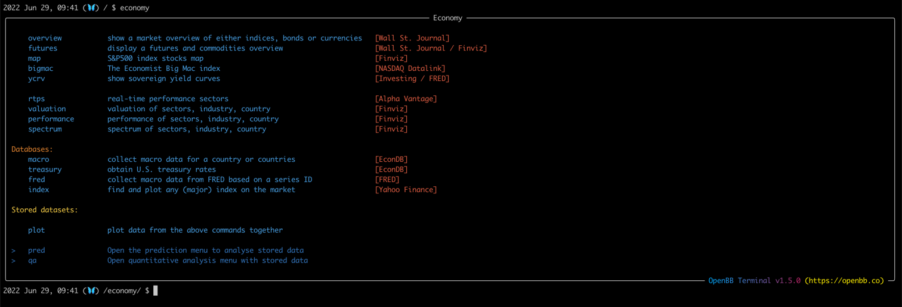
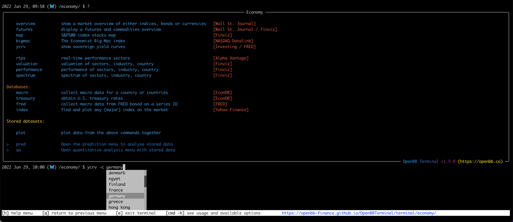
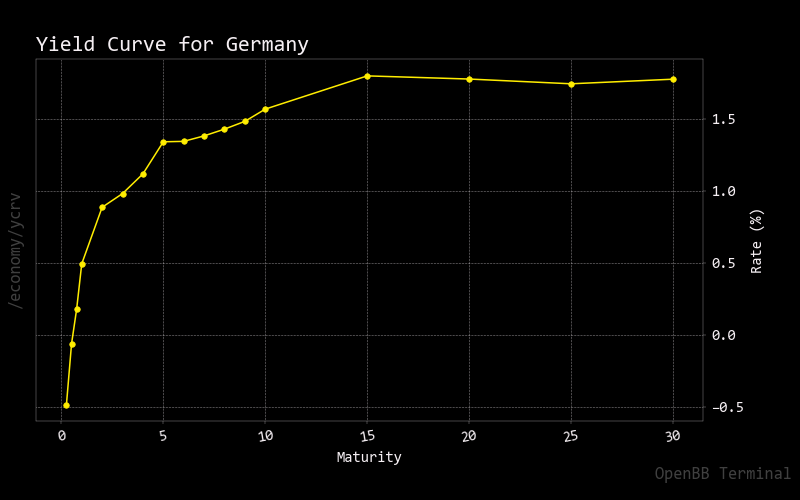
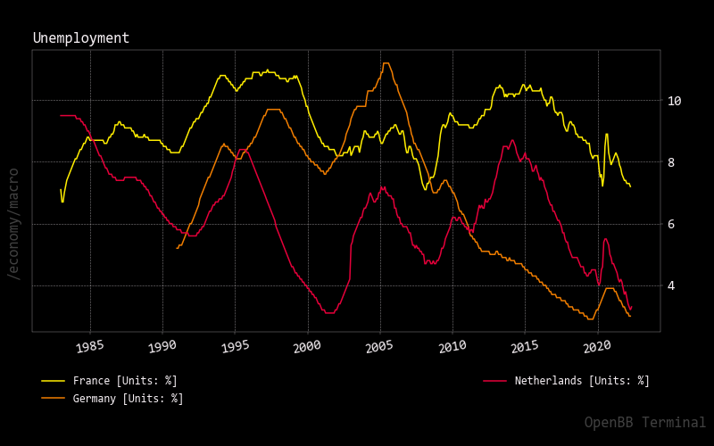
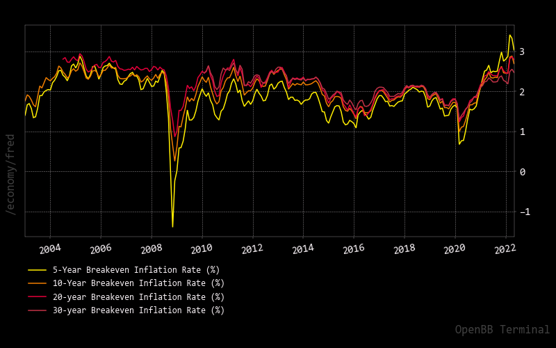
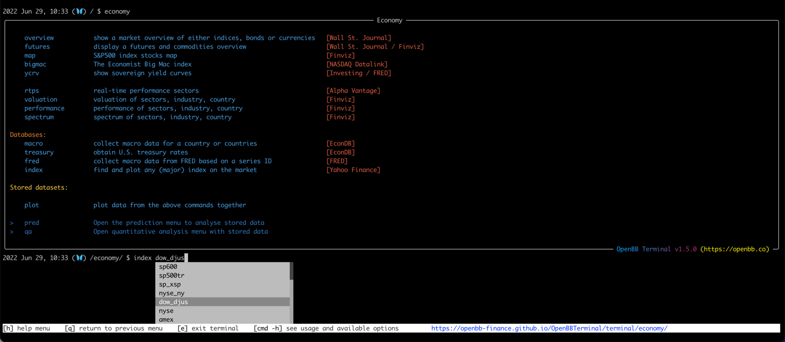
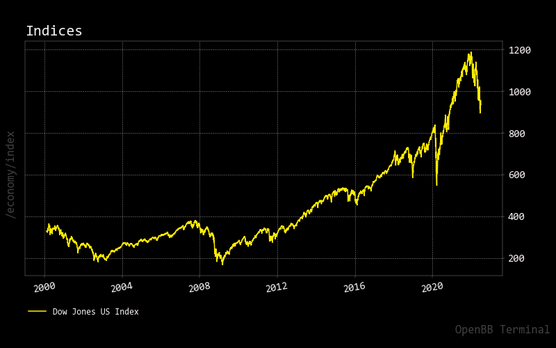
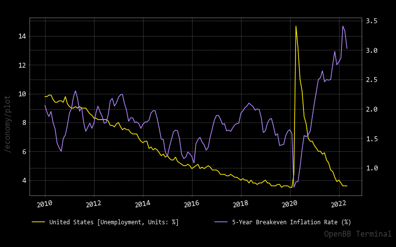

The Economy menu enables you to obtain market overviews (<a href="https://openbb-finance.github.io/OpenBBTerminal/terminal/economy/overview/" target="_blank">overview</a> and <a href="https://openbb-finance.github.io/OpenBBTerminal/terminal/economy/futures/" target="_blank">futures</a>),
see yield curves of any country (<a href="https://openbb-finance.github.io/OpenBBTerminal/terminal/economy/ycrv/" target="_blank">ycrv</a>)
and discover sector, industry and country performance (<a href="https://openbb-finance.github.io/OpenBBTerminal/terminal/economy/performance/" target="_blank">performance</a>).
Next to that, the databases of <a href="https://www.econdb.com/" target="_blank">EconDB</a>, <a href="https://fred.stlouisfed.org/" target="_blank">FRED</a> and <a href="https://finance.yahoo.com/" target="_blank">Yahoo Finance</a>
can be accessed via <a href="https://openbb-finance.github.io/OpenBBTerminal/terminal/economy/macro/" target="_blank">macro</a>,
<a href="https://openbb-finance.github.io/OpenBBTerminal/terminal/economy/fred/" target="_blank">fred</a> and
<a href="https://openbb-finance.github.io/OpenBBTerminal/terminal/economy/index/" target="_blank">index</a> respectively.
All of this can also be further analysed with <a href="https://openbb-finance.github.io/OpenBBTerminal/terminal/common/prediction_techniques/" target="_blank">Prediction Techniques</a> (`pred`) and <a href="https://openbb-finance.github.io/OpenBBTerminal/terminal/common/quantitative_analysis/" target="_blank">Quantitative Techniques</a> (`qa`).

## How to use

The Economy menu is called upon by typing `economy` which opens the following menu:



Within the Economy menu you have a variety of options ranging from treasury rates to population growth to country financial performance.
As this is quite extensive, the guide has two sections. The first section will discuss valuations and performance and the
second section discusses the databases.

### Performance and valuations
By using <a href="https://openbb-finance.github.io/OpenBBTerminal/terminal/economy/overview/" target="_blank">overview</a> we can look
into market overviews from the perspective of indices (`indices`), bonds (`usbonds` and `glbonds`), currencies (`currencies`) and in general.
E.g. let's look at global bond performance by adding the `-t` argument:

```
2022 Jun 29, 09:56 (🦋) /economy/ $ overview -t glbonds

                              Global Bonds
┏━━━━━━━━━━━━━━━━━━━━━━━━━━━━━━━━━━━┳━━━━━━━━━━┳━━━━━━━━━┳━━━━━━━━━━━━━┓
┃                                   ┃ Rate (%) ┃ Yld (%) ┃ Yld Chg (%) ┃
┡━━━━━━━━━━━━━━━━━━━━━━━━━━━━━━━━━━━╇━━━━━━━━━━╇━━━━━━━━━╇━━━━━━━━━━━━━┩
│ U.S. 10 Year Treasury Note        │ 2.875    │ 3.164   │ -0.016      │
├───────────────────────────────────┼──────────┼─────────┼─────────────┤
│ Germany 10 Year Government Bond   │ 0.000    │ 1.582   │ -0.046      │
├───────────────────────────────────┼──────────┼─────────┼─────────────┤
│ U.K. 10 Year Gilt                 │ 4.250    │ 2.440   │ -0.028      │
├───────────────────────────────────┼──────────┼─────────┼─────────────┤
│ Japan 10 Year Government Bond     │ 0.200    │ 0.232   │ -0.002      │
├───────────────────────────────────┼──────────┼─────────┼─────────────┤
│ Australia 10 Year Government Bond │ 1.000    │ 3.703   │ -0.041      │
├───────────────────────────────────┼──────────┼─────────┼─────────────┤
│ China 10 Year Government Bond     │ 2.760    │ 2.851   │ -0.010      │
└───────────────────────────────────┴──────────┴─────────┴─────────────┘
```

Next to that, to better understand the current commodity market we can look into the <a href="https://openbb-finance.github.io/OpenBBTerminal/terminal/economy/futures/" target="_blank">futures</a> 
of a variety of commodities. For example, let's look at a general overview:

```

2022 Jun 29, 09:58 (🦋) /economy/ $ futures

     Futures/Commodities [Source: Wall St. Journal]
┏━━━━━━━━━━━━━━━━━━━━━━━━━━━┳━━━━━━━━━┳━━━━━━━━━┳━━━━━━━┓
┃                           ┃ Price   ┃ Chg     ┃ %Chg  ┃
┡━━━━━━━━━━━━━━━━━━━━━━━━━━━╇━━━━━━━━━╇━━━━━━━━━╇━━━━━━━┩
│ Crude Oil Futures         │ 113.10  │ 1.34    │ 1.20  │
├───────────────────────────┼─────────┼─────────┼───────┤
│ Brent Crude Futures       │ 115.24  │ 1.44    │ 1.27  │
├───────────────────────────┼─────────┼─────────┼───────┤
│ Gold Futures              │ 1823.50 │ 2.30    │ 0.13  │
├───────────────────────────┼─────────┼─────────┼───────┤
│ Silver Futures            │ 20.690  │ -0.116  │ -0.56 │
├───────────────────────────┼─────────┼─────────┼───────┤
│ Natural Gas Futures       │ 6.738   │ 0.187   │ 2.85  │
├───────────────────────────┼─────────┼─────────┼───────┤
│ Unleaded Gasoline Futures │ 3.8239  │ -0.0203 │ -0.53 │
├───────────────────────────┼─────────┼─────────┼───────┤
│ Copper Futures            │ 3.7905  │ 0.0105  │ 0.28  │
├───────────────────────────┼─────────┼─────────┼───────┤
│ Corn Futures              │ 653.75  │ -5.50   │ -0.83 │
├───────────────────────────┼─────────┼─────────┼───────┤
│ Wheat Futures             │ 938.25  │ 2.25    │ 0.24  │
├───────────────────────────┼─────────┼─────────┼───────┤
│ Bloomberg Commodity Index │ 123.95  │ 1.25    │ 1.02  │
└───────────────────────────┴─────────┴─────────┴───────┘
```

Furthermore, we can look into yield curves of any country, by default this is set to the United States, but it can be any:



Which then returns the following plot:



Lastly, we can also show industry, sector and country performance with <a href="https://openbb-finance.github.io/OpenBBTerminal/terminal/economy/performance/" target="_blank">performance</a>.
For example, looking at the `sectors` returns the following:

```
2022 Jun 29, 10:03 (🦋) /economy/ $ performance -g sector

                                                         Group Performance Data
┏━━━━━━━━━━━━━━━━━━━━━━━━┳━━━━━━━┳━━━━━━━┳━━━━━━━━┳━━━━━━━━┳━━━━━━━┳━━━━━━━┳━━━━━━━┳━━━━━━━━━━━━━━━━┳━━━━━━━━━━━┳━━━━━━━━┳━━━━━━━━━━━━━┓
┃ Name                   ┃ Week  ┃ Month ┃ 3Month ┃ 6Month ┃ 1Year ┃ YTD   ┃ Recom ┃ AvgVolume (1M) ┃ RelVolume ┃ Change ┃ Volume (1M) ┃
┡━━━━━━━━━━━━━━━━━━━━━━━━╇━━━━━━━╇━━━━━━━╇━━━━━━━━╇━━━━━━━━╇━━━━━━━╇━━━━━━━╇━━━━━━━╇━━━━━━━━━━━━━━━━╇━━━━━━━━━━━╇━━━━━━━━╇━━━━━━━━━━━━━┩
│ Utilities              │ 0.04  │ -0.08 │ -0.07  │ -0.03  │ 0.06  │ -0.04 │ 2.37  │ 171.85         │ 0.50      │ -0.00  │ 8.05        │
├────────────────────────┼───────┼───────┼────────┼────────┼───────┼───────┼───────┼────────────────┼───────────┼────────┼─────────────┤
│ Technology             │ 0.01  │ -0.10 │ -0.25  │ -0.31  │ -0.22 │ -0.31 │ 2.00  │ 1660.00        │ 1.08      │ -0.01  │ 168.13      │
├────────────────────────┼───────┼───────┼────────┼────────┼───────┼───────┼───────┼────────────────┼───────────┼────────┼─────────────┤
│ Real Estate            │ 0.01  │ -0.06 │ -0.15  │ -0.21  │ -0.24 │ -0.22 │ 2.21  │ 396.36         │ 0.68      │ -0.02  │ 25.29       │
├────────────────────────┼───────┼───────┼────────┼────────┼───────┼───────┼───────┼────────────────┼───────────┼────────┼─────────────┤
│ Industrials            │ 0.01  │ -0.09 │ -0.18  │ -0.20  │ -0.17 │ -0.20 │ 2.26  │ 656.49         │ 0.99      │ -0.01  │ 61.12       │
├────────────────────────┼───────┼───────┼────────┼────────┼───────┼───────┼───────┼────────────────┼───────────┼────────┼─────────────┤
│ Healthcare             │ 0.03  │ -0.04 │ -0.10  │ -0.14  │ -0.12 │ -0.14 │ 2.07  │ 1530.00        │ 3.02      │ -0.00  │ 434.03      │
├────────────────────────┼───────┼───────┼────────┼────────┼───────┼───────┼───────┼────────────────┼───────────┼────────┼─────────────┤
│ Financial              │ 0.01  │ -0.10 │ -0.19  │ -0.18  │ -0.16 │ -0.17 │ 2.26  │ 1010.00        │ 0.67      │ -0.00  │ 63.28       │
├────────────────────────┼───────┼───────┼────────┼────────┼───────┼───────┼───────┼────────────────┼───────────┼────────┼─────────────┤
│ Energy                 │ 0.04  │ -0.12 │ -0.03  │ 0.24   │ 0.29  │ 0.26  │ 2.21  │ 851.32         │ 0.82      │ 0.00   │ 65.35       │
├────────────────────────┼───────┼───────┼────────┼────────┼───────┼───────┼───────┼────────────────┼───────────┼────────┼─────────────┤
│ Consumer Defensive     │ 0.02  │ -0.04 │ -0.08  │ -0.08  │ -0.05 │ -0.09 │ 2.28  │ 384.26         │ 0.84      │ -0.00  │ 30.44       │
├────────────────────────┼───────┼───────┼────────┼────────┼───────┼───────┼───────┼────────────────┼───────────┼────────┼─────────────┤
│ Consumer Cyclical      │ 0.00  │ -0.07 │ -0.26  │ -0.31  │ -0.32 │ -0.31 │ 2.12  │ 1390.00        │ 1.25      │ -0.01  │ 163.60      │
├────────────────────────┼───────┼───────┼────────┼────────┼───────┼───────┼───────┼────────────────┼───────────┼────────┼─────────────┤
│ Communication Services │ 0.01  │ -0.05 │ -0.22  │ -0.28  │ -0.28 │ -0.28 │ 1.90  │ 745.84         │ 0.77      │ -0.01  │ 53.75       │
├────────────────────────┼───────┼───────┼────────┼────────┼───────┼───────┼───────┼────────────────┼───────────┼────────┼─────────────┤
│ Basic Materials        │ -0.00 │ -0.15 │ -0.20  │ -0.13  │ -0.13 │ -0.13 │ 2.26  │ 529.64         │ 0.76      │ -0.01  │ 37.97       │
└────────────────────────┴───────┴───────┴────────┴────────┴───────┴───────┴───────┴────────────────┴───────────┴────────┴─────────────┘
```

### Economic Databases
Starting with the EconDB database (via <a href="https://openbb-finance.github.io/OpenBBTerminal/terminal/economy/macro/" target="_blank">macro</a>)
a large selection of Economic data can be obtained. What can be obtained is easily found by typing `macro --show parameters` which returns the following:

```
2022 Jun 29, 10:16 (🦋) /economy/ $ macro --show parameters

┏━━━━━━━━━━━┳━━━━━━━━━━━━━━━━━━━━━━━━━━━━━━━━━━━━━━━━━━━━━━━━━━━━━┳━━━━━━━━━━━┳━━━━━━━━━━━━━━━━━━━━━━━━━━━━━━━━━━━━━━━━━━━━━━━━━━━━━━━━━━━━━━━━━━━━━━━━━━━━━━━━━━━━━━━━━━━━━━━━━━━━━━━━━━━━━━━━━━━━━━━━━━━━━━━━━━━━━━┓
┃ Parameter ┃ Name                                                ┃ Period    ┃ Description                                                                                                                          ┃
┡━━━━━━━━━━━╇━━━━━━━━━━━━━━━━━━━━━━━━━━━━━━━━━━━━━━━━━━━━━━━━━━━━━╇━━━━━━━━━━━╇━━━━━━━━━━━━━━━━━━━━━━━━━━━━━━━━━━━━━━━━━━━━━━━━━━━━━━━━━━━━━━━━━━━━━━━━━━━━━━━━━━━━━━━━━━━━━━━━━━━━━━━━━━━━━━━━━━━━━━━━━━━━━━━━━━━━━━┩
│ RGDP      │ Real gross domestic product                         │ Quarterly │ Inflation-adjusted measure that reflects the value of all goods and services produced by an economy in a given year (chain-linked    │
│           │                                                     │           │ series).                                                                                                                             │
├───────────┼─────────────────────────────────────────────────────┼───────────┼──────────────────────────────────────────────────────────────────────────────────────────────────────────────────────────────────────┤
│ RPRC      │ Real private consumption                            │ Quarterly │ All purchases made by consumers adjusted by inflation (chain-linked series).                                                         │
├───────────┼─────────────────────────────────────────────────────┼───────────┼──────────────────────────────────────────────────────────────────────────────────────────────────────────────────────────────────────┤
│ RPUC      │ Real public consumption                             │ Quarterly │ All purchases made by the government adjusted by inflation (chain-linked series).                                                    │
├───────────┼─────────────────────────────────────────────────────┼───────────┼──────────────────────────────────────────────────────────────────────────────────────────────────────────────────────────────────────┤
│ RGFCF     │ Real gross fixed capital formation                  │ Quarterly │ The acquisition of produced assets adjusted by inflation (chain-linked series).                                                      │
├───────────┼─────────────────────────────────────────────────────┼───────────┼──────────────────────────────────────────────────────────────────────────────────────────────────────────────────────────────────────┤
│ REXP      │ Real exports of goods and services                  │ Quarterly │ Transactions in goods and services from residents to non-residents adjusted for inflation (chain-linked series)                      │
├───────────┼─────────────────────────────────────────────────────┼───────────┼──────────────────────────────────────────────────────────────────────────────────────────────────────────────────────────────────────┤
│ RIMP      │ Real imports of goods and services                  │ Quarterly │ Transactions in goods and services to residents from non-residents adjusted for inflation (chain-linked series)                      │
├───────────┼─────────────────────────────────────────────────────┼───────────┼──────────────────────────────────────────────────────────────────────────────────────────────────────────────────────────────────────┤
<continues>
```

As well as the available countries with `macro --show countries`:

```
2022 Jun 29, 10:16 (🦋) /economy/ $ macro --show countries

┏━━━━━━━━━━━━━━━━━━━━━━━━┳━━━━━━━━━━┓
┃ Country                ┃ Currency ┃
┡━━━━━━━━━━━━━━━━━━━━━━━━╇━━━━━━━━━━┩
│ Albania                │ ALL      │
├────────────────────────┼──────────┤
│ Argentina              │ ARS      │
├────────────────────────┼──────────┤
│ Australia              │ AUD      │
├────────────────────────┼──────────┤
│ Austria                │ EUR      │
├────────────────────────┼──────────┤
│ Azerbaijan             │ AZN      │
├────────────────────────┼──────────┤
│ Bangladesh             │ BDT      │
├────────────────────────┼──────────┤
│ Belarus                │ BYR      │
├────────────────────────┼──────────┤
│ Belgium                │ EUR      │
├────────────────────────┼──────────┤
<continues>
```

Then, with these parameters and countries, you can now plot macroeconomic data. For example, we can look at unemployment
rate (`URATE`) of the Netherlands, Germany and France with the following:

```
2022 Jun 29, 10:18 (🦋) /economy/ $ macro --countries Netherlands Germany France --parameters URATE
```

This returns the following graph:



The FRED database similarly has a lot of macroeconomic data, do note that you need an API key to do this which is explained in more detail
in the <a href="https://openbb-finance.github.io/OpenBBTerminal/#accessing-other-sources-of-data-via-api-keys" target="_blank">Accessing other sources of data via API keys</a> section.

You have the ability to query the entire FRED database with the `-q` argument. For example, down below we look for datasets that are centered around inflation.
The `-l` argument is set to show a maximum of 10 datasets:

```
022 Jun 29, 10:23 (🦋) /economy/ $ fred -q inflation -l 10

                                                                         Search results for inflation
┏━━━━━━━━━━━━━━━━━┳━━━━━━━━━━━━━━━━━━━━━━━━━━━━━━━━━━━━━━━━━━━━━━━━━━━━┳━━━━━━━━━━━━━━━━━━━━━━━━━━━━━━━━━━━━━━━━━━━━━━━━━━━━━━━━━━━━━━━━━━━━━━━━━━━━━━━━━━━━━━━━━━━━━━━━━━━━━━┓
┃ Series ID       ┃ Title                                              ┃ Description                                                                                          ┃
┡━━━━━━━━━━━━━━━━━╇━━━━━━━━━━━━━━━━━━━━━━━━━━━━━━━━━━━━━━━━━━━━━━━━━━━━╇━━━━━━━━━━━━━━━━━━━━━━━━━━━━━━━━━━━━━━━━━━━━━━━━━━━━━━━━━━━━━━━━━━━━━━━━━━━━━━━━━━━━━━━━━━━━━━━━━━━━━━┩
│ T10YIE          │ 10-Year Breakeven Inflation Rate                   │ The breakeven inflation rate represents a measure of expected inflation derived from 10-Year         │
│                 │                                                    │ Treasury Constant Maturity Securities (BC_10YEAR) and 10-Year Treasury Inflation-Indexed Constant    │
│                 │                                                    │ Maturity Securities (TC_10YEAR). The latest value implies what market participants expect inflation  │
│                 │                                                    │ to be in the next 10 years, on average. Starting with the update on June 21, 2019, the Treasury bond │
│                 │                                                    │ data used in calculating interest rate spreads is obtained directly from the U.S. Treasury           │
│                 │                                                    │ Department (https://www.treasury.gov/resource-center/data-chart-center/interest-                     │
│                 │                                                    │ rates/Pages/TextView.aspx?data=yield).                                                               │
├─────────────────┼────────────────────────────────────────────────────┼──────────────────────────────────────────────────────────────────────────────────────────────────────┤
│ DFII10          │ Market Yield on U.S. Treasury Securities at        │ For further information regarding treasury constant maturity data, please refer to the H.15          │
│                 │ 10-Year Constant Maturity, Quoted on an Investment │ Statistical Release notes (https://www.federalreserve.gov/releases/h15/default.htm) and the Treasury │
│                 │ Basis, Inflation-Indexed                           │ Yield Curve Methodology (https://home.treasury.gov/policy-issues/financing-the-government/interest-  │
│                 │                                                    │ rate-statistics/treasury-yield-curve-methodology).                                                   │
├─────────────────┼────────────────────────────────────────────────────┼──────────────────────────────────────────────────────────────────────────────────────────────────────┤
│ T10YIEM         │ 10-Year Breakeven Inflation Rate                   │ The breakeven inflation rate represents a measure of expected inflation derived from 10-Year         │
│                 │                                                    │ Treasury Constant Maturity Securities (BC_10YEARM) and 10-Year Treasury Inflation-Indexed Constant   │
│                 │                                                    │ Maturity Securities (TC_10YEARM). The latest value implies what market participants expect inflation │
│                 │                                                    │ to be in the next 10 years, on average. Starting with the update on June 21, 2019, the Treasury bond │
│                 │                                                    │ data used in calculating interest rate spreads is obtained directly from the U.S. Treasury           │
│                 │                                                    │ Department (https://www.treasury.gov/resource-center/data-chart-center/interest-                     │
│                 │                                                    │ rates/Pages/TextView.aspx?data=yield).                                                               │
├─────────────────┼────────────────────────────────────────────────────┼──────────────────────────────────────────────────────────────────────────────────────────────────────┤
│ FII10           │ Market Yield on U.S. Treasury Securities at        │ For further information regarding treasury constant maturity data, please refer to the H.15          │
│                 │ 10-Year Constant Maturity, Quoted on an Investment │ Statistical Release notes (https://www.federalreserve.gov/releases/h15/default.htm) and the Treasury │
│                 │ Basis, Inflation-Indexed                           │ Yield Curve Methodology (https://home.treasury.gov/policy-issues/financing-the-government/interest-  │
│                 │                                                    │ rate-statistics/treasury-yield-curve-methodology).                                                   │
├─────────────────┼────────────────────────────────────────────────────┼──────────────────────────────────────────────────────────────────────────────────────────────────────┤
│ WFII10          │ Market Yield on U.S. Treasury Securities at        │ For further information regarding treasury constant maturity data, please refer to the H.15          │
│                 │ 10-Year Constant Maturity, Quoted on an Investment │ Statistical Release notes (https://www.federalreserve.gov/releases/h15/default.htm) and the Treasury │
│                 │ Basis, Inflation-Indexed                           │ Yield Curve Methodology (https://home.treasury.gov/policy-issues/financing-the-government/interest-  │
│                 │                                                    │ rate-statistics/treasury-yield-curve-methodology).                                                   │
├─────────────────┼────────────────────────────────────────────────────┼──────────────────────────────────────────────────────────────────────────────────────────────────────┤
│ RIFLGFCY10XIINA │ Market Yield on U.S. Treasury Securities at        │ Averages of daily figures.  For further information regarding treasury constant maturity data,       │
│                 │ 10-Year Constant Maturity, Quoted on an Investment │ please refer to the H.15 Statistical release notes                                                   │
│                 │ Basis, Inflation-Indexed                           │ (https://www.federalreserve.gov/releases/h15/default.htm) and the Treasury Yield Curve Methodology   │
│                 │                                                    │ (https://home.treasury.gov/policy-issues/financing-the-government/interest-rate-statistics/treasury- │
│                 │                                                    │ yield-curve-methodology).                                                                            │
├─────────────────┼────────────────────────────────────────────────────┼──────────────────────────────────────────────────────────────────────────────────────────────────────┤
│ T5YIFR          │ 5-Year, 5-Year Forward Inflation Expectation Rate  │ This series is a measure of expected inflation (on average) over the five-year period that begins    │
│                 │                                                    │ five years from today.  This series is constructed as: (((((1+((BC_10YEAR-                           │
│                 │                                                    │ TC_10YEAR)/100))^10)/((1+((BC_5YEAR-TC_5YEAR)/100))^5))^0.2)-1)*100  where BC10_YEAR, TC_10YEAR,     │
│                 │                                                    │ BC_5YEAR, and TC_5YEAR are the 10 year and 5 year nominal and inflation adjusted Treasury            │
│                 │                                                    │ securities. All of those are the actual series IDs in FRED. Starting with the update on June 21,     │
│                 │                                                    │ 2019, the Treasury bond data used in calculating interest rate spreads is obtained directly from the │
│                 │                                                    │ U.S. Treasury Department (https://www.treasury.gov/resource-center/data-chart-center/interest-       │
│                 │                                                    │ rates/Pages/TextView.aspx?data=yield).                                                               │
├─────────────────┼────────────────────────────────────────────────────┼──────────────────────────────────────────────────────────────────────────────────────────────────────┤
│ T5YIE           │ 5-Year Breakeven Inflation Rate                    │ The breakeven inflation rate represents a measure of expected inflation derived from 5-Year Treasury │
│                 │                                                    │ Constant Maturity Securities (BC_5YEAR) and 5-Year Treasury Inflation-Indexed Constant Maturity      │
│                 │                                                    │ Securities (TC_5YEAR). The latest value implies what market participants expect inflation to be in   │
│                 │                                                    │ the next 5 years, on average. Starting with the update on June 21, 2019, the Treasury bond data used │
│                 │                                                    │ in calculating interest rate spreads is obtained directly from the U.S. Treasury Department          │
│                 │                                                    │ (https://www.treasury.gov/resource-center/data-chart-center/interest-                                │
│                 │                                                    │ rates/Pages/TextView.aspx?data=yield).                                                               │
├─────────────────┼────────────────────────────────────────────────────┼──────────────────────────────────────────────────────────────────────────────────────────────────────┤
│ T5YIFRM         │ 5-Year, 5-Year Forward Inflation Expectation Rate  │ This series is a measure of expected inflation (on average) over the five-year period that begins    │
│                 │                                                    │ five years from today.  This series is constructed as: (((((1+((BC_10YEAR-                           │
│                 │                                                    │ TC_10YEAR)/100))^10)/((1+((BC_5YEAR-TC_5YEAR)/100))^5))^0.2)-1)*100  where BC10_YEAR, TC_10YEAR,     │
│                 │                                                    │ BC_5YEAR, and TC_5YEAR are the 10 year and 5 year nominal and inflation adjusted Treasury            │
│                 │                                                    │ securities. All of those are the actual series IDs in FRED. Starting with the update on June 21,     │
│                 │                                                    │ 2019, the Treasury bond data used in calculating interest rate spreads is obtained directly from the │
│                 │                                                    │ U.S. Treasury Department (https://www.treasury.gov/resource-center/data-chart-center/interest-       │
│                 │                                                    │ rates/Pages/TextView.aspx?data=yield).                                                               │
├─────────────────┼────────────────────────────────────────────────────┼──────────────────────────────────────────────────────────────────────────────────────────────────────┤
│ T5YIEM          │ 5-Year Breakeven Inflation Rate                    │ The breakeven inflation rate represents a measure of expected inflation derived from 5-Year Treasury │
│                 │                                                    │ Constant Maturity Securities (BC_5YEAR) and 5-Year Treasury Inflation-Indexed Constant Maturity      │
│                 │                                                    │ Securities (TC_5YEAR). The latest value implies what market participants expect inflation to be in   │
│                 │                                                    │ the next 5 years, on average. Starting with the update on June 21, 2019, the Treasury bond data used │
│                 │                                                    │ in calculating interest rate spreads is obtained directly from the U.S. Treasury Department          │
│                 │                                                    │ (https://www.treasury.gov/resource-center/data-chart-center/interest-                                │
│                 │                                                    │ rates/Pages/TextView.aspx?data=yield).                                                               │
└─────────────────┴────────────────────────────────────────────────────┴──────────────────────────────────────────────────────────────────────────────────────────────────────┘
```

With this information, we can now plot datasets, e.g. the 5-year, 10-year, 20-year and 30-year break-even inflation rates, with the following.
Note that I added some additional series not in the above table. This is because you can recognise the structure relatively easy of the
break-even inflation rates, the number after the `T` refers to the amount of years.

```
2022 Jun 29, 10:27 (🦋) /economy/ $ fred T5YIEM T10YIEM T20YIEM T30YIEM
```

Which returns the following graph:



Furthermore, understanding the influence macroeconomic trends have to indices, the `index` command can be used. This has a
large set of pre-configured indices but has the possibility to add your own if you enter the ticker.



Which plots the following:



This then all comes together within the <a href="https://openbb-finance.github.io/OpenBBTerminal/terminal/economy/plot/" target="_blank">plot</a> command where you can combine the datasets from the above commands into one graph.
For example, it seems there is a relationship between the inflation rates and the unemployment rate (<a href="https://www.investopedia.com/articles/markets/081515/how-inflation-and-unemployment-are-related.asp" target="_blank">source</a>)
which we can graphically show with:

```
2022 Jun 29, 10:38 (🦋) /economy/ $ macro -p URATE -s 2010-01-01

2022 Jun 29, 10:39 (🦋) /economy/ $ fred T5YIEM -s 2010-01-01

2022 Jun 29, 10:39 (🦋) /economy/ $ plot --y1 United_States_URATE --y2 T5YIEM
```

Resulting in the following graph:



## Sub-menus available

The Economy menu has a few sub-menus available to delve further into a specific macroeconomic indicator. To find more information about each menu, click on one of the following:

- <a href="/OpenBBTerminal/terminal/common/prediction_techniques" target="_blank">Introduction to Prediction Techniques</a>: apply advanced AI and Machine Learning models to form prediction of future macroeconomic indicators including Recurrent Neural Network (RNN),
Autoregressive Integrated Moving Average (ARIMA) and Monte Carlo forecasting.
- <a href="/OpenBBTerminal/terminal/common/quantitative_analysis" target="_blank">Introduction to Quantitative Analysis</a>: analyse the macroeconomic indicators extensively for seasonality, rolling windows and statistical techniques.

## Examples

**TODO**