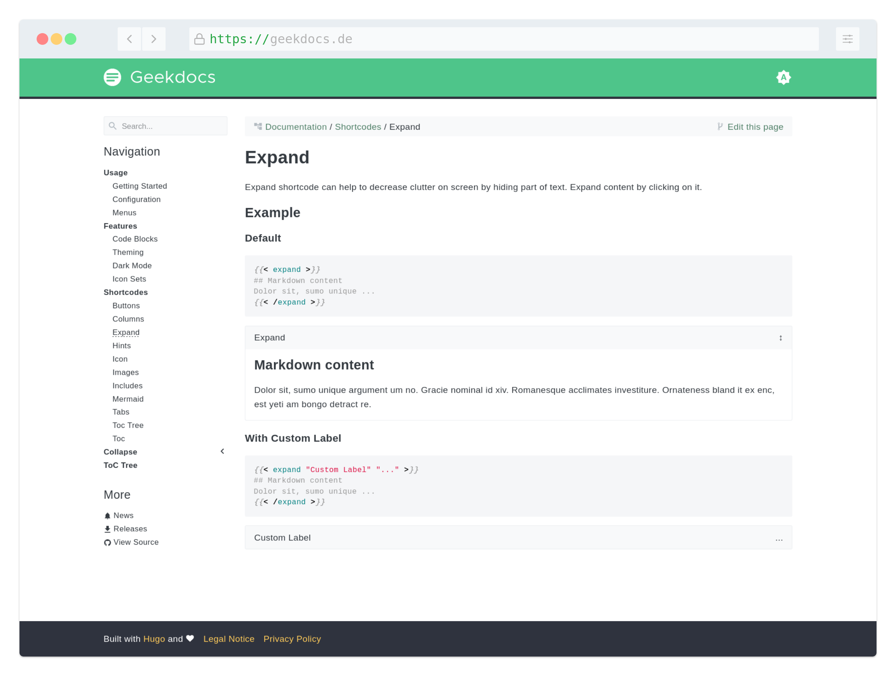

If you want to customize the theme's color scheme to give it your individual touch, you are only a few lines of CSS away. Generally, you need to override the default settings. The easiest way to do this is to create a file named `static/custom.css` right at the root of your site.

All the necessary CSS customization properties are listed below. If you want to customize elements that don't use these properties, you can always look up the class name and override it directly. For inspiration, you can also take a look at [https://www.color-hex.com/color-palettes/](https://www.color-hex.com/). In this simple example, we'll use the [_Beach_](https://www.color-hex.com/color-palette/895) color palette.

**Custom CSS:**

<!-- prettier-ignore-start -->
<!-- spellchecker-disable -->

<!-- spellchecker-enable -->
<!-- prettier-ignore-end -->

Happy customizing!
